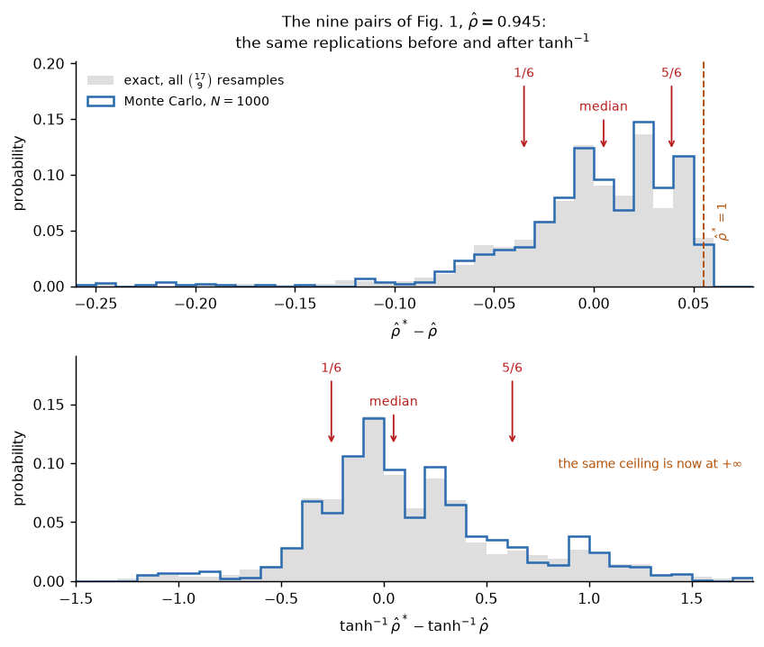

# Paper Reviews & From-Scratch Implementations

Reading foundational papers in statistics, machine learning and quantitative
finance — then reimplementing their core results in Python from scratch and
validating against the numbers published in the paper.

The goal is understanding, not production code: every implementation references
the specific equation or section it implements, and every claim is checked
against a figure, table or numerical value from the original work. Where the
paper turns out to be wrong, that is documented in place with the numerical
evidence rather than smoothed over.

**Diego Froilán García Campos** — B.Sc. Mathematics & Physics (University of
Oviedo), M.Sc. Big Data Analytics (Universidad Carlos III de Madrid).

## How it works

Each paper follows the same pipeline:

1. **Read** the paper in full.
2. **Review** — a structured write-up in `reviews/`: context, methodology with the
   key equations, results, strengths *and* limitations, links to related reviews.
3. **Derive** — `DERIVATIONS.md`, the mathematics developed end to end in its own
   logical order, to be read as a chapter rather than consulted. Figures are
   computed by the solver, so each one checks the step it accompanies.
4. **Implement** — a self-contained folder in `implementations/`, built
   incrementally, each piece validated against the paper.

```
papers/           Original PDFs (not versioned — see papers/INDEX.md)
reviews/          One markdown review per paper
implementations/  One folder per paper, each with its own README
ROADMAP.md        Reading queue, organised by topic
```

## Implemented so far

### Tibshirani (1996) — *Regression Shrinkage and Selection via the Lasso*

[Review](reviews/1996-tibshirani-lasso.md) ·
[Implementation](implementations/1996-tibshirani-lasso/) ·
**[Derivations](implementations/1996-tibshirani-lasso/DERIVATIONS.md)**

- **The paper's own algorithm** (Sec. 6): a quadratic program over the $2^p$ sign
  constraints, introduced one at a time, with a hand-written primal active-set
  inner solve. Deliberately *not* coordinate descent, which is Friedman et al.
  (2007) — eleven years later.
- **Validated against the paper**: Eq. 3 in the orthonormal case to `1e-15`,
  Table 1 and the prostate-cancer coefficient paths to the printed 0.01, Eqs. 5–6
  for two correlated predictors, and Figures 1, 2, 4 and 5.
- **Cross-checked externally** against `sklearn.linear_model.Lasso` to `8e-13`
  over the whole path — after deriving the conversion between the two objectives,
  which differ by a factor of $2N$ — and against LARS with no conversion at all.
- **Four discrepancies with the paper, documented with the numbers**: the
  `lweight` decimal-point typo corrected in the data file after 1996; GCV
  minimising at $s=0.69$ rather than the paper's 0.44; a lower limit missing from
  Eq. 6; and `max` printed where `min` belongs in the Stein risk formula.

The [derivations](implementations/1996-tibshirani-lasso/DERIVATIONS.md) build the
method from the problem statement to the choice of the penalty in 20 sections.
Two results in there go beyond the paper: the closed form that survives outside
the orthonormal case,

$$
\hat\beta_A = \hat\beta^{\,\mathrm{ols}(A)} - \lambda\,(X_A^\top X_A)^{-1}s_A,
$$

from which the piecewise linearity of the coefficient paths follows as a theorem;
and a proof of the stability the abstract only asserts — the lasso is a projection
onto a convex set, projections onto convex sets are non-expansive, so the fit
never moves further than the data did.


### Efron (1979) — *Bootstrap Methods: Another Look at the Jackknife*

[Review](reviews/1979-efron-bootstrap.md) ·
[Implementation](implementations/1979-efron-bootstrap/) ·
**[Derivations](implementations/1979-efron-bootstrap/DERIVATIONS.md)**

The paper that introduced the bootstrap and showed the jackknife to be its linear
approximation. Closed at **four of the paper's eight sections and three of its eleven
remarks, by choice** — the README states what is left out and why, and names the
omission most worth returning to.

- **Both ways of computing the bootstrap distribution**: Monte Carlo, and exact
  enumeration of all $\binom{2n-1}{n}$ distinct resamples with their multinomial
  weights — which lets every Monte Carlo claim be checked against the fixed object it
  approximates, rather than against another simulation.
- **Validated against the paper**: Eq. (2.8) to twelve decimals; the closed form of
  Eq. (3.5) against brute-force enumeration, also to twelve; the six probabilities of
  Eq. (3.6) to the printed precision; column (3.6) of Table 1 at AVE 1.011, S.D. 0.317
  against 1.01 and 0.31; the derivatives of Eq. (5.14) to $2\times10^{-7}$; the
  regression covariance of Eq. (7.7), and the symmetrization of Eq. (7.9) that recovers
  it, to $2\times10^{-11}$; and Figure 1 from the nine data pairs printed in its caption,
  at $\hat\rho = 0.944848$ against the paper's .945.
- **The central thesis, verified twice by independent routes.** That the jackknife is the
  linearised bootstrap is checked once for the median — where every derivative is
  *identically zero*, so the linearisation reports that a sample median has no sampling
  variability at all — and again for regression, where Eq. (7.8) and Eq. (7.7) turn out
  to be the same formula, Eq. (5.10), applied to two data sets that differ by one index.
- **Two discrepancies with the paper, documented with the numbers**: Eq. (3.12) needs a
  factor $\sqrt n$ before a single entry of Table 1 can be reproduced, and $E_F R$ comes
  out at $0.9822 \pm 0.0012$ rather than the stated 0.95 — a gap small enough to be that
  paper's own Monte Carlo error, and labelled as such rather than as an error.
- **Three claims the paper asserts without numbers, supplied**: that deleting in groups
  of size $O(\sqrt n)$ repairs the jackknife for the median (it does, slowly — 11% high
  at $n = 6401$); that jackknife-style estimates buy robustness at the cost of efficiency
  (both halves measured, and under heteroskedasticity the leverage-corrected jackknife is
  the only one of four estimators that lands); and that treating $\hat\theta - \theta$ as
  a pivot is illegitimate (Remark D's interval claims 91.4% coverage and delivers 70–75%).

One result goes beyond the paper: the limiting law of the jackknife variance of a sample
median **depends on the parity of $n$** — $[\chi^2_2/2]^2$ for $n$ even and
$[\chi^2_4/4]^2$ for $n$ odd — because an odd sample has a middle observation that can
itself be deleted, so two spacings enter and are averaged where one entered alone. Both
cases are derived and simulated. The law Efron prints is the even one, stated in a
section built on odd $n$; it is correct, and what it omits is that the parity decides.



### Markowitz (1952) — *Portfolio Selection* · Vaswani et al. (2017) — *Attention Is All You Need*

Reviews done ([Markowitz](reviews/1952-markowitz-portfolio-selection.md),
[Transformer](reviews/2017-vaswani-attention.md)), implementations in progress.

## Running the code

```bash
conda env create -f environment.yml
conda activate papers
python implementations/1996-tibshirani-lasso/lasso.py
python implementations/1979-efron-bootstrap/bootstrap.py
```

Python ≥ 3.11 with NumPy, SciPy, matplotlib and pandas; scikit-learn only in
`sklearn_check.py`, as an external reference to check against — no solver uses it.
Each implementation's README lists the scripts and what each one runs.

Data files are not versioned. The lasso implementation needs
`data/prostate.data`, downloadable from the *Elements of Statistical Learning*
website; its README says so.

## What's next

The [roadmap](ROADMAP.md) tracks the reading queue: papers mapped to the master's
syllabus, a quantitative-finance track (portfolio theory, covariance estimation,
financial time series), and a deep-learning track running from RNNs through the
Transformer to modern LLMs and generative models. `papers/INDEX.md` is the full
inventory, with download links.

## How this repo is written

Written with an AI assistant (Claude), recorded in the `Co-Authored-By` trailer of
every commit. The working rule is that nothing goes in that I cannot derive and
defend on a whiteboard.

That rule is why [DERIVATIONS.md](implementations/1996-tibshirani-lasso/DERIVATIONS.md)
exists at all: working the mathematics through myself, in my own order rather than the
paper's, is how I check that I understand what the code does. And it is why the
Section 7 simulations of the lasso are deliberately absent — they run, but I have not
yet pinned down the setup well enough to say whose numbers are wrong, and saying it
anyway would be claiming more than I know.
