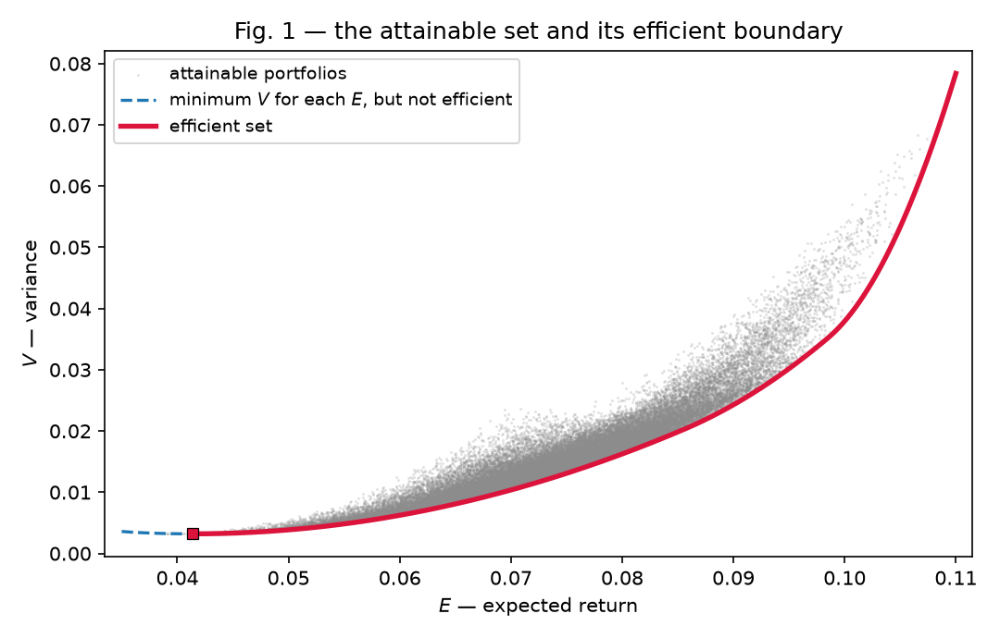
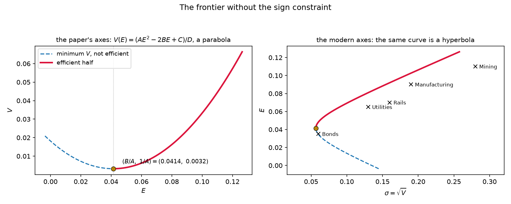
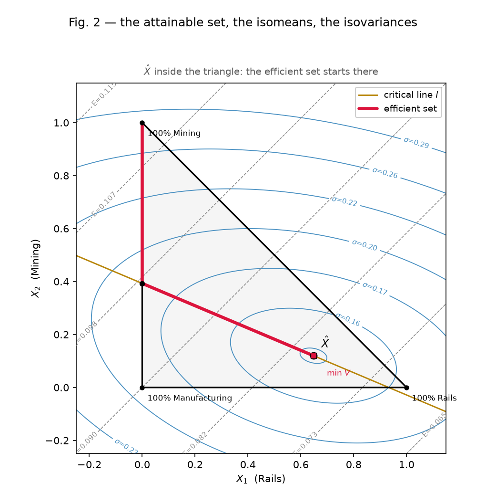
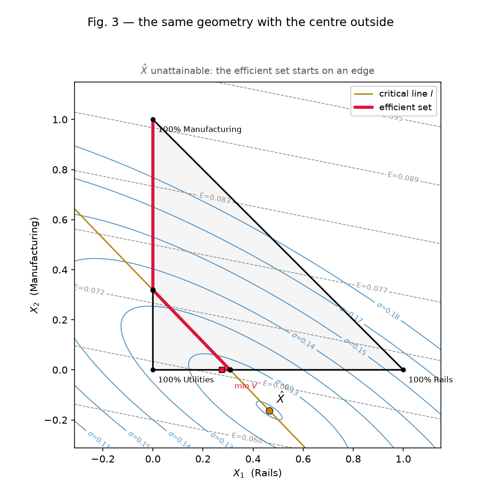
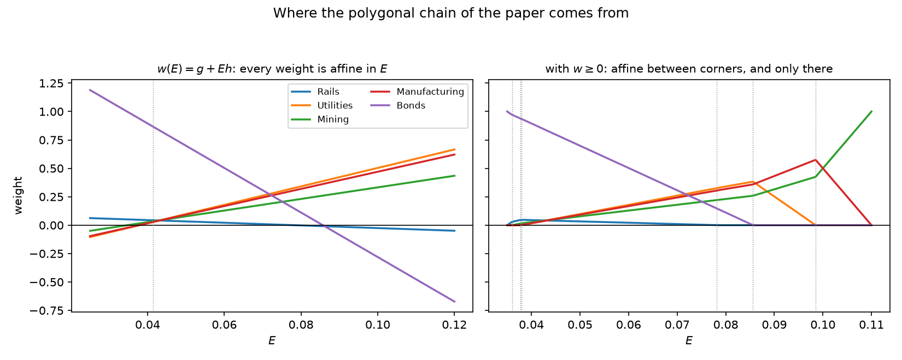
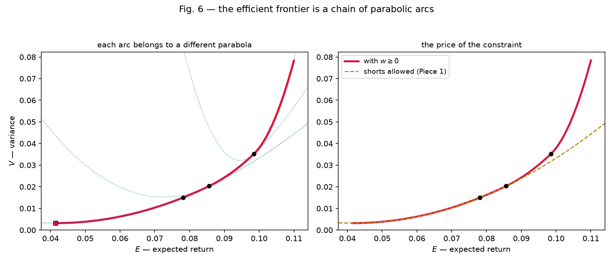
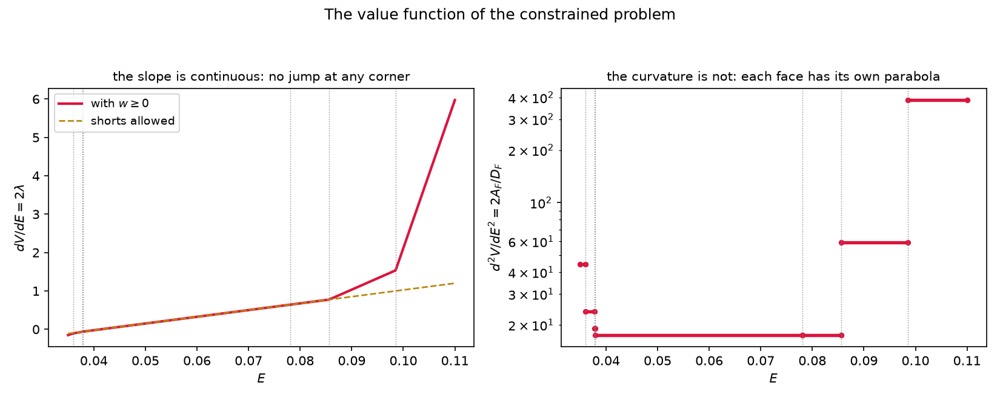

# Mean-variance portfolio selection — a full derivation

From the choice an investor actually faces to the algorithm that makes it. The
order is the order of construction: we ask what is being chosen, discard the
rule that suggests itself first, find the one that survives, solve it completely
where a closed form exists, and only then put back the constraint that destroys
the closed form and see what is left. The paper's own order is the reverse — it
opens with the constrained three-asset problem and draws it — and its geometry
turns up here as a consequence rather than as a starting point.

**Notation.** There are $n$ assets. The investor chooses the fractions of wealth
$\mathbf w \in \mathbb R^n$ (the paper's $X_i$), not the returns. We write
$\boldsymbol\mu$ for the vector of expected returns, $\Sigma$ for the covariance
matrix, $\mathbf 1$ for the vector of ones, and

```math
E = \boldsymbol\mu^\top\mathbf w, \qquad V = \mathbf w^\top\Sigma\mathbf w .
```

$\Sigma$ is symmetric and positive semi-definite always, positive definite
unless stated otherwise; section 9 is where the difference starts to matter.
References to Markowitz (1952) are anchors, cited in passing.

The figures are **computed with the solvers of this implementation**, not drawn:
each one checks the step it accompanies. They come from
[derivation_figures.py](derivation_figures.py) (the `ded_` ones),
[geometry.py](geometry.py) and [figures.py](figures.py) (the paper's own).

---

### Part I — What is being chosen
&nbsp;&nbsp;1. [One number is not enough, and the reason is linearity](#s1)
&nbsp;&nbsp;2. [The second moment, and the floor it puts under diversification](#s2)
&nbsp;&nbsp;3. [Efficient, and the shape of what is attainable](#s3)

### Part II — Solving it without the sign constraint
&nbsp;&nbsp;4. [Two multipliers and four scalars](#s4)
&nbsp;&nbsp;5. [The frontier, without expanding anything](#s5)
&nbsp;&nbsp;6. [Two funds span the whole of it](#s6)
&nbsp;&nbsp;7. [What the multiplier is worth](#s7)

### Part III — Three assets, which is where the paper lives
&nbsp;&nbsp;8. [Eliminating one weight turns the problem into plane geometry](#s8)
&nbsp;&nbsp;9. [Ellipses, and the exact condition for them](#s9)
&nbsp;&nbsp;10. [The critical line, with the algebra the paper omits](#s10)
&nbsp;&nbsp;11. [Inside or outside: the two figures are one argument](#s11)

### Part IV — Putting the sign constraint back
&nbsp;&nbsp;12. [Why the chain is polygonal and the frontier piecewise](#s12)
&nbsp;&nbsp;13. [The algorithm the paper does not give](#s13)
&nbsp;&nbsp;14. [What the constraint costs, and what it buys](#s14)

### Part V — Where this stops
&nbsp;&nbsp;15. [The inputs, which are the whole remaining problem](#s15)

---

# Part I — What is being chosen

<a name="s1"></a>
## 1. One number is not enough, and the reason is linearity

The investor holds fractions $\mathbf w$ of wealth in $n$ assets whose returns
$R_i$ are random. The portfolio return $R = \sum_i w_i R_i$ is therefore random
too, and the choice is not of $R$ but of the $\mathbf w$, which are numbers the
investor sets. Any rule for choosing has to rank random variables, and the first
candidate is to rank them by their mean,

```math
E = \sum_{i=1}^n w_i \mu_i,
\qquad\text{subject to}\qquad \sum_i w_i = 1, \quad w_i \ge 0 .
```

This rule is unusable, and it is worth seeing exactly why, because the reason
dictates everything that follows. $E$ is a **weighted average** of the $\mu_i$
with weights that are non-negative and sum to one, so $E \le \max_i \mu_i$, with
equality precisely when all the weight sits on an asset attaining the maximum.
The maximiser is a vertex of the simplex: a single asset. Ties change nothing —
they merely make several undiversified portfolios equally good, and any mixture
of the tied assets does no better than each of them alone. As the paper puts it
(pp. 77–78), in no case is a diversified portfolio *preferred* to all the
undiversified ones.

The defect is structural rather than accidental. A **linear** function on a
polytope attains its maximum at a vertex; that is the fundamental theorem of
linear programming, and it is exactly the property that makes the simplex
method work. So no ranking by a single linear functional of $\mathbf w$ will
ever recommend diversification, no matter which functional is chosen. To get an
optimum in the interior of the simplex, the objective must have **curvature**.

That is the whole reason the second moment enters. It is also, incidentally, the
distance between linear and quadratic programming: same feasible region, same
duality apparatus, and one term that bends the objective and moves the optimum
off the vertices.

---

<a name="s2"></a>
## 2. The second moment, and the floor it puts under diversification

The variance of the portfolio is the quadratic form

```math
V = \operatorname{Var}\Big(\sum_i w_i R_i\Big)
= \sum_{i=1}^n\sum_{j=1}^n \sigma_{ij} w_i w_j = \mathbf w^\top\Sigma\mathbf w ,
```

with $\sigma_{ij} = \rho_{ij}\sigma_i\sigma_j$ the covariance and
$\sigma_{ii} = \sigma_i^2$ the variance (the paper's Eq. 2, p. 81). This is
non-negative for every $\mathbf w$ by construction — it is the variance of a
real random variable — so $\Sigma \succeq 0$ comes free, and the problem we are
about to write down is convex before we do anything.

Curvature is what we came for, but the useful thing is *where* it comes from.
Separate the diagonal from the rest and take equal weights $w_i = 1/N$, which is
the crudest possible diversification:

```math
V = \frac{1}{N^2}\sum_i \sigma_{ii} + \frac{1}{N^2}\sum_{i\neq j}\sigma_{ij}
  = \frac{1}{N}\,\overline{\sigma^2} + \Big(1-\frac{1}{N}\Big)\overline{\sigma_{ij}}
  \ \xrightarrow[N\to\infty]{}\ \overline{\sigma_{ij}} ,
```

where $\overline{\sigma^2}$ is the average variance and
$\overline{\sigma_{ij}}$ the average covariance between distinct assets. The
first term is **diluted** as $1/N$; the second is not diluted at all. Adding
names to a portfolio drives the contribution of the individual variances to
zero, and leaves the average covariance standing.

For the five-asset market of [markets.py](markets.py) — the paper's four
sectors plus bonds — the four equities have
$\overline{\sigma^2} = 0.03925$ and $\overline{\sigma_{ij}} = 0.01336$, so the
equally weighted portfolio of the four has $V = 0.01983$, exactly the value the
identity predicts, and a volatility of $`14.1\%`$ against a floor of
$`\sqrt{0.01336} = 11.6\%`$. No amount of further diversification *among assets
like these* gets below that floor.

This is the paper's rejection of the appeal to the law of large numbers (p. 79):
returns are too intercorrelated for the average of many of them to concentrate
at its mean. And it is the same computation as the "right kind of
diversification" of p. 89 — sixty railway securities are not as well diversified
as sixty spread across rails, utilities, mining and manufacturing, because what
survives the limit is $\overline{\sigma_{ij}}$ and nothing else. The quantity to
be avoided is not the number of holdings but the covariance among them. A decade
later that surviving term acquires a name, *systematic risk*, and Sharpe (1964)
builds the CAPM on it.

> The version of this with a figure — variance against $N$ for correlated and
> uncorrelated families — is Piece 4 of the implementation, still to be written.
> What is used below is only the identity.

---

<a name="s3"></a>
## 3. Efficient, and the shape of what is attainable

With two numbers attached to every portfolio there is no total order, so the
rule cannot be "maximise". Markowitz's move (p. 82) is to rank only what can be
ranked: a portfolio is **efficient** when no other has both at least as much $E$
and no more $V$, with one of the two strict. Equivalently, minimum $V$ for each
attainable $E$ and maximum $E$ for each attainable $V$.

Two remarks before computing anything, both of which save work later.

First, the rule is insensitive to how risk is measured, as long as the measure
is a monotone function of $V$ at fixed $E$. The investor who uses the standard
deviation $\sigma=\sqrt V$, or the coefficient of dispersion $\sigma/E$, ends up
choosing inside the **same** efficient set (p. 89). This is why we may draw the
frontier in $(E,V)$ or in $(\sigma,E)$ interchangeably, and it is what licenses
the two panels of the figure in section 5.

Second, the problem
"minimise $V$ subject to $E$ fixed and the weights adding to one" is a **convex
quadratic program**: convex objective, affine constraints. For such problems the
Karush–Kuhn–Tucker conditions are not merely necessary but sufficient, and —
because all the constraints are affine — the constraint qualification degenerates
to the mere existence of a feasible point. Solving the stationarity equations
*is* solving the problem, with nothing to verify afterwards. Sections 4 and 12
both cash this in, the first without inequality constraints and the second with
them.



Forty thousand portfolios drawn uniformly from the simplex, against the boundary
computed by the solver of section 13. The cloud has the shape the paper draws
freehand in its Fig. 1, and no point of it falls below the red curve — which is
the claim "minimum $V$ for each $E$" tested rather than assumed. The dashed
piece is the other half of the boundary: those portfolios also minimise $V$ for
their own $E$, but they are not efficient, because directly above each of them
sits a portfolio with the same variance and more return.

---

# Part II — Solving it without the sign constraint

<a name="s4"></a>
## 4. Two multipliers and four scalars

Drop $w_i \ge 0$ for the moment — shorts allowed — and keep the two equalities:

```math
\min_{\mathbf w}\ \tfrac12\,\mathbf w^\top\Sigma\mathbf w
\qquad\text{subject to}\qquad
\boldsymbol\mu^\top\mathbf w = E,\quad \mathbf 1^\top\mathbf w = 1 .
```

The $\tfrac12$ is cosmetic and makes the derivative clean. Dropping the sign
constraint is not cosmetic at all: it is precisely what will make a closed form
possible, and section 12 is the account of what it costs.

With equality constraints only there is no complementary slackness to resolve —
no inequality multipliers, no cases — and the Lagrangian carries one multiplier
per constraint:

```math
\mathcal L = \tfrac12\,\mathbf w^\top\Sigma\mathbf w
- \lambda\,(\boldsymbol\mu^\top\mathbf w - E)
- \gamma\,(\mathbf 1^\top\mathbf w - 1) .
```

Differentiating in $\mathbf w$ and setting the gradient to zero,

```math
\Sigma\mathbf w = \lambda\boldsymbol\mu + \gamma\mathbf 1
\qquad\Longrightarrow\qquad
\mathbf w = \Sigma^{-1}(\lambda\boldsymbol\mu + \gamma\mathbf 1) .
```

Read the right-hand side before solving for the multipliers: whatever $E$ turns
out to demand, the optimal weights are a **combination of two fixed vectors**,
$\Sigma^{-1}\boldsymbol\mu$ and $\Sigma^{-1}\mathbf 1$. The market enters only
through those two, and section 6 makes that observation into the structure of
the entire frontier.

Imposing the constraints on this expression produces the same three inner
products over and over, so we name them:

```math
A = \mathbf 1^\top\Sigma^{-1}\mathbf 1, \qquad
B = \mathbf 1^\top\Sigma^{-1}\boldsymbol\mu, \qquad
C = \boldsymbol\mu^\top\Sigma^{-1}\boldsymbol\mu, \qquad
D = AC - B^2 ,
```

and the two constraints become a $2\times 2$ linear system,

```math
\begin{pmatrix} C & B \\ B & A\end{pmatrix}
\begin{pmatrix} \lambda \\ \gamma\end{pmatrix}
=\begin{pmatrix} E \\ 1\end{pmatrix}
\qquad\Longrightarrow\qquad
\lambda = \frac{AE-B}{D},\qquad \gamma = \frac{C-BE}{D} .
```

**The signs, which we shall need.** $\Sigma \succ 0$ implies
$\Sigma^{-1}\succ 0$, so $A>0$ and $C>0$ immediately. For $D$, note that
$\langle \mathbf x,\mathbf y\rangle = \mathbf x^\top\Sigma^{-1}\mathbf y$ is an
inner product — this is the same device the lasso derivation uses with $S$, and
it is worth recognising as a device rather than a coincidence: a positive
definite matrix is a geometry, and the natural inequalities come for free. Here
Cauchy–Schwarz gives

```math
B^2 = \langle \mathbf 1,\boldsymbol\mu\rangle^2
\ \le\ \langle\mathbf 1,\mathbf 1\rangle\,\langle\boldsymbol\mu,\boldsymbol\mu\rangle = AC ,
```

so $D \ge 0$, with equality exactly when $\boldsymbol\mu$ is proportional to
$\mathbf 1$: all assets with the same expected return. In that degenerate case
the return constraint is either vacuous or infeasible and the problem is not the
one we are solving — it is the case the paper's footnote 9 sets aside, where the
isomean lines of section 8 cease to be defined. Away from it, $D>0$ strictly.

For the five-asset market: $A = 311.77$, $B = 12.90$, $C = 0.6482$,
$D = 35.65$. Those four numbers are the whole of Piece 1.

---

<a name="s5"></a>
## 5. The frontier, without expanding anything

We want $V$ as a function of $E$ along the solutions just found. Substituting
$\mathbf w$ into $\mathbf w^\top\Sigma\mathbf w$ and expanding is a page of
algebra; using the first-order condition instead is one line. Since
$\Sigma\mathbf w = \lambda\boldsymbol\mu+\gamma\mathbf 1$,

```math
V = \mathbf w^\top(\Sigma\mathbf w)
= \mathbf w^\top(\lambda\boldsymbol\mu + \gamma\mathbf 1)
= \lambda\underbrace{\boldsymbol\mu^\top\mathbf w}_{=\,E}
+ \gamma\underbrace{\mathbf 1^\top\mathbf w}_{=\,1}
= \lambda E + \gamma ,
```

and now the multipliers of section 4 finish the job:

```math
V(E) = \frac{AE-B}{D}\,E + \frac{C-BE}{D}
= \frac{AE^2 - 2BE + C}{D} .
```

A **parabola** in $(E,V)$, opening upwards because $A/D>0$. Its vertex is where
$V'(E) = (2AE-2B)/D$ vanishes:

```math
E_{\min} = \frac{B}{A}, \qquad V_{\min} = \frac{1}{A}, \qquad
\mathbf w_{\min} = \frac{\Sigma^{-1}\mathbf 1}{A} .
```

Look at what is missing from $\mathbf w_{\min}$: **$\boldsymbol\mu$ does not
appear**. The minimum-variance portfolio is a function of the covariances alone.
That is a mathematical triviality with a large practical consequence, since the
expected returns are the worst-estimated inputs of the whole exercise; it is the
reason the minimum-variance portfolio survives out of sample far better than any
other point of the frontier, and the first hint of the estimation problem that
section 15 hands over to the papers that follow.

Taking square roots turns the parabola into a **hyperbola** in $(\sigma, E)$,
which is how the frontier is drawn today. Nothing has changed but the axes —
section 3 already established that the efficient set is the same.



The same curve twice. On the left the paper's axes, with $V$ vertical and $E$
horizontal, and the vertex at $(B/A, 1/A) = (0.0414, 0.0032)$ computed from the
four scalars. On the right the modern ones, with the five assets marked: every
one of them lies strictly to the right of the curve, which is what "the frontier
is a lower boundary" means asset by asset. The dashed half is the inefficient
branch of section 3. Twenty thousand random portfolios were checked against the
formula in [frontier.py](frontier.py); none came out below it.

---

<a name="s6"></a>
## 6. Two funds span the whole of it

Section 4 left the solution as a combination of two fixed vectors with
coefficients $\lambda,\gamma$ that depend on $E$. Since both depend on $E$
*affinely*, so does $\mathbf w$. Substituting the multipliers and collecting
terms,

```math
\mathbf w(E) = \mathbf g + E\,\mathbf h,
\qquad
\mathbf g = \frac{C\,\Sigma^{-1}\mathbf 1 - B\,\Sigma^{-1}\boldsymbol\mu}{D},
\qquad
\mathbf h = \frac{A\,\Sigma^{-1}\boldsymbol\mu - B\,\Sigma^{-1}\mathbf 1}{D} .
```

The two pieces have clean identities, which also serve as a check on the
algebra: $\mathbf 1^\top\mathbf g = (CA-B^2)/D = 1$ and
$\boldsymbol\mu^\top\mathbf g = (CB-BC)/D = 0$, so $\mathbf g$ is a genuine
portfolio with zero expected return; while $\mathbf 1^\top\mathbf h = 0$ and
$\boldsymbol\mu^\top\mathbf h = 1$, so $\mathbf h$ is not a portfolio at all but
a **direction**: a zero-cost, self-financing trade that buys one unit of
expected return. Both identities hold to machine precision in
[frontier.py](frontier.py).

Three consequences, and they will all reappear:

- The efficient frontier in weight space is a **straight line**, traced at unit
  speed by the target return.
- Any two distinct efficient portfolios determine it. Mix them in the right
  proportion and you reach any other; the investor's problem collapses to
  choosing a point on a segment. This is, in embryo, the **two-fund separation
  theorem** that Tobin (1958) states once a risk-free asset is available.
- In three assets that straight line, seen in the plane of section 8, is
  precisely the paper's ***critical line***. Section 10 derives it again from
  the plane geometry and checks that the two constructions agree.

The picture of $\mathbf w(E)$ is deferred to section 12, where it can be put
beside the constrained version and the comparison does the explaining.

---

<a name="s7"></a>
## 7. What the multiplier is worth

$\lambda$ was introduced to enforce a constraint and can be discarded once the
weights are found, but it carries information worth keeping. Differentiating the
frontier of section 5,

```math
\frac{dV}{dE} = \frac{2AE-2B}{D} = 2\lambda .
```

The multiplier is **half the marginal cost of the return target**: demand one
more unit of expected return and the variance rises by $2\lambda$ per unit. At
the vertex $E = B/A$ it vanishes identically, which is the statement that at the
minimum-variance portfolio the return constraint has stopped costing anything —
it is not binding in the economic sense, even though it still holds as an
equation. For the five-asset market $\lambda = 0.425$ at $E = 0.09$, and the
finite-difference check in [frontier.py](frontier.py) reproduces $dV/dE = 2\lambda$
to $10^{-15}$.

Two readings of this that connect outwards:

**Constrained and penalised are the same family.** Instead of fixing $E$ we may
maximise a trade-off,

```math
\min_{\mathbf w}\ \ \mathbf w^\top\Sigma\mathbf w - \tau\,\boldsymbol\mu^\top\mathbf w
\qquad\text{subject to}\qquad \mathbf 1^\top\mathbf w = 1 ,
```

and sweeping the risk-aversion parameter $\tau \ge 0$ traces the same frontier,
with $\tau$ playing the role of $2\lambda$. This is the identical correspondence
the lasso derivation establishes between its budget $t$ and its penalty
$\lambda$, and for the identical reason: both are convex programs, so the value
function is convex in the constraint level and its derivative is the multiplier.

**Where the shadow price stops being a formula.** Here $\lambda$ is affine in
$E$, because the frontier is a single parabola. Once the sign constraint is back
it will still be the slope of the value function, still continuous, but only
**piecewise** affine — and section 12 shows that its kinks are exactly the
corners of the paper's polygonal efficient set.
---

# Part III — Three assets, which is where the paper lives

<a name="s8"></a>
## 8. Eliminating one weight turns the problem into plane geometry

Everything so far was $n$-dimensional and algebraic. The paper is neither: it
takes $n=3$, uses the budget constraint to remove a variable and draws the
result. That is not a loss of generality so much as a change of viewpoint, and
the viewpoint is worth having, because the objects it exhibits — parallel lines,
concentric ellipses, a critical line — are the ones that survive into the
general case.

With three assets, $X_3 = 1 - X_1 - X_2$ (the paper's Eq. 3'), so a portfolio is
a point $\mathbf x = (X_1,X_2)$ of the plane and the constraint $X_i \ge 0$
becomes the **triangle**

```math
X_1 \ge 0, \qquad X_2 \ge 0, \qquad X_1 + X_2 \le 1 ,
```

whose vertices are the three single-asset portfolios. Substituting into $E$,

```math
E = \mu_3 + (\mu_1-\mu_3)X_1 + (\mu_2-\mu_3)X_2
\qquad\text{(the paper's Eq. 1')},
```

an **affine** function of $\mathbf x$. Its level sets — the paper's *isomean
curves* — are therefore straight lines, and solving for $X_2$,

```math
X_2 = \frac{E-\mu_3}{\mu_2-\mu_3} - \frac{\mu_1-\mu_3}{\mu_2-\mu_3}\,X_1 ,
```

shows that the slope does not involve $E$: only the intercept does. The isomeans
are a family of **parallel** lines, which is the fact that makes the picture
work, and it is nothing but linearity again — the same linearity that made
section 1 fail. What was fatal for the rule is convenient for the geometry.

---

<a name="s9"></a>
## 9. Ellipses, and the exact condition for them

The same substitution done on $V$ is the more interesting half. Write
$\mathbf w = \mathbf e_3 + D\mathbf x$ with
$`D = [\,\mathbf e_1-\mathbf e_3,\ \mathbf e_2-\mathbf e_3\,]`$, whose columns
span the directions that keep the weights summing to one. Then

```math
V(\mathbf x) = \sigma_{33} + 2\,\mathbf c^\top\mathbf x
+ \mathbf x^\top Q\,\mathbf x,
\qquad Q = D^\top\Sigma D, \qquad \mathbf c = D^\top\Sigma\,\mathbf e_3 .
```

If $Q \succ 0$ this is an elliptic paraboloid, and completing the square puts it
in the form that displays its level sets,

```math
V(\mathbf x) = V(\hat{\mathbf x}) + (\mathbf x-\hat{\mathbf x})^\top Q\,(\mathbf x-\hat{\mathbf x}),
\qquad \hat{\mathbf x} = -\,Q^{-1}\mathbf c .
```

The **isovariance curves are concentric ellipses** centred at $\hat{\mathbf x}$,
all with the same axes and orientation, growing as one moves away from the
centre. And $\hat{\mathbf x}$ is the unconstrained minimiser of $V$ over the
plane, so it is the minimum-variance portfolio of section 5 seen in these
coordinates — the two agree to $2\times10^{-16}$ in
[geometry.py](geometry.py), which is the first check the figure below carries.

**When the ellipses degenerate, and the paper's footnote 12.** Everything above
needs $Q \succ 0$. Since $\mathbf x^\top Q\mathbf x = (D\mathbf x)^\top\Sigma(D\mathbf x)$
and $D\mathbf x$ ranges over exactly the vectors summing to zero, the condition
is:

```math
Q \succ 0
\iff
\mathbf d^\top\Sigma\,\mathbf d > 0 \quad\text{for every } \mathbf d \neq \mathbf 0
\text{ with } \mathbf 1^\top\mathbf d = 0 .
```

Suppose it fails, with $\mathbf d \ne \mathbf 0$ zero-sum and
$\mathbf d^\top\Sigma\mathbf d = 0$. Take any portfolio $\mathbf w$ and set
$\mathbf w' = \mathbf w + \mathbf d$, also a portfolio. The difference of their
returns has zero variance, so the two returns **differ by a constant** — they
are perfectly correlated *and* have the same variance. Conversely, two distinct
portfolios whose returns differ by a constant produce such a $\mathbf d$. Hence
the sharp statement:

> the isovariance curves are ellipses **if and only if** no two distinct
> portfolios have returns differing by an additive constant.

Footnote 12 (p. 89) states the condition as no two distinct portfolios having
perfectly correlated returns, and calls it necessary and sufficient. Sufficient
it is. Necessary it is not, and the gap is not hypothetical: perfect correlation
between assets of **different** variance leaves the ellipses intact. Three
assets, the first two perfectly correlated, the third independent:

| variances of the correlated pair | $\min\operatorname{eig}\Sigma$ | $\det Q$ | level sets |
|---|---|---|---|
| $1$ and $4$ | $0$ | $1.00$ | ellipses |
| $1$ and $1$ | $0$ | $0.00$ | degenerate |

Both markets contain two distinct portfolios with perfectly correlated returns —
the two single-asset portfolios themselves — yet only the second loses its
ellipses. The reason the first survives is that the direction realising the
perfect correlation, $\mathbf d \propto (1,-\tfrac12,0)$ up to scale, does not
sum to zero, so it is not a difference of portfolios and the plane never sees
it. What it *is* is visible another way: the portfolio $2\cdot(1) - (2)$ sums to
one and has variance exactly $0$. The market contains a **riskless** portfolio,
so $\Sigma$ is singular, and Piece 1 has no closed form there at all — while the
plane picture of this section is perfectly well defined.

That asymmetry is worth stating plainly, because it is easy to assume the two
conditions are the same one:

```math
\Sigma \succ 0 \ \Longrightarrow\ Q \succ 0,
\qquad\text{and the converse fails.}
```

The closed form of Part II needs the first; the geometry of Part III needs only
the second. Both checks are in `_footnote12` in [geometry.py](geometry.py).

---

<a name="s10"></a>
## 10. The critical line, with the algebra the paper omits

Now the two families meet. For a given target $E$, the attainable portfolios lie
on one isomean line and the best of them is the one on the smallest ellipse:
the point where that line is **tangent** to an isovariance curve. Markowitz
calls the locus of those points, as $E$ varies, the ***critical line*** $l$, and
asserts (p. 85) that it is a straight line through $\hat{\mathbf x}$. He does
not derive it. The derivation is three lines, and it explains itself.

Minimise $V(\mathbf x)$ subject to $\mathbf e^\top\mathbf x = E-\mu_3$, where
$`\mathbf e = (\mu_1-\mu_3,\ \mu_2-\mu_3)`$. With one multiplier $\theta$,

```math
2Q\mathbf x + 2\mathbf c = \theta\,\mathbf e
\qquad\Longrightarrow\qquad
\mathbf x(\theta) = \hat{\mathbf x} + \tfrac{\theta}{2}\,Q^{-1}\mathbf e .
```

As $E$ sweeps, $\theta$ sweeps, and the tangency point moves along a **fixed
direction** $Q^{-1}\mathbf e$ from the fixed point $\hat{\mathbf x}$. That is the
critical line, and the reason it is straight is that the gradient of a quadratic
is affine: the tangency condition equates an affine function of $\mathbf x$ to a
constant vector, and its solution set is a line. Nothing about it is special to
three assets — it is the two-fund result of section 6 in the plane, the same
statement twice. The identification is exact and checkable:

- the tangency points computed from the $n$-asset closed form span a line to
  machine precision (their centred coordinates have singular values
  $5.7166$ and $1.5\times10^{-16}$ times that);
- the direction $Q^{-1}\mathbf e$ of the plane algebra and the direction
  $\mathbf h$ of section 6 are parallel to $6\times10^{-17}$ in cross product.

So the paper's critical line, the two-fund line, and the set of solutions of the
equality-constrained problem are three names for one object. Which of the three
names is the useful one depends on what comes next: the first draws, the second
generalises, the third computes.



Rails, mining and manufacturing, from [markets.py](markets.py). The dashed grey
lines are the isomeans, parallel as section 8 requires; the blue curves are the
isovariances, concentric ellipses around $\hat X = (0.648, 0.120)$; the gold line
is the critical line, computed from $Q^{-1}\mathbf e$. In red, the efficient set
returned by the solver of section 13 — and note where it runs: **along the
critical line** from $\hat X$ until it strikes the edge $X_1 = 0$, then along
that edge to the vertex of maximum expected return. The red segment lies on the
gold line to $1.4\times10^{-15}$, which is not a drawing convention but a test:
the constrained solver and the closed form agree wherever no constraint binds.
The black dot is the corner, at $E = 0.09786$, where rails leaves the portfolio.

---

<a name="s11"></a>
## 11. Inside or outside: the two figures are one argument

The paper needs a second figure because the first one hides a case. Everything
in section 10 was about the *unconstrained* minimiser $\hat{\mathbf x}$, and
nothing so far guarantees that it is a portfolio at all: $\hat{\mathbf x}$ solves
a problem with no sign constraint, so it may fall outside the triangle. Which of
the two happens is not a curiosity, it decides where the efficient set starts.

**When $\hat{\mathbf x}$ is attainable** (Fig. 2 above), it is itself the
minimum-variance portfolio, it is efficient, and the efficient set begins there:
critical line first, then an edge once the line leaves the triangle.

**When it is not** (Fig. 3 below), the efficient set begins at the point of the
triangle with least variance, which now lies on an **edge** — one asset already
excluded — and the traversal has one more phase: along the edge until it meets
the critical line, then along the line, then along another edge to the vertex of
maximum $E$.

What puts $\hat{\mathbf x}$ outside is worth naming, since it is the same
mechanism throughout this document. A negative unconstrained weight means the
asset is **dominated**: highly correlated with something already held, and more
volatile than it, so the optimum would like to sell it short to cancel that
common variation. In the market below, manufacturing has volatility $`22\%`$
against rails' $`16\%`$ and correlates $0.85$ with it, and its unconstrained
weight is $-0.163$.



$\hat X = (0.465, -0.163)$ sits below the $X_1$ axis, unattainable. The efficient
set now starts at the red square, the constrained minimum-variance portfolio
$`(0.279,\ 0,\ 0.721)`$ with volatility $`12.4\%`$, which is *on* the edge
$X_2 = 0$; runs a short way along that edge to $E = 0.06654$, where manufacturing
enters; follows the critical line to $E = 0.07297$, where rails leaves; and
finishes up the edge $X_1 = 0$ at the vertex. Three phases, two corners, and both
corners are points where the set of held assets changes — which is the subject of
the next part.

Two further cases the paper mentions in passing (p. 87) fall out of the same
picture without needing new arguments: if the critical line misses the triangle
entirely, some asset enters no efficient portfolio at all; and if two assets
have the same $\mu_i$, the isomeans run parallel to an edge and the maximum-$E$
portfolio need not be a single asset.
---

# Part IV — Putting the sign constraint back

<a name="s12"></a>
## 12. Why the chain is polygonal and the frontier piecewise

The problem the paper actually poses has $w_i \ge 0$ — no short selling, its
Eq. (4). Adding $n$ inequalities to the two equalities of section 4 changes the
character of the thing: there is no longer one stationarity equation to solve
but a family of them, one per guess at which constraints are tight. The KKT
conditions are

```math
\Sigma\mathbf w = \lambda\boldsymbol\mu + \gamma\mathbf 1 + \mathbf s,
\qquad
\mathbf s \ge \mathbf 0,
\qquad
s_i\,w_i = 0 \ \ \forall i,
```

together with primal feasibility. The new vector $\mathbf s$ holds the
multipliers of the sign constraints, and complementary slackness says each of
its entries is zero wherever the corresponding weight is positive. Compare with
section 4: the stationarity equation is the same one, plus a term supported on
the assets that are **not held**.

That comparison is the whole of the structure. Call
$`\mathcal A = \{i : w_i = 0\}`$ the **active set** and $\mathcal F$ its
complement. On the free coordinates $\mathbf s$ vanishes, so the equations
restricted to $\mathcal F$ read

```math
\Sigma_{\mathcal F\mathcal F}\,\mathbf w_{\mathcal F}
= \lambda\,\boldsymbol\mu_{\mathcal F} + \gamma\,\mathbf 1,
\qquad
\boldsymbol\mu_{\mathcal F}^\top\mathbf w_{\mathcal F} = E,
\qquad
\mathbf 1^\top\mathbf w_{\mathcal F} = 1 ,
```

which is **exactly the problem of section 4** posed on the sub-market of the
held assets. Everything derived in Part II therefore applies verbatim to it,
with its own four scalars $A_{\mathcal F}, B_{\mathcal F}, C_{\mathcal F},
D_{\mathcal F}$. Three consequences follow at once, and they are the three
things the paper asserts geometrically:

**The efficient set is a polygonal chain.** While the active set does not
change, $`\mathbf w(E) = \mathbf g_{\mathcal F} + E\,\mathbf h_{\mathcal F}`$ is
affine in $E$ by section 6 — a straight segment, and by section 10 a piece of
the critical line of that sub-market. The active set can only change at
isolated values of $E$, where some weight reaches zero or some multiplier
$s_i$ changes sign. Between them, segments; at them, corners. This is the
paper's Fig. 4 statement for any number of assets, proved rather than drawn.

**The frontier is a chain of parabolic arcs.** On each segment,
$V(E) = (A_{\mathcal F}E^2 - 2B_{\mathcal F}E + C_{\mathcal F})/D_{\mathcal F}$
by section 5 — a parabola, but a **different** parabola on each, because the
sub-market changed. That is Fig. 6, and the reason it is drawn as connected
segments rather than as a single curve.

**It is $C^1$ but not $C^2$.** The slope $dV/dE = 2\lambda$ is continuous across
a corner: at the corner both descriptions are valid simultaneously — the asset
that leaves does so with weight exactly zero, so both sub-markets give the same
portfolio and the same multiplier. The curvature is not: it jumps from
$2A_{\mathcal F}/D_{\mathcal F}$ to the value of the next sub-market. For the
five-asset market the four efficient segments have curvatures

| $E$ | held | $d^2V/dE^2$ |
|---|---|---|
| $0.0414 - 0.0781$ | all five | $17.489$ |
| $0.0781 - 0.0856$ | utilities, mining, manufacturing, bonds | $17.527$ |
| $0.0856 - 0.0985$ | utilities, mining, manufacturing | $59.027$ |
| $0.0985 - 0.1100$ | mining, manufacturing | $386.300$ |

with corners where rails leaves ($E = 0.07810$), bonds leaves ($0.08560$) and
utilities leaves ($0.09850$). The first jump is worth a second look: from
$17.489$ to $17.527$, a change of two parts in a thousand. Nothing forces a
corner to be visible. An asset whose weight was already near zero leaves almost
without trace, and the two arcs meeting there are nearly the same parabola — the
kink is real, and it is not a feature one could reliably find by looking at a
plot. Markowitz's own Fig. 6 draws a curve that is almost smooth, with one
visible break; ours has three, of which one is invisible.



The same market with and without the constraint. On the left, section 6: each
weight is affine in $E$, the lines are straight over the whole range, and bonds
is short by $-0.68$ at the top end while rails is short throughout the upper
half. On the right the constrained solution: still affine, but only between the
dotted verticals, which are the corners located by bisection in
[constrained.py](constrained.py). Weights leave at a corner and stay at zero;
the chain of straight pieces is the paper's polygonal efficient set, seen one
coordinate at a time. The resemblance to a lasso coefficient path is not
superficial — section 14 says what the two have in common.



Left, each arc drawn together with the full parabola of its own sub-market
(dotted): the arcs are pieces of four different curves, which is the content of
Fig. 6. Right, the same chain against the single parabola of Part II. They
coincide exactly until $E = 0.0781$ — while no sign constraint binds, the
constrained and unconstrained problems have the same solution — and separate
after it, the constrained frontier lying strictly above.



The two derivatives of that value function. On the left $dV/dE = 2\lambda$ is
continuous with visible kinks at the corners; on the right the curvature, which
is constant on each segment and jumps at each one, plotted on a log scale
because the last jump is a factor of six. The pair is the $C^1$-but-not-$C^2$
statement in the only form that can be checked.

---

<a name="s13"></a>
## 13. The algorithm the paper does not give

Section 12 says that if we knew the active set we would be done: one linear
system on the held assets, and the answer. We do not know it, so we guess and
correct. That is the **active set method**, and it is worth being explicit that
this repository has already written one — the lasso's sequential sign-constraint
algorithm is the same idea, with the $2^p$ faces of the $L_1$ ball in place of
the $n$ sign constraints here.

The version in [constrained.py](constrained.py), for one target $E$:

1. **Start feasible.** Mix the two assets whose returns bracket $E$; that
   portfolio satisfies all constraints and needs no solve. Everything else goes
   into the working set.
2. **Solve on the free set.** With $\mathbf g = \Sigma\mathbf w$, find the step
   $\mathbf p$ minimising $\tfrac12\mathbf p^\top\Sigma\mathbf p +
   \mathbf g^\top\mathbf p$ subject to $\boldsymbol\mu^\top\mathbf p = 0$,
   $\mathbf 1^\top\mathbf p = 0$ and $p_i = 0$ on the working set. Its KKT
   conditions are the saddle-point system
   ```math
   \begin{pmatrix} \Sigma_{\mathcal F\mathcal F} & A_{\mathcal F}^\top\\
   A_{\mathcal F} & 0\end{pmatrix}
   \begin{pmatrix}\mathbf p_{\mathcal F}\\ -\boldsymbol\nu\end{pmatrix}
   = \begin{pmatrix}-\mathbf g_{\mathcal F}\\ \mathbf 0\end{pmatrix},
   ```
   with $A_{\mathcal F}$ the two rows $\boldsymbol\mu$ and $\mathbf 1$ restricted
   to the free set. Note what this matrix is not: it is symmetric but **never**
   positive definite, whatever $\Sigma$ does, because the zero block makes the
   quadratic form vanish on vectors of the form $(\mathbf 0,\boldsymbol\nu)$. It
   is an indefinite saddle-point system and has to be solved as one.
3. **Step, and see what blocks.** If the step would drive a free weight below
   zero, take the largest fraction $\alpha$ of it that does not, and add the
   first constraint reached to the working set. This is the minimum-ratio test
   of the simplex method, unchanged.
4. **When the step vanishes, check the multipliers.** Solve the free-set
   equations for $(\lambda,\gamma)$ and read $\mathbf s$ off the rest. If every
   $s_i \ge 0$, the KKT conditions of section 12 hold in full and — the problem
   being a convex QP with affine constraints — we are done. If some $s_i < 0$,
   that constraint is pushing the wrong way; release it and continue.

The correction rule of step 4 is the exact analogue of the reduced-cost test in
the simplex method, and step 3 is its ratio test; with $\Sigma = 0$ the whole
thing degenerates into the simplex method itself.

**Cost and its limits.** For the markets here it terminates in at most 7
subproblem solves out of a possible $2^5$ sign patterns, which is the point of
the method: the exponential lives in the combinatorics of the active set, and
one never enumerates it. What is *not* implemented is an anti-cycling rule, so a
degenerate vertex could in principle make it loop; the guard is an iteration cap
that no market in this implementation comes close to. Since the whole efficient
frontier is a sweep over $E$, warm-starting from the previous active set would
save most of the work, and would turn this into Markowitz's own critical line
method.

**What the paper has and has not.** Footnote 10 (p. 87) does describe the
general procedure — define a critical line for each subspace $X_i = 0$, start at
the point of minimum variance and move along successive critical lines,
switching whenever a boundary is met, until the maximum-$E$ point is reached. It
is the traversal, correctly stated, "according to definite rules" that the
footnote does not give. The systematic version is Markowitz (1956), four years
later, and it is what the finance literature calls the critical line algorithm.
So the gap between the paper and this section is not the idea; it is the rules.

**Checks.** Against `scipy.optimize.minimize` with SLSQP over the whole sweep,
the largest discrepancy in any weight is $3\times10^{-8}$, which is that
solver's own tolerance and not ours. On each segment, against the closed form of
Part II applied to the sub-market, agreement is at $10^{-15}$. The constraints
themselves hold to $7\times10^{-16}$, and no weight is ever negative — not
merely small, but exactly zero, because assets in the working set are held there
rather than driven there.

---

<a name="s14"></a>
## 14. What the constraint costs, and what it buys

**What it costs** is read straight off the right panel of the Fig. 6 figure, and
it is very unevenly distributed. For the five-asset market, at $E = 0.09$ the
volatility of the constrained optimum is $`15.58\%`$ against $`15.45\%`$ without the
constraint — eight tenths of one per cent. At $E = 0.10$ it is $`19.48\%`$ against
$`18.24\%`$, and at $E = 0.105$, $`23.10\%`$ against $`19.65\%`$: nearly eighteen per
cent worse. The cost is zero while no constraint binds, and then grows without
bound as the target approaches the largest single-asset return, where the
feasible set collapses to one point.

**What it does to the portfolio** is more interesting than what it does to the
variance. At $E = 0.09$,

| | rails | utilities | mining | manufacturing | bonds |
|---|---|---|---|---|---|
| shorts allowed | $-0.014$ | $0.422$ | $0.282$ | $0.394$ | $-0.084$ |
| $w \ge 0$ | $0$ | $0.252$ | $0.315$ | $0.432$ | $0$ |

Two small shorts are removed, and the budget they financed is redistributed —
not proportionally, but towards mining and manufacturing, the assets that were
doing the work the shorts were funding.

**What it buys** is the same thing the lasso buys, and the mechanism is
identical. Both are convex quadratic programs whose feasible region is a
polytope; both have solutions that sit on faces of it; and a face is a set where
some coordinates are exactly zero. The constrained optimum is therefore
**sparse**, and the active set *is* the list of zeros. The paths of section 12
are piecewise linear in the parameter for the same reason the lasso's are
piecewise linear in its budget — Markowitz's critical line and the lasso's
regularisation path are the same phenomenon, and Brodie et al. (2009) close the
circle by adding an $L_1$ penalty to this very problem.

There is a second and less obvious purchase, and it can be derived here in two
lines from the KKT conditions of section 12. Take the minimum-variance problem
alone, without the return constraint, so that stationarity reads
$\Sigma\mathbf w = \gamma\mathbf 1 + \mathbf s$. Define

```math
\tilde\Sigma = \Sigma - \mathbf s\mathbf 1^\top - \mathbf 1\mathbf s^\top .
```

Then, using $\mathbf 1^\top\mathbf w = 1$ and $\mathbf s^\top\mathbf w = 0$,

```math
\tilde\Sigma\mathbf w = \Sigma\mathbf w - \mathbf s(\mathbf 1^\top\mathbf w)
- \mathbf 1(\mathbf s^\top\mathbf w) = \gamma\mathbf 1 ,
```

so the constrained portfolio is the **unconstrained** minimum-variance portfolio
of a modified covariance matrix. For the Fig. 3 market, where manufacturing is
held at zero, that matrix differs from $\Sigma$ only in manufacturing's row and
column: its variance drops from $0.0484$ to $0.0439$ and its correlation with
rails from $0.850$ to $0.826$. The constrained solution of $\tilde\Sigma$
reproduces $\mathbf w$ to $3\times10^{-16}$.

Forbidding short sales is therefore a form of **shrinkage** of the covariance
matrix — exactly what it looks like it is not. The general statement is
Jagannathan and Ma (2003); the point of deriving it here is that it needs
nothing beyond the multipliers this implementation already computes, and it
connects this paper directly to the estimation problem of the next section.

---

# Part V — Where this stops

<a name="s15"></a>
## 15. The inputs, which are the whole remaining problem

Everything above takes $\boldsymbol\mu$ and $\Sigma$ as given. That is not an
oversight of the exposition, it is the paper's own division of labour: beliefs
first, portfolio second, and only the second is treated (pp. 77 and 91). The
frontier we have computed is *exact* given the inputs; every error in it is an
error in them.

The awkward part is that the optimisation does not merely inherit that error, it
amplifies it. Section 5 already showed the shape of the problem: the weights
depend on $\Sigma^{-1}$, so directions in which the covariance matrix is poorly
determined — its small eigenvalues — are precisely the ones the optimiser
leverages hardest, and the expected returns, which are the worst-estimated
inputs of all, enter everywhere except the minimum-variance vertex. The critical
line of section 10 is a very sharp instrument applied to very blunt data. That
is the *error maximization* critique of Michaud (1989), and it is the reason
several of the mitigations turn out to be the mathematics of this document read
backwards: shrinking $\Sigma$ towards something better conditioned
(Ledoit and Wolf, 2004), which section 14 shows the sign constraint is already
doing by accident; penalising the weights (Brodie et al., 2009), which is the
lasso applied here; resampling the inputs to see how much of the frontier
survives (Michaud, with Efron's bootstrap).

What this implementation does not yet do, and says so rather than implying
otherwise:

- **The diversification floor with a figure** — the identity of section 2 turned
  into the refutation of the law of large numbers that p. 79 asserts. Piece 4.
- **Real data** — estimating $\boldsymbol\mu$ and $\Sigma$ from returns and
  tracing the frontier of an actual market, with the bootstrap of Efron (1979)
  to show how unstable it is. Piece 5.

And what neither this document nor the paper contains: a risk-free asset, which
turns the frontier into a straight line and gives two-fund separation its
familiar form (Tobin, 1958, whose seed is section 6); any derivation of the E-V
rule from utility axioms, which Markowitz defends here only as a working
hypothesis and takes up properly in his 1959 book; and anything at all about
more than one period.
