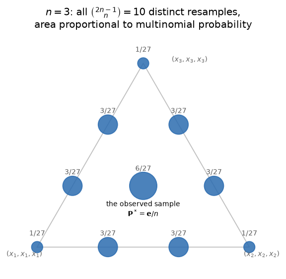
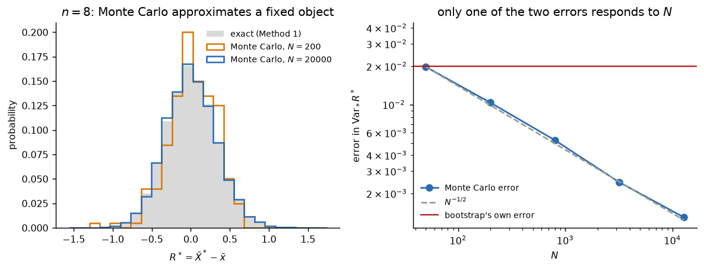
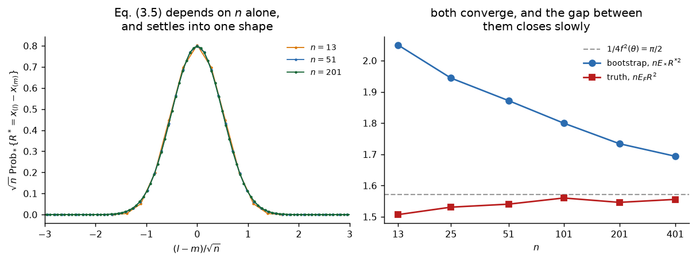
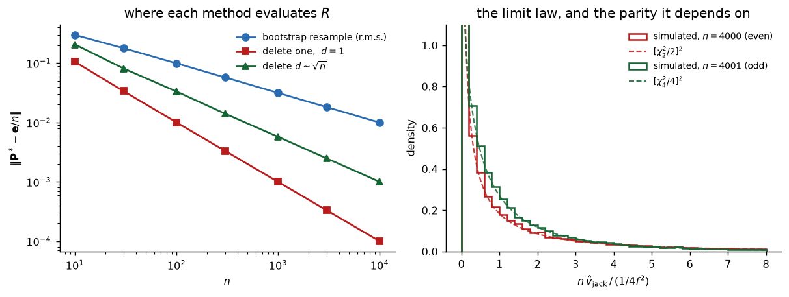

# The bootstrap, derived

Everything below is built in the order the pieces need each other, which is not the
order of Efron (1979). We start from the question the paper answers, show what stands in
the way of answering it, and let each obstacle dictate the next tool. The paper's
equation numbers appear at the end of a derivation, as a cross-reference, never as a
starting point.

One thread runs through all of it: **how smooth $R$ is as a function of the distribution
it is fed**. That single question decides which cases can be solved by hand, which need
simulation, and where the jackknife breaks. It is worth keeping in view from the first
section, where it will look like an idle remark.

## Contents

1. [The question, and why it has no direct answer](#1-the-question-and-why-it-has-no-direct-answer)
2. [Replacing what we do not know](#2-replacing-what-we-do-not-know)
3. [What a resample actually is](#3-what-a-resample-actually-is)
4. [The first case we can solve completely: the mean](#4-the-first-case-we-can-solve-completely-the-mean)
5. [One step up: the variance, and the first bias](#5-one-step-up-the-variance-and-the-first-bias)
6. [A statistic with no expansion: the median](#6-a-statistic-with-no-expansion-the-median)
7. [Linearising the bootstrap, and what it costs](#7-linearising-the-bootstrap-and-what-it-costs)

*(Sections 8–10 — the choice of coordinate, regression, and the inferential step the
bootstrap does not license — are still being written.)*

---

## 1. The question, and why it has no direct answer

We observe $\mathbf{X} = (X_1, \dots, X_n)$, independent and identically distributed
according to some $F$ on the real line, and we compute from them a statistic
$t(\mathbf{X})$ meant to estimate a quantity of interest $\theta(F)$. The estimate will
be wrong. The whole of what follows is about the size and shape of that error,

$$R(\mathbf{X}, F) \;=\; t(\mathbf{X}) - \theta(F).$$

Note what kind of object $R$ is: a random variable, because $\mathbf{X}$ is random, but
one whose definition also involves $F$ directly through $\theta(F)$. Both dependencies
matter and they are different in nature; keeping them apart is most of the conceptual
work in Section 2.

What we would like is the whole **sampling distribution** of $R$, because every question
we might ask is a functional of it:

$$\mathrm{bias} = E_F\,R, \qquad \mathrm{variance} = \mathrm{Var}_F\,R, \qquad
\text{interval endpoints} = \text{quantiles of } R .$$

Write $\Psi(F)$ for that distribution — the law of $R(\mathbf{X},F)$ when
$\mathbf{X} \sim F^{\otimes n}$. It is a perfectly well-defined object, and it is what we
are after. The difficulty is immediate and total: **$\Psi$ depends on $F$, which we do
not know.** Nothing else is in the way.

It is worth being precise about what "in the way" means here, because the obvious
reading is wrong. The obstacle is not that the calculation is hard. Suppose someone
handed us $F$. Then $\Psi(F)$ would be available in at least two ways: by analysis when
$R$ is simple enough, and otherwise by brute force, generating samples
$\mathbf{X}^{(1)}, \dots, \mathbf{X}^{(B)}$ from $F$, computing $R$ on each, and reading
off the histogram — as accurately as we care to, since $B$ is limited only by patience.

So the problem is not computational. It is that we are one object short, and that object
is $F$.

Two examples fix the scale of the difficulty. For the mean, $t(\mathbf{X}) = \bar X$ and
$\theta(F) = \int x \, dF$, classical theory gives
$\mathrm{Var}_F R = \sigma^2(F)/n$ — a complete answer, except that $\sigma^2(F)$ is
itself unknown and must be estimated. For the median the situation is worse: there is no
elementary closed form at all for finite $n$, only an asymptotic statement involving the
density of $F$ at the median, which is a far more delicate thing to estimate than a
variance.

The gap between those two examples is not an accident of which formulas happen to have
been worked out. It is the smoothness thread announced above, making its first
appearance: $\bar X$ depends on the data in the gentlest way imaginable, the median in a
way that ignores almost all of them.

## 2. Replacing what we do not know

If the only missing ingredient is $F$, the only possible move is to substitute something
for it. The question is what.

### 2.1 The empirical distribution

Having observed $\mathbf{X} = \mathbf{x} = (x_1, \dots, x_n)$, define $\hat F$ to be the
distribution placing mass $1/n$ on each observed value:

$$\hat F(t) \;=\; \frac{1}{n}\,\#\{\,i : x_i \le t\,\}.$$

This is not an arbitrary choice, and three separate arguments point at it.

**It is the nonparametric maximum likelihood estimate.** Consider any distribution $G$
as a candidate, and ask for the likelihood it assigns to the data. Any mass $G$ places
away from the observed points contributes nothing to that likelihood, so a maximiser
must put all its mass on $x_1, \dots, x_n$; say mass $p_i$ on $x_i$, with
$\sum_i p_i = 1$ and $p_i \ge 0$. The likelihood is then $\prod_{i=1}^n p_i$ (taking the
$x_i$ distinct for the moment), and by the arithmetic–geometric mean inequality

$$\prod_{i=1}^{n} p_i \;\le\; \left(\frac{1}{n}\sum_{i=1}^{n} p_i\right)^{\!n}
\;=\; \frac{1}{n^n},$$

with equality if and only if all the $p_i$ coincide, that is $p_i = 1/n$. So $\hat F$ is
the maximiser, and uniquely so. If some observations tie, the same argument applies to
the distinct values with their multiplicities and returns the same $\hat F$.

**It converges to $F$.** The Glivenko–Cantelli theorem gives
$\sup_t |\hat F(t) - F(t)| \to 0$ almost surely. Whatever we build on $\hat F$ is at
least built on something that approaches the right object.

**It is the centre of what is plausible.** Among all $F$ consistent with having observed
$\mathbf{x}$, none is better supported. This is the informal version of the first
argument, and it is the one Efron leans on.

### 2.2 The plug-in principle, applied to a distribution

Now the substitution. We wanted $\Psi(F)$; we compute instead

$$\widehat{\Psi} \;=\; \Psi(\hat F).$$

This is worth pausing on, because it is the whole idea of the paper and it is easy to
read past. Estimating $\theta(F)$ by $\theta(\hat F)$ is a reflex — it is what the sample
mean and the sample median already are. What is new here is applying that same reflex to
a functional whose **value is an entire distribution** rather than a number. There is no
new principle involved, only a new place to apply an old one.

Concretely, $\Psi(\hat F)$ is the law of

$$R^* \;=\; R(\mathbf{X}^*, \hat F) \;=\; t(\mathbf{X}^*) - \theta(\hat F),
\qquad X_1^*, \dots, X_n^* \;\overset{\text{iid}}{\sim}\; \hat F,$$

which is Efron's Eqs. (2.4)–(2.5). Sampling from $\hat F$ is sampling with replacement
from $\{x_1, \dots, x_n\}$, since $\hat F$ puts mass $1/n$ on each.

Two features of this expression are what make it computable, and both come from the same
place. First, $\theta(\hat F)$ is **known**: it is the functional evaluated at a
distribution we hold in our hands — for the mean it is $\bar x$, for the median the
sample median. The unknown constant that made $R$ inaccessible has become a number we
can print. Second, the law of $\mathbf{X}^*$ is known exactly, being a draw from a
finite distribution we specified ourselves.

### 2.3 Two levels of randomness

The notation now has to carry two different kinds of variability, and confusing them
makes everything that follows unintelligible.

- **Under $F$:** $\mathbf{X}$ is random, $\hat F$ is random (it is a function of
  $\mathbf{X}$), and $R$ is random. This is the level at which the original question
  lives.
- **Under $\hat F$, with $\mathbf{x}$ held fixed:** $\hat F$ is a *fixed, fully
  specified* distribution, and the only randomness is in the resampling. We write
  $E_*$, $\mathrm{Var}_*$, $\mathrm{Prob}_*$ for calculations at this level, following
  the paper.

The consequence deserves to be stated bluntly, because it contradicts the way the
bootstrap is usually described. **Given the data, the bootstrap distribution is not
random at all.** It is a deterministic function of $\mathbf{x}$ — a finite sum, as
Section 3 will make explicit. Simulation enters later, and only as a way of
approximating that sum; it is not part of the definition. A great deal of confusion
about what the bootstrap estimates dissolves once this is fixed.

### 2.4 Why this is the right kind of answer, and what it does not promise

The plug-in estimator $T(\hat F)$ of a quantity $\theta(F) = T(F)$ is called **Fisher
consistent** when $T(F) = \theta(F)$ for every $F$ in the model: fed the true
distribution, the recipe returns the true answer. Fisher (1922) introduced this in
preference to asymptotic consistency, which he found too weak a requirement — one can
degrade an estimator arbitrarily at any fixed $n$ without disturbing its limit.
Fisher consistency mentions no limit and no $n$; it is a statement about the recipe.

By construction, $\Psi(\hat F)$ is Fisher consistent for $\Psi(F)$. Were $\hat F$ equal
to $F$, the answer would be exactly right rather than approximately right. This is what
licenses the bootstrap as *the* natural answer rather than one heuristic among several:
any method that got the wrong answer when handed the true distribution would be
incoherent.

It is equally important that this guarantees nothing on its own. Fisher consistency is a
minimum standard, automatic for every plug-in estimator, and the bootstrap satisfies it
even in the cases where it is known to fail — the maximum of a uniform, parameters on
the boundary, distributions without a variance, dependent data. What fails there is not
$\Psi(F) = \Psi(F)$ but the **continuity** of $\Psi$: a small discrepancy between
$\hat F$ and $F$ produces a large discrepancy between the sampling distributions.

That continuity is the smoothness thread again, now in its sharpest form. We will meet
it as the difference between a statistic that can be linearised and one that cannot.

## 3. What a resample actually is

Section 2 left us with a finite object to compute. Here we describe it exactly, because
its structure governs both what can be enumerated and what has to be simulated.

### 3.1 The count vector

Drawing $X_i^*$ from $\hat F$ means drawing an index uniformly from $\{1, \dots, n\}$.
A resample is therefore fully described by an index vector, and — provided $t$ is
symmetric in its arguments, which every statistic we care about is — the order of those
indices is irrelevant. All that survives is how many times each observation was drawn:

$$N_i^* \;=\; \#\{\,j : X_j^* = x_i\,\}, \qquad \sum_{i=1}^n N_i^* = n .$$

Since the $n$ draws are independent and each lands in cell $i$ with probability $1/n$,

$$\mathbf{N}^* \;\sim\; \mathrm{Multinomial}\!\left(n; \tfrac{1}{n}, \dots, \tfrac{1}{n}\right),$$

which is the paper's Eq. (3.2). It is convenient to normalise and write
$\mathbf{P}^* = \mathbf{N}^*/n$, a point of the simplex
$\{\mathbf{p} : p_i \ge 0, \sum_i p_i = 1\}$. Then $\mathbf{P}^*$ *is* the resampled
empirical distribution, expressed in coordinates, and any symmetric statistic can be
written as a function $R(\mathbf{P}^*)$ of it alone.

The original sample sits at the centre of the simplex, $\mathbf{P}^* = \mathbf{e}/n$
with $\mathbf{e} = (1, \dots, 1)$. This is the vantage point from which everything in
Section 8 will be expanded, and it is why the multinomial parametrisation is worth
setting up now rather than when it becomes indispensable.

### 3.2 How many resamples, and with what probabilities

Two counts must be distinguished.

**Ordered draws.** There are $n^n$ index vectors, all equally likely. This is the honest
description of the sampling mechanism, and it is useless for enumeration: $n = 10$ gives
$10^{10}$.

**Distinct resamples.** Collapsing orderings, a resample is determined by the count
vector $\mathbf{N}^*$, so the number of distinct ones is the number of non-negative
integer solutions of $N_1 + \dots + N_n = n$. By the standard stars-and-bars argument —
arrange $n$ indistinguishable stars and $n-1$ bars in a row, each arrangement encoding
one solution — this is

$$\binom{2n-1}{\,n-1\,} \;=\; \binom{2n-1}{n}.$$

For $n = 10$ that is $92\,378$, against $10^{10}$ ordered draws: a reduction by five
orders of magnitude, and the difference between an enumeration that finishes and one
that does not.

**But they are not equally likely.** This is the trap, and it is worth stating as such
because the reduction just performed is so appealing that one is tempted to work with
the distinct resamples as if they formed a uniform sample space. The probability of a
given count vector is the multinomial one,

$$\mathrm{Prob}_*\{\mathbf{N}^* = (N_1, \dots, N_n)\}
\;=\; \frac{n!}{N_1!\,N_2!\cdots N_n!}\cdot\frac{1}{n^n},$$

the leading factor counting how many of the $n^n$ ordered draws collapse onto that
resample.

The spread is not a minor correction. Take $n = 3$: the resample $(x_1, x_2, x_3)$ that
uses each datum once has multiplicity $3!/(1!1!1!) = 6$ and probability $6/27$, while
$(x_1, x_1, x_1)$ has multiplicity $1$ and probability $1/27$. A sixfold difference at
$n=3$, and it grows quickly with $n$. Any enumeration that omits these weights is
computing a different — and wrong — resampling scheme.

Every distinct resample for $n=3$, positioned at its own $\mathbf{P}^*$, with area
proportional to the multinomial weight computed by `bootstrap_exact`. What to look at is
the spread: the centre — which *is* the observed sample, $\mathbf{P}^* = \mathbf{e}/n$ —
carries $6/27$, each corner $1/27$, the edges $3/27$. Ten points, three different
probabilities. Treating them as ten equally likely outcomes would put $2.7$ times too
little weight on the centre and $2.7$ times too much on the corners, which is to say it
would systematically overstate how wild a resample can be.

Monte Carlo, by contrast, gets the weights for free: drawing indices with replacement
produces each count vector with exactly its multinomial probability, without anyone
having to write the factorials down. This is the first of several places where
simulating is not merely easier than enumerating but structurally safer.

Both routes are implemented in [`bootstrap.py`](bootstrap.py) — `bootstrap_exact`
carries the weights explicitly, `bootstrap_mc` inherits them from the sampling — and
Section 6 will use their agreement as a check on both.

## 4. The first case we can solve completely: the mean

We now have a well-defined finite object. The natural next question is whether it can be
computed without simulation, and the answer depends entirely on $R$. We begin with the
case where everything works, both because it must be checked before anything harder and
because the way it works turns out to be the exception rather than the rule.

Take $t(\mathbf{X}) = \bar X$ and $\theta(F) = \int x\,dF$, so that
$R(\mathbf{X}, F) = \bar X - \theta(F)$. Since $\theta(\hat F) = \bar x$, the bootstrap
version is

$$R^* \;=\; \bar X^* - \bar x .$$

### 4.1 The bootstrap mean

Each $X_i^*$ is drawn from $\hat F$, so its expectation under $\hat F$ is the mean of
that distribution,

$$E_*\,X_i^* \;=\; \sum_{j=1}^n \frac{1}{n}\,x_j \;=\; \bar x,$$

and by linearity $E_*\bar X^* = \bar x$, giving

$$E_*\,R^* \;=\; 0 .$$

Exactly zero, for every sample, at every $n$. The bootstrap reports no bias here, which
is correct: $\bar X$ is unbiased for the mean. It is worth registering that this came out
*exactly* rather than approximately, since the cases to come will not be so obliging.

### 4.2 The bootstrap variance

The $X_i^*$ are independent under $\hat F$ — this is the point of resampling with
replacement, and it would fail without it — so variances add:

$$\mathrm{Var}_*\big(\bar X^*\big) \;=\; \frac{1}{n^2}\sum_{i=1}^n \mathrm{Var}_*\big(X_i^*\big)
\;=\; \frac{\mathrm{Var}_*\big(X_1^*\big)}{n}.$$

It remains to compute the variance of a single draw from $\hat F$. That is just the
variance **of the distribution $\hat F$**, which puts mass $1/n$ on each $x_j$ and has
mean $\bar x$:

$$\mathrm{Var}_*\big(X_1^*\big) \;=\; \sum_{j=1}^{n} \frac{1}{n}\,(x_j - \bar x)^2
\;=\; \frac{1}{n}\sum_{j=1}^{n}(x_j - \bar x)^2 \;=:\; \hat\sigma^2 .$$

Therefore

$$\boxed{\;\mathrm{Var}_*\,R^* \;=\; \frac{\hat\sigma^2}{n}
\;=\; \frac{1}{n^2}\sum_{i=1}^{n}(x_i - \bar x)^2\;}$$

which for data taking the values $0$ and $1$ collapses to $\bar x(1-\bar x)/n$, the
paper's Eq. (2.8), since then $\sum_i (x_i - \bar x)^2 = n\bar x(1-\bar x)$.

### 4.3 Why $1/n$ and not $1/(n-1)$

The divisor deserves an explanation, because every reflex trained on sample variances
says it should be $n-1$, and the reflex is wrong here for a reason worth internalising.

The $-1$ in the usual sample variance corrects a bias: $\bar x$ is estimated from the
same data, so the squared deviations are on average slightly too small, and $n-1$
compensates. **None of that applies here.** In the calculation above we were not
estimating anything. We were computing the exact variance of a completely specified
distribution, $\hat F$, whose mean is exactly $\bar x$ — not an estimate of its mean,
its actual mean. A distribution's variance is what it is, and there is no bias to correct.

The same conclusion arrives from the plug-in view of Section 2.4. The variance
functional is $T(G) = \int (x - \int u\,dG)^2 dG$, and $T(\hat F) = \hat\sigma^2$ with
the $1/n$. The version with $1/(n-1)$ is not $T(\hat F)$ for any functional $T$ at all:
the sample size appears in it explicitly, not merely through $\hat F$. It is therefore
not a plug-in estimator, and one should not expect the bootstrap — which is the plug-in
principle and nothing else — to produce it.

Every $1/n$ appearing throughout this implementation has this origin, and none of them
is an oversight.

### 4.4 What the answer is worth

It is instructive to compare with the truth. The quantity we actually wanted is
$\mathrm{Var}_F R = \sigma^2(F)/n$, and the bootstrap has returned $\hat\sigma^2/n$. The
two differ **only** in that $\sigma^2(F)$ has been replaced by $\hat\sigma^2$.

So in this case the bootstrap introduces no error of its own whatsoever: whatever it
gets wrong, it gets wrong solely because $\hat\sigma^2 \ne \sigma^2$. The resampling
apparatus has faithfully reproduced the classical formula and then inherited the one
estimation problem that formula already had.

That inheritance is not free of consequences. Since
$E_F[\hat\sigma^2] = \frac{n-1}{n}\sigma^2$, the bootstrap variance of the mean is
biased low by a factor $(n-1)/n$ — a 10% underestimate at $n = 10$. This is the mirror
image of what we will find for the median, where the bootstrap errs substantially in the
*other* direction, and the contrast between the two is diagnostic rather than
coincidental.

The exactness of this section is a consequence of $R^*$ being **linear** in
$\mathbf{P}^*$: writing $\bar X^* = \sum_i P_i^* x_i$ makes the dependence on the
resample affine, and expectations and variances of affine functions are available in
closed form with no approximation anywhere. Everything difficult in what follows is a
departure from that linearity, and the sections are ordered by how far each case departs.

Both panels are about the claim of Section 2.3, that the bootstrap distribution is fixed
once the data are. On the left, the grey bars are the exact distribution of
$R^* = \bar X^* - \bar x$ — all $\binom{15}{8} = 6435$ resamples with their weights — and
the two outlines are Monte Carlo with $N = 200$ and $N = 20\,000$. The outlines chase the
bars; the bars do not move. On the right, the same thing quantitatively: the Monte Carlo
error falls along a line of slope $-1/2$ over more than two decades, while the red line —
the distance from $\hat\sigma^2/n$ to the true $\sigma^2/n$, available here only because
we chose $F$ — does not respond to $N$ at all. Spending more computation buys the left
gap and never the right one.

*Verified numerically in [`bootstrap.py`](bootstrap.py): enumeration of all
$\binom{2n-1}{n}$ resamples reproduces $\hat\sigma^2/n$ to machine precision at
$n = 3, 5, 8, 10$, and Eq. (2.8) to twelve decimals.*

## 5. One step up: the variance, and the first bias

Section 4 solved the mean completely, and it is worth asking how much of that was the
method and how much was the statistic. Almost all of it was the statistic. Every step
went through because $\bar X^*$ is an **affine** function of the resampling proportions,
$\bar X^* = \sum_i P_i^* x_i$, and the moments of an affine function of a known
distribution are available with no approximation anywhere.

The natural test is the simplest statistic that is not affine. Take

$$t(\mathbf{X}) = \hat\sigma^2 = \frac{1}{n}\sum_{i=1}^n (X_i - \bar X)^2$$

estimating $\theta(F) = \sigma^2(F)$ — the plug-in variance of Section 4.3, with its
$1/n$ — so that $R^* = \hat\sigma^{2*} - \hat\sigma^2$. In terms of the resample,

$$\hat\sigma^{2*} \;=\; \sum_{i=1}^n P_i^* x_i^2 \;-\; \Big(\sum_{i=1}^n P_i^* x_i\Big)^{\!2},$$

a **quadratic** in $\mathbf{P}^*$. One degree up, and exactly one thing goes wrong.

### 5.1 The bootstrap finds a bias

Use the identity $\hat\sigma^{2*} = \frac{1}{n}\sum_i (X_i^*)^2 - (\bar X^*)^2$ and take
expectations under $\hat F$. Each $X_i^*$ is a draw from $\hat F$, so

$$E_*\,(X_i^*)^2 \;=\; \frac{1}{n}\sum_{j=1}^n x_j^2 \;=:\; \hat\mu_2',$$

the raw second moment of $\hat F$. The second term needs nothing new: Section 4.2 gave
$E_*\bar X^* = \bar x$ and $\mathrm{Var}_*\bar X^* = \hat\sigma^2/n$, so

$$E_*\,(\bar X^*)^2 \;=\; \mathrm{Var}_*\bar X^* + \big(E_*\bar X^*\big)^2
\;=\; \frac{\hat\sigma^2}{n} + \bar x^2 .$$

Subtracting, and using $\hat\mu_2' - \bar x^2 = \hat\sigma^2$,

$$E_*\,\hat\sigma^{2*} \;=\; \hat\sigma^2 - \frac{\hat\sigma^2}{n}
\;=\; \frac{n-1}{n}\,\hat\sigma^2,
\qquad\text{that is}\qquad
\boxed{\;E_*\,R^* \;=\; -\frac{\hat\sigma^2}{n}\;}$$

Not zero. This is the first non-zero bias in the development, and it is worth being
clear about what has just happened, because it is more than an algebraic curiosity.

**The answer is right.** The quantity the bootstrap is estimating is the true bias
$E_F\hat\sigma^2 - \sigma^2$, and since $E_F\hat\sigma^2 = \frac{n-1}{n}\sigma^2$ that
bias is $-\sigma^2/n$. The bootstrap has returned exactly this with $\sigma^2$ replaced
by $\hat\sigma^2$ — the plug-in principle once again, and this time we did not put it
in by hand. Section 4.3 argued that $1/n$ is the only divisor the plug-in principle can
produce and noted in passing that it is biased low; here the machinery **finds that
bias on its own**, having been told nothing but how to resample. It is the first thing
in this development that the bootstrap discovers rather than reproduces, and it is a
small model of what the method is for: we did not need to know that a bias existed in
order to measure it.

**Correcting it is not exact.** Subtracting the estimated bias gives
$\hat\sigma^2 - E_*R^* = \frac{n+1}{n}\hat\sigma^2$, while the unbiased estimator is
$\frac{n}{n-1}\hat\sigma^2$. Expanding,

$$\frac{n+1}{n} = 1 + \frac{1}{n},
\qquad
\frac{n}{n-1} = 1 + \frac{1}{n} + \frac{1}{n^2} + \cdots,$$

so the correction is right to first order and wrong at order $n^{-2}$ — because the
estimate of the bias is itself biased. Bootstrap bias correction is an asymptotic
device even when, as here, the bias under $\hat F$ is computed exactly.

### 5.2 The variance, and where the fourth moment comes from

For the second moment of $R^*$, shift the centre to $\bar x$ using the exact identity

$$\hat\sigma^{2*} \;=\; \underbrace{\frac{1}{n}\sum_{i=1}^n (X_i^* - \bar x)^2}_{A}
\;-\; \underbrace{(\bar X^* - \bar x)^2}_{B}.$$

Under $\hat F$ the terms of $A$ are independent and identically distributed, with

$$E_*\,(X_i^* - \bar x)^2 = \hat\sigma^2,
\qquad
E_*\,(X_i^* - \bar x)^4 = \hat\mu_4 := \frac{1}{n}\sum_{j=1}^n (x_j - \bar x)^4,$$

so $E_*A = \hat\sigma^2$ and

$$\mathrm{Var}_*A \;=\; \frac{\hat\mu_4 - \hat\sigma^4}{n}.$$

The correction term $B$ is small: $E_*B = \mathrm{Var}_*\bar X^* = \hat\sigma^2/n$ by
Section 4.2, so $B$ is of order $n^{-1}$ in mean and contributes to a variance at order
$n^{-2}$. Hence

$$\mathrm{Var}_*R^* \;=\; \frac{\hat\mu_4 - \hat\sigma^4}{n} \;+\; O(n^{-2}),$$

and carrying the $B$ terms to the end gives the exact expression

$$\mathrm{Var}_*R^* \;=\; \frac{(n-1)^2}{n^3}\,\hat\mu_4
\;-\; \frac{(n-1)(n-3)}{n^3}\,\hat\sigma^4 .$$

This is the classical finite-sample variance of a plug-in variance with every moment of
$F$ replaced by the corresponding moment of $\hat F$. Borrowing the classical identity
is legitimate here without any approximation whatsoever, and the reason is the one from
Section 2.3: under $\hat F$, with the data held fixed, the $X_i^*$ genuinely *are*
independent draws from a distribution whose moments we know exactly, so any identity
valid for iid sampling applies verbatim. It is the plug-in principle applied to a
formula rather than to a number.

### 5.3 What changed, and what it announces

Three things, and the third is what the next two sections are built on.

**A bias appeared, of order $1/n$.** It was identically zero for the mean and cannot be
zero here, and the reason is exactly the degree: the second-order term of an expansion
about the observed sample contributes to a mean, and a first-order term does not.
Section 7.3 will produce that statement in general, and this bias is the number it must
return.

**The answer now depends on a fourth moment.** $\hat\mu_4$ is a far noisier functional
of the data than $\hat\sigma^2$, being dominated by the extreme observations. So
although $\mathrm{Var}_*R^*$ is *exact given the data* — as exact as $\hat\sigma^2/n$
was in Section 4 — it is a considerably worse estimate of what we wanted. This is the
first place where "computed with no approximation under $\hat F$" and "close to the
truth" come apart. They are different claims, they were easy to conflate while the mean
was the only example, and Section 6 will separate them much further.

**The expansion we are going to build will be exact here.** $R^*$ is a quadratic
polynomial in $\mathbf{P}^*$, so a Taylor expansion about $\mathbf{P}^* = \mathbf{e}/n$
carried to second order has no remainder at all. That makes the variance the only
non-trivial case in which the machinery of Section 7 is not an approximation, and we
will use it there as a check with the arithmetic already done: whatever the general
formula says about bias must come out at $-\hat\sigma^2/n$.

*Verified in [`bootstrap.py`](bootstrap.py): enumerating every resample at
$n = 4, 6, 8, 10$ reproduces both boxed expressions to sixteen decimals.*

## 6. A statistic with no expansion: the median

Sections 4 and 5 went through because $R^*$ was a polynomial in $\mathbf{P}^*$, of
degree one and then two. The obvious next question is what degree three looks like, and
it is the wrong question. The interesting failure is not a higher degree but no degree
at all, and the statistic that exhibits it is the median. It is also the statistic
Efron's paper is organised around, and by the end of Section 7 it will be clear why: it
is the smallest example on which the bootstrap and its predecessor give different
answers, one of them right.

### 6.1 The median as a function of the weights

Take $n = 2m-1$ odd, so that the median is the single order statistic $x_{(m)}$ and no
averaging of two middle values is required. Attach weights $\mathbf{p}$ to the
observations and define the weighted median as the smallest $x_{(k)}$ whose cumulative
weight reaches one half. At $\mathbf{p} = \mathbf{e}/n$ the cumulative weight strictly
below $x_{(m)}$ is

$$\frac{m-1}{n} \;=\; \frac{n-1}{2n} \;=\; \frac{1}{2} - \frac{1}{2n},$$

so the answer stays at $x_{(m)}$ until some weight has moved by $\frac{1}{2n}$, and then
jumps to a neighbour. As a function of $\mathbf{p}$ the median is **locally constant**,
with jumps.

That is worth stating in the sharpest form available, because the usual description —
"the median is not smooth" — understates it in a way that will matter. The median is
not merely non-differentiable at $\mathbf{e}/n$; it is *flat* there, constant on a whole
neighbourhood, with every directional derivative equal to zero. There is nothing
irregular to expand and nothing pathological to work around: there is nothing at all.
We will collect on that in Section 7.4, and it is the single most useful thing to carry
forward from this section.

### 6.2 A different exact route

Non-differentiability closes one door, and the discreteness of $\hat F$ opens another. A
resample can only produce medians that are observed values, so

$$R^* \;=\; X^*_{(m)} - x_{(m)}$$

is supported on the $n$ numbers $x_{(1)} - x_{(m)}, \dots, x_{(n)} - x_{(m)}$, and the
distribution is known as soon as we have the $n$ probabilities.

Fix $l$ and ask when the resampled median exceeds $x_{(l)}$. The event
$\{X^*_{(m)} > x_{(l)}\}$ occurs exactly when fewer than $m$ of the $n$ draws land in
$\{x_{(1)}, \dots, x_{(l)}\}$: had $m$ or more landed there, the $m$-th smallest of the
resample would be one of them. Each draw lands there with probability $l/n$,
independently of the rest, so the number that do is $\mathrm{Binomial}(n, l/n)$ and

$$\mathrm{Prob}_*\{X^*_{(m)} > x_{(l)}\}
\;=\; \mathrm{Prob}\Big\{\mathrm{Bi}\big(n, \tfrac{l}{n}\big) \le m-1\Big\}.$$

The events for consecutive $l$ are nested — the resample median exceeding $x_{(l)}$
implies it exceeds $x_{(l-1)}$ — and the two differ precisely by the event
$\{X^*_{(m)} = x_{(l)}\}$. Differencing,

$$\mathrm{Prob}_*\{R^* = x_{(l)} - x_{(m)}\}
\;=\; \mathrm{Prob}\Big\{\mathrm{Bi}\big(n, \tfrac{l-1}{n}\big) \le m-1\Big\}
\;-\; \mathrm{Prob}\Big\{\mathrm{Bi}\big(n, \tfrac{l}{n}\big) \le m-1\Big\}.$$

These are Efron's Eqs. (3.4) and (3.5); the same result was obtained independently by
Maritz and Jarrett.

### 6.3 The data have disappeared

Look at what is on the right-hand side: $n$, $m$ and $l$. **No data.** The bootstrap
distribution of a sample median assigns exactly the same probabilities for every data
set of a given size; the observations enter only through the support, by fixing where
the atoms sit. For the mean they entered the answer itself, through $\hat\sigma^2$; here
the shape is universal and only the scale is estimated.

This is easy to mistake for a curiosity and it is not one. It says the median case can
be tabulated once and reused forever, which is what `median_pmf(n)` in
[`median.py`](median.py) does; and it makes the median the cheapest possible test of
the whole machinery, since the closed form above and a brute-force enumeration of all
$\binom{2n-1}{n}$ resamples are two entirely different computations that must agree to
the last digit. They do, to twelve decimals at $n = 5, 7, 9$, which validates at once
the binomial argument here and the multinomial weights of Section 3.2 — it would take a
conspiracy for two wrong routes to meet.

### 6.4 What it converges to

The distribution is exact but opaque: a difference of two binomial tails says little at
a glance. Let us find its limit.

Write $p = l/n$ and set $p = \frac{1}{2} + \frac{s}{\sqrt n}$, which is the scale on
which anything interesting happens. The count $\mathrm{Bi}(n,p)$ has mean
$np = \frac{n}{2} + s\sqrt n$ and standard deviation $\sqrt{np(1-p)} \to \frac{\sqrt n}{2}$,
so with $m - 1 = \frac{n-1}{2}$ the normal approximation gives

$$\mathrm{Prob}\Big\{\mathrm{Bi}(n,p) \le m-1\Big\}
\;\longrightarrow\;
\Phi\!\left(\frac{\frac{n}{2} - \frac{n}{2} - s\sqrt n}{\sqrt n / 2}\right)
\;=\; \Phi(-2s).$$

Therefore $\mathrm{Prob}_*\{X^*_{(m)} \le x_{(l)}\} \to \Phi(2s)$: the **rank** of the
resampled median is asymptotically normal about $m$ with standard deviation
$\frac{\sqrt n}{2}$.

It remains to convert ranks into values. Near the median the order statistics are spaced
by about $\frac{1}{n f(\theta)}$, because the empirical distribution function climbs at
rate $f$ there, so a displacement of $l - m$ ranks is a displacement of roughly
$\frac{l-m}{n f(\theta)}$ in value. With $l - m = s\sqrt n$ and $2s$ standard normal,

$$R^* \;\approx\; \frac{s \sqrt n}{n f(\theta)} \;=\; \frac{Z}{2\sqrt n\, f(\theta)},
\qquad Z \sim \mathcal{N}(0,1),$$

and hence

$$\boxed{\;n\,E_*(R^*)^2 \;\longrightarrow\; \frac{1}{4 f^2(\theta)}\;}$$

which is the right answer: the classical asymptotic variance of the sample median is
$\frac{1}{4n f^2(\theta)}$. The bootstrap is estimating the quantity we wanted and not
merely a stable one. This is the content of Efron's Eq. (3.7) and the sentence following
it.

On the left, Eq. (3.5) evaluated at three sample sizes and plotted against
$(l-m)/\sqrt n$, with the mass rescaled by $\sqrt n$. The three curves lie on top of one
another, which is the calculation just performed made visible: the rank of the resampled
median is normal on the scale $\sqrt n$, and nothing else about $n$ survives. What to
notice is that no data were involved in drawing any of them — this is Section 6.3, and
it is the reason a single figure can stand for every sample of size 13, 51 or 201.

On the right, the two quantities that converge to $\pi/2 = 1/4f^2(0)$ for
$F = \mathcal{N}(0,1)$: the truth $n E_F R^2$, which we can compute only because we
chose $F$, and the bootstrap estimate of it averaged over samples, which is all a
practitioner ever has. Both walk towards the dashed line and towards each other. The
gap between them at $n = 13$ is the thing worth looking at.

### 6.5 How far away the asymptote is

"Asymptotically correct" hides the distance to the asymptote, and for the median the
distance is large:

| $n$ | truth $n E_F R^2$ | bootstrap (mean) | ratio |
|---|---|---|---|
| 13 | 1.542 | 2.054 | 1.33 |
| 51 | 1.538 | 1.874 | 1.22 |
| 201 | 1.574 | 1.742 | 1.11 |

The bootstrap overestimates the squared error of a median by a third at $n = 13$ and by
a tenth at $n = 201$. Nothing is broken — both columns are converging to $\pi/2$ and to
each other — but slowly, and this is worth knowing before trusting a bootstrap standard
error for a median in a small sample.

It is also the mirror image of Section 4.4, where the bootstrap variance of the mean was
biased *low*, by the factor $\frac{n-1}{n}$ inherited from $E_F\hat\sigma^2$. Two
statistics, two biases of opposite sign, one method. The contrast is diagnostic rather
than coincidental: what the bootstrap inherits is whatever $\hat F$ gets wrong about
$F$, and a discrete $\hat F$ with $n$ atoms misrepresents a smooth $F$ in one direction
when the statistic averages everything and in the other when it depends on the local
spacing of a few central observations.

### 6.6 Table 1, and two numbers that do not reproduce

The paper's Monte Carlo comparison, its Table 1, tabulates for $n = 13$ and
$F = \mathcal{N}(0,1)$ the bootstrap expectation of

$$R(\mathbf{X}, F) \;=\; \frac{|t(\mathbf{X}) - \theta(F)|}{\sigma(F)},$$

the absolute error rather than the squared one — more stable — divided by a scale, so
that $R^*$ is scale invariant and the variation due to $\hat\sigma$ differing from
$\sigma(F)$ drops out. That is its Eq. (3.12). Computed as printed, over 200 trials, it
averages **0.287**, where the table reports **1.01**.

The discrepancy is a factor $3.6$, and $\sqrt{13} = 3.606$. Multiplying by $\sqrt n$
gives $1.016$. This is not an accident of one experiment: by Section 6.4 the absolute
error of a median shrinks like $n^{-1/2}$, so the unscaled quantity drifts to $0$ as $n$
grows and has no stable value to tabulate at any sample size. Only $\sqrt n\,R$ has.
**Eq. (3.12) is missing a factor $\sqrt n$**, and with it restored the column
reproduces: 20000 trials give AVE $1.011$ and S.D. $0.317$ against the paper's $1.01$
and $0.31$.

Nothing in the argument depends on this. $R^*$ is scale invariant either way, and that
invariance is the only property the section uses. But the factor has to be put back
before a single number of Table 1 can be reproduced.

The second number is the one the whole table is measured against. The paper states
$E_F R = 0.95$ (its Eq. 3.13) as the true value the columns are estimating. With the
scaling settled this can be simulated directly, and $400\,000$ samples of size 13 give

$$E_F R \;=\; 0.9822 \pm 0.0012,$$

which is not $0.95$. Nor is $0.95$ the asymptotic value: by Section 6.4 the median is
approximately $\mathcal{N}(0, \frac{\pi}{2n})$, so

$$\sqrt n \; E_F\big|\mathrm{median}\big|
\;\longrightarrow\; \sqrt n \cdot \sqrt{\frac{2}{\pi}} \cdot \sqrt{\frac{\pi}{2n}}
\;=\; 1,$$

approached from below. Nor does any other natural reading produce it: scaling by
$\sqrt{n-1}$ rather than $\sqrt n$ would give $0.943$, but then column (3.6) of Table 1
comes out at $0.971$ against its printed $1.01$, so no single convention reconciles both
of the paper's numbers at once.

**This is a discrepancy and not an error, and the distinction is worth being careful
about.** The gap is $0.03$. The paper does not say how $0.95$ was obtained, and a Monte
Carlo estimate over a few hundred trials — the scale of every other experiment in the
section — carries a standard error of about $0.025$, which places $0.95$ comfortably
within sampling error of $0.982$. The $\pm 0.0012$ above is the precision of *our*
computation and says nothing about how far the paper is from the truth; quoting it as
though it measured the paper's error would be a misuse of it, and an easy one to commit.

That is the difference between this and the missing $\sqrt n$ above. The factor is a
discrepancy internal to the paper — a printed definition and a printed table that cannot
both be right — and needs no external computation to establish. This one is a
disagreement between our number and theirs, and the honest report is the disagreement,
not a verdict.

Either way it changes how Table 1 reads and not what it concludes. Measured against
$0.95$ the plain bootstrap looks biased upward by 6%; measured against $0.982$, by 3%.
Every column moves together, so the conclusion — that the plain bootstrap does as well as
the smoothed and symmetrized versions — is untouched.

*All of Section 6 is checked in [`median.py`](median.py): the six probabilities Efron
prints for $n = 13$ to $7\times10^{-5}$, his printing precision; the closed form against
enumeration to twelve decimals; and both discrepancies above with the arithmetic that
settles them.*

## 7. Linearising the bootstrap, and what it costs

Three cases, three outcomes: exact and free for the mean, exact with a bias and a fourth
moment for the variance, and for the median a function that is flat and then jumps. In
every one the difficulty sat in the same place, in how $R$ depends on the resampling
proportions, and in the third case we evaded it entirely by exploiting a structure
peculiar to the median. That will not generalise.

What would generalise is to expand $R$ about the observed sample and keep two terms.
This section builds that expansion, checks it on the cases already solved, and applies
it to the median. The last of those is the reason the paper exists, because the
expansion turns out to be the jackknife — the method the bootstrap was proposed to
replace — so that comparing them is not a matter of taste between two procedures but of
comparing a function with its own linearisation.

### 7.1 The moments of a resample

Everything below needs the first two moments of $\mathbf{P}^*$, and Section 3.1 has
already supplied the distribution:
$\mathbf{N}^* \sim \mathrm{Multinomial}(n; \frac1n, \dots, \frac1n)$.
From the standard multinomial moments,

$$E\,N_i^* = 1, \qquad \mathrm{Var}\,N_i^* = n\cdot\frac1n\Big(1-\frac1n\Big) = 1 - \frac1n,
\qquad \mathrm{Cov}\,(N_i^*, N_j^*) = -n\cdot\frac{1}{n^2} = -\frac1n \;\;(i\ne j),$$

so dividing by $n$,

$$E_*\mathbf{P}^* = \frac{\mathbf{e}}{n},
\qquad
\mathrm{Cov}_*\,\mathbf{P}^* = \frac{\mathbf{I}}{n^2} - \frac{\mathbf{e}'\mathbf{e}}{n^3}.$$

This is Efron's Eq. (5.2). The negative off-diagonal is the simplex constraint making
itself felt: the proportions must sum to one, so they cannot all be large at once.

### 7.2 Differentiating on a simplex

We want to expand $R(\mathbf{P}^*)$ about $\mathbf{P}^* = \mathbf{e}/n$, and immediately
meet an obstacle of definition. $R$ is only defined for weight vectors summing to one,
so its partial derivatives — which ask what happens when one coordinate moves and the
others do not — are not defined at all.

The repair is to extend $R$ off the simplex in the only way that changes nothing:

$$R(\mathbf{p}) \;:=\; R\!\left(\frac{\mathbf{p}}{\sum_i p_i}\right),$$

for all $\mathbf{p}$ with non-negative entries, at least one positive. This is Efron's
Eq. (5.6). The extension is homogeneous of degree zero by construction, and that single
property forces three identities which we shall use repeatedly. Write

$$U_i = \frac{\partial R}{\partial p_i}\bigg|_{\mathbf{e}/n},
\qquad
V_{ij} = \frac{\partial^2 R}{\partial p_i \partial p_j}\bigg|_{\mathbf{e}/n}.$$

**First**, differentiate $R(c\,\mathbf{p}) = R(\mathbf{p})$ with respect to $c$ and set
$c = 1$. The chain rule gives $\sum_i p_i \,\partial_i R(\mathbf{p}) = 0$, for every
$\mathbf{p}$ — Euler's relation for a function of degree zero. Evaluating at
$\mathbf{p} = \mathbf{e}/n$ and multiplying by $n$,

$$\mathbf{e}\,\mathbf{U} \;=\; \sum_{i=1}^n U_i \;=\; 0 .$$

**Second**, differentiate that identity — which holds for all $\mathbf{p}$, so it may be
differentiated again — with respect to $p_j$:

$$\partial_j R(\mathbf{p}) + \sum_i p_i\, \partial_i\partial_j R(\mathbf{p}) \;=\; 0 .$$

At $\mathbf{p} = \mathbf{e}/n$ this reads $U_j + \frac1n\sum_i V_{ij} = 0$, that is

$$\mathbf{e}\,\mathbf{V} \;=\; -\,n\,\mathbf{U}' .$$

**Third**, summing the last identity over $j$ and using the first,
$\mathbf{e}\mathbf{V}\mathbf{e}' = -n\sum_j U_j = 0$.

These are Efron's Eq. (5.7), which the paper states as "easily shown". They are, but
they are also doing real work: each of the two calculations in Section 7.3 has a term
that survives only because one of them holds. And they are a check on any numerical
differentiation, since they follow from the homogeneity alone and have nothing to do
with the statistic — a violation is the differencing scheme's fault and never the
data's. In [`jackknife.py`](jackknife.py) they hold to $10^{-6}$.

### 7.3 Bias and variance to second order

Now expand:

$$R(\mathbf{P}^*) \;\doteq\; R\!\left(\frac{\mathbf{e}}{n}\right)
+ \Big(\mathbf{P}^* - \frac{\mathbf{e}}{n}\Big)\mathbf{U}
+ \frac{1}{2}\Big(\mathbf{P}^* - \frac{\mathbf{e}}{n}\Big)
\mathbf{V}\Big(\mathbf{P}^* - \frac{\mathbf{e}}{n}\Big)' ,$$

Efron's Eq. (5.4). Take the bootstrap expectation term by term. The linear term has mean
zero, since $E_*\mathbf{P}^* = \mathbf{e}/n$ exactly. For the quadratic term, the
expectation of a quadratic form is the trace of the matrix against the covariance:

$$E_*\,\frac{1}{2}\Big(\mathbf{P}^*-\frac{\mathbf{e}}{n}\Big)\mathbf{V}
\Big(\mathbf{P}^*-\frac{\mathbf{e}}{n}\Big)'
= \frac{1}{2}\,\mathrm{trace}\Big[\mathbf{V}\Big(\frac{\mathbf{I}}{n^2}
- \frac{\mathbf{e}'\mathbf{e}}{n^3}\Big)\Big]
= \frac{1}{2}\left[\frac{\mathrm{trace}\,\mathbf{V}}{n^2}
- \frac{\mathbf{e}\mathbf{V}\mathbf{e}'}{n^3}\right]
= \frac{\bar V}{2n},$$

where $\bar V = \frac1n\sum_i V_{ii}$ and the second piece vanished by the third
identity of Section 7.2. So

$$\boxed{\;E_*\,R(\mathbf{P}^*) \;\doteq\; R\!\left(\frac{\mathbf{e}}{n}\right)
+ \frac{\bar V}{2n}\;}$$

For the variance, keep the linear term alone — the quadratic one contributes at order
$n^{-2}$:

$$\mathrm{Var}_*\,R(\mathbf{P}^*) \;\doteq\;
\mathbf{U}'\left[\frac{\mathbf{I}}{n^2} - \frac{\mathbf{e}'\mathbf{e}}{n^3}\right]\mathbf{U}
\;=\; \frac{\sum_i U_i^2}{n^2} - \frac{\big(\sum_i U_i\big)^2}{n^3}
\;=\; \boxed{\;\frac{\sum_{i=1}^n U_i^2}{n^2}\;}$$

the last step by the first identity of Section 7.2. These are Efron's Eqs. (5.8) and
(5.10), and with $R = \theta(\hat F) - \theta(F)$, for which $R(\mathbf{e}/n) = 0$, they
become his Eq. (5.11) — the bias and variance formulas of Jaeckel's **infinitesimal
jackknife**. Nothing has been assumed about $R$ beyond its being twice differentiable at
$\mathbf{e}/n$, and no resampling appears anywhere in the two boxed expressions. That is
the point of them: they replace a distribution by two derivatives.

### 7.4 Two checks, and one collapse

The formulas can be tested on the three statistics already solved, and each tells us
something different.

**The mean.** $R(\mathbf{p}) = \frac{\sum_i p_i x_i}{\sum_i p_i} - \bar x$ gives
$U_i = x_i - \bar x$, which sums to zero as it must, and $\mathbf{V} = 0$ since $R$ is
affine on the simplex. The variance formula returns

$$\frac{\sum_i (x_i - \bar x)^2}{n^2} \;=\; \frac{\hat\sigma^2}{n},$$

which is Section 4.2 exactly, and the bias formula returns zero, which is Section 4.1
exactly. Here the expansion is not an approximation at all: an affine function is its
own first-order Taylor polynomial.

**The variance.** $R$ is quadratic, so the expansion terminates and is again exact —
this time with a genuine second-order term. Then the bias formula must reproduce
Section 5.1, which forces

$$\frac{\bar V}{2n} = -\frac{\hat\sigma^2}{n},
\qquad\text{that is}\qquad \bar V = -2\hat\sigma^2,$$

and the variance formula must reproduce the leading term of Section 5.2. Both hold. At
$n = 5$, numerical differentiation gives $\bar V = -1.32832870$ against
$-2\hat\sigma^2 = -1.32832853$, and $\sum_i U_i^2/n^2 = 0.104222328$ against
$(\hat\mu_4 - \hat\sigma^4)/n = 0.104222303$. The two sections were computed by entirely
different routes — one by taking expectations under $\hat F$, the other by
differentiating a weight functional — and they meet.

**The median.** By Section 6.1 the weighted median is constant on a neighbourhood of
$\mathbf{e}/n$. Therefore

$$U_i = 0 \quad\text{for every } i, \qquad V_{ij} = 0 \quad\text{for every } i,j,$$

not approximately but identically, and the variance formula returns

$$\mathrm{Var}_*R^* \;\doteq\; 0 .$$

The linearisation reports that the sample median has no sampling variability whatsoever
— for every sample, at every $n$. This is not a numerical accident and no choice of step
size mends it: the function is locally constant, so every sufficiently small step
returns the same zero, and [`jackknife.py`](jackknife.py) confirms it at step sizes
$10^{-2}$, $10^{-3}$ and $10^{-6}$ alike.

It is worth setting this beside the usual diagnosis. Efron's Remark J attributes the
failure to the derivative of $R$ being "too irregular for the jackknife's quadratic
extrapolation formulas to work". At $\hat F$ it is not irregular. It is absent, and the
formulas do not fail to converge — they return a definite and absurd answer.

### 7.5 The ordinary jackknife

The infinitesimal jackknife is unusable for the median because it looks at $R$
infinitesimally close to $\mathbf{e}/n$, where nothing happens. The ordinary jackknife
does the same thing with a finite step: instead of nudging the weight of $x_i$, delete
it outright. In the notation of Section 7.2 the deleted sample is the weight vector
$\mathbf{e}_{(i)}$, a vector of ones with a zero in position $i$ — no renormalisation
needed, that being what the homogeneous extension is for — and the finite-difference
analogue of $U_i$ is

$$\tilde U_i \;=\; (n-1)\big(R^*_{\cdot} - R^*_{(i)}\big),
\qquad R^*_{(i)} = R\Big(\frac{\mathbf{e}_{(i)}}{n-1}\Big),
\qquad R^*_{\cdot} = \frac1n\sum_i R^*_{(i)},$$

Efron's Eq. (5.12). The centring at the *average* is not optional: it is what makes
$\sum_i \tilde U_i = 0$, mirroring $\mathbf{e}\mathbf{U} = 0$, and hence what makes
$\sum_i \tilde U_i^2 / [n(n-1)]$ coincide with Tukey's variance formula
$\frac{n-1}{n}\sum_i (\hat\theta_{(i)} - \hat\theta_{(\cdot)})^2$. The gloss below
Eq. (5.12) in the paper prints $\hat\theta$ where it needs $\hat\theta_{(\cdot)}$; with
that reading the pseudo-values would not sum to zero.

Substituting the expansion into the definition gives

$$\tilde U_i \;\doteq\; \frac{n-2}{n-1}\,U_i - \frac{V_{ii} - \bar V}{2(n-1)},$$

Efron's Eq. (5.13), so $\tilde U_i / U_i = 1 + O(1/n)$ and the two jackknives agree to
that order. For the mean the discrepancy can be computed exactly: the ordinary jackknife
variance is $\frac{n}{n-1}$ times $\hat\sigma^2/n$, and the factor is the finite step
$1/(n-1)$ failing to be infinitesimal. This is the whole relationship between the three
methods, and it is worth stating once in full:

| | what it evaluates | where |
|---|---|---|
| bootstrap | $R$ itself | over the whole simplex |
| infinitesimal jackknife | the linearisation of $R$ | at the centre of the simplex |
| ordinary jackknife | the same linearisation | with slopes measured at the edges |

### 7.6 What the jackknife makes of the median

The ordinary jackknife survives the median because a deletion is a step of size
$1/(n-1)$, which is large enough to cross the boundary of the flat region. What it
crosses into, however, is very little.

Delete one observation from an odd sample $n = 2m-1$: the remainder has even size and
its median is the average of its two middle values. Which two depends only on where the
deleted point sat relative to $x_{(m)}$, so with

$$a = x_{(m)} - x_{(m-1)}, \qquad b = x_{(m+1)} - x_{(m)},$$

the $n$ leave-one-out medians take, relative to $x_{(m)}$, only three values:

$$\frac{b}{2}\;\;(m-1 \text{ times}), \qquad -\frac{a}{2}\;\;(m-1 \text{ times}),
\qquad \frac{b-a}{2}\;\;(\text{once}),$$

the last being what happens when the median itself is deleted. Their sum and sum of
squares are $S_1 = \frac{m(b-a)}{2}$ and
$S_2 = \frac{(m-1)(a^2+b^2)}{4} + \frac{(b-a)^2}{4}$, and since
$1 - \frac{m^2}{2m-1} = -\frac{(m-1)^2}{2m-1}$, the centred sum of squares is

$$S_2 - \frac{S_1^2}{n} \;=\; \frac{m-1}{4}\left[a^2 + b^2
- \frac{(m-1)(a-b)^2}{2m-1}\right].$$

Multiplying by $\frac{n-1}{n} = \frac{2(m-1)}{2m-1}$ gives the jackknife variance in
closed form,

$$\hat v_{\mathrm{jack}} \;=\; \frac{(m-1)^2}{2(2m-1)}
\left[a^2 + b^2 - \frac{(m-1)(a-b)^2}{2m-1}\right],$$

a function of **three order statistics**, however large $n$ is. That is the disease
stated exactly: $n - 3$ of the observations are not consulted.

Its consequence follows from letting $m$ grow. The bracket tends to
$a^2 + b^2 - \frac{(a-b)^2}{2} = \frac{(a+b)^2}{2}$ and the prefactor to $\frac{n}{8}$,
so

$$\hat v_{\mathrm{jack}} \;\sim\; \frac{n\,(a+b)^2}{16},
\qquad\text{that is}\qquad
n\,\hat v_{\mathrm{jack}} \;\sim\; \frac{\big[n(a+b)\big]^2}{16}.$$

Now $a$ and $b$ are the two spacings flanking the median. For a continuous $F$ with
$f(\theta) > 0$ the spacings near a fixed quantile, scaled by $n$, converge to
independent exponentials of mean $1/f(\theta)$, so

$$n(a+b) \;\xrightarrow{\;d\;}\; \frac{E_1 + E_2}{f(\theta)} = \frac{\Gamma(2,1)}{f(\theta)}
= \frac{\chi^2_4}{2 f(\theta)},$$

and therefore

$$\boxed{\;n\,\hat v_{\mathrm{jack}} \;\xrightarrow{\;d\;}\;
\frac{1}{4 f^2(\theta)}\left[\frac{\chi^2_4}{4}\right]^{2}\;}$$

The limit is a **random variable**, not a number. No amount of data makes the jackknife
settle: it converges in distribution to something with mean

$$E\left[\frac{\chi^2_4}{4}\right]^2 = \frac{E\,\Gamma(2,1)^2}{4} = \frac{6}{4} = 1.5$$

and variance $\frac{120 - 36}{16} = 5.25$, in units of the correct answer
$\frac{1}{4f^2}$ of Section 6.4. So the jackknife estimate of the variance of a median
is not consistent, is biased upward by 50% on average, and has a standard deviation more
than twice its own target. That is Efron's conclusion and the flagship argument of the
paper.

### 7.7 The same calculation for an even sample

Everything above assumed $n$ odd, which Section 6.1 adopted so that the median would be
a single order statistic. It is worth doing the even case as well, and not for
completeness: the answer changes.

Let $n = 2m$, so that $\hat\theta = \frac{x_{(m)} + x_{(m+1)}}{2}$. Deleting one
observation now leaves an *odd* sample, whose median is a single order statistic, and
the three-way split collapses to a two-way one: deleting any of the $m$ observations at
or below $x_{(m)}$ leaves the median at $x_{(m+1)}$, and deleting any of the $m$ at or
above $x_{(m+1)}$ leaves it at $x_{(m)}$. The middle case — deleting the median itself —
has no analogue, because there is no single median to delete.

With $d = x_{(m+1)} - x_{(m)}$ the $n$ replicates take two values, $\pm d/2$ about their
own mean, $m$ times each, so

$$\sum_i \big(\hat\theta_{(i)} - \hat\theta_{(\cdot)}\big)^2 = 2m\left(\frac{d}{2}\right)^2
= \frac{n d^2}{4},
\qquad
\hat v_{\mathrm{jack}} = \frac{n-1}{n}\cdot\frac{n d^2}{4} = \frac{(n-1)\,d^2}{4}.$$

Then $n\hat v_{\mathrm{jack}} \sim \frac{[n d]^2}{4}$, and a **single** spacing is
involved where the odd case had two, so $nd \to E/f(\theta)$ with $E$ one standard
exponential and

$$\boxed{\;n\,\hat v_{\mathrm{jack}} \;\xrightarrow{\;d\;}\;
\frac{1}{4f^2(\theta)}\left[\frac{\chi^2_2}{2}\right]^{2}\;}$$

of mean $E[E^2] = 2$ and variance $E[E^4] - 4 = 20$.

### 7.8 Which law is which

Putting Sections 7.6 and 7.7 side by side gives a single statement. The even case is
the standard one — it is what Efron prints, and it is what the usual treatments of why
the jackknife fails for quantiles derive; the odd case follows from the same argument
with one more spacing in it. What we have not found stated anywhere is the contrast:

$$\boxed{\;n\,\hat v_{\mathrm{jack}} \;\xrightarrow{\;d\;}\;
\frac{1}{4f^2(\theta)} \times
\begin{cases}
\big[\chi^2_2/2\big]^2, & n \text{ even},\\[4pt]
\big[\chi^2_4/4\big]^2, & n \text{ odd}.
\end{cases}\;}$$

The limiting law of the jackknife variance of a median **depends on the parity of the
sample size**, through nothing more than whether there is a middle observation to delete:

| | replicates take | spacings involved | limit, in units of $1/4f^2$ | mean | variance |
|---|---|---|---|---|---|
| $n$ even | 2 values | 1 | $[\chi^2_2/2]^2$ | 2 | 20 |
| $n$ odd | 3 values | 2 | $[\chi^2_4/4]^2$ | 1.5 | 5.25 |

The two entries in the last column are the same random variable seen once and averaged
twice: $n$ times a spacing at the median converges to an exponential of rate $f(\theta)$,
so one spacing contributes the square of an exponential and two contribute the square of
their mean. Averaging a second draw before squaring is what takes the mean from 2 to 1.5
and the variance from 20 to 5.25 — a quarter of the spread, bought with one observation
of sample size.

This is a curiosity rather than a hazard — the parity of a sample size is not something
one chooses on statistical grounds — but it is the kind of curiosity a resampling method
is supposed not to have, and neither law announces it. It has one practical edge: a
simulation reporting that the jackknife overestimates the variance of a median by a
factor 2, and another reporting 1.5, can both be right and be measuring the same thing.

This is worth stating carefully, because Section 3 of the paper prints
$\frac{1}{4f^2(\theta)}[\chi^2_2/2]^2$, "mean 2 and variance 20", in a section that has
assumed $n = 2m-1$ odd. **That law is the even one, and it is correct as a statement
about even samples.** What the sentence does not say is that the parity matters; read in
the setting where it appears, it names the wrong one of the two.

The two are easy to tell apart, both densities being elementary. Writing
$W = [\chi^2_2/2]^2$ and $W' = [\chi^2_4/4]^2$ and changing variables from the
exponential,

$$f_W(w) = \frac{e^{-\sqrt{w}}}{2\sqrt{w}},
\qquad
f_{W'}(w) = 2e^{-2\sqrt{w}} .$$

Simulating $40\,000$ samples at $n = 4000$ and at $n = 4001$ from $\mathcal{N}(0,1)$ and
computing $n\hat v_{\mathrm{jack}} / (\pi/2)$ from the closed forms separates them at
every quantile:

| | mean | var | $q_{.10}$ | $q_{.25}$ | $q_{.50}$ | $q_{.75}$ | $q_{.90}$ | $q_{.99}$ |
|---|---|---|---|---|---|---|---|---|
| simulated, $n = 4000$ (even) | 2.005 | 19.6 | 0.011 | 0.084 | 0.480 | 1.93 | 5.39 | 21.0 |
| $[\chi^2_2/2]^2$ | 2.002 | 19.8 | 0.011 | 0.082 | 0.481 | 1.92 | 5.31 | 21.2 |
| simulated, $n = 4001$ (odd) | 1.510 | 5.42 | 0.070 | 0.228 | 0.702 | 1.80 | 3.84 | 11.2 |
| $[\chi^2_4/4]^2$ | 1.502 | 5.24 | 0.071 | 0.231 | 0.705 | 1.81 | 3.78 | 11.1 |

Each simulated row tracks its own law and neither is a rounding of the other.

Note also that the odd case, the one Efron's section is set in, is the *milder* of the
two: with a second spacing averaged in, the estimate is biased by 50% rather than 100%
and is a quarter as variable. The argument is therefore conservative where it is made,
and its conclusion — that the jackknife is not even consistent for the median — holds in
both parities, since a random limit is a random limit either way.

One remark on how this was found, since it is a lesson rather than a result. The parity
was invisible from the code for as long as the code enforced odd $n$. `median_pmf`
requires it, because Section 6.2 needs a single middle order statistic; the jackknife
closed form inherited the requirement for no reason at all, and with it the
impossibility of ever observing the even case. An implementation that refuses the inputs
on which a claim would fail cannot be used to test that claim, and that is not a remark
about this implementation in particular.

### 7.9 Where each method looks

There is a single quantity behind everything in this section, and it is worth extracting
because it explains both the failure and its repair: **how far from $\mathbf{e}/n$ each
method evaluates $R$.**

For a bootstrap resample, Section 7.1 gives the mean square displacement directly,

$$E_*\Big\|\mathbf{P}^* - \frac{\mathbf{e}}{n}\Big\|^2
= \sum_{i=1}^n \mathrm{Var}_*P_i^* = n\cdot\frac{1}{n^2}\Big(1-\frac1n\Big)
= \frac{n-1}{n^2},
\qquad\text{r.m.s.} = \frac{\sqrt{n-1}}{n} \sim n^{-1/2}.$$

For a deletion of $d$ observations the weight vector carries $\frac{1}{n-d}$ on $n-d$
coordinates and zero on $d$, so

$$\Big\|\mathbf{p} - \frac{\mathbf{e}}{n}\Big\|^2
= (n-d)\left(\frac{1}{n-d} - \frac1n\right)^2 + \frac{d}{n^2}
= \frac{d^2}{n^2(n-d)} + \frac{d}{n^2}
= \frac{d}{n(n-d)} .$$

At $d = 1$ that is $\frac{1}{\sqrt{n(n-1)}} \sim n^{-1}$. The jackknife therefore
evaluates $R$ an order of magnitude closer to the observed sample than the bootstrap
does — this is Efron's Eq. (8.14) — and for the median $n^{-1}$ is precisely the scale
of the flat region of Section 6.1. The jackknife lives on the boundary of the region
where nothing happens, which is why its answer is decided by whether one deletion
happens to cross, and hence by three order statistics. The bootstrap operates at
$n^{-1/2}$, far outside, where the resampled median has moved by many order statistics
and averages over all of them.

Stated that way the repair suggests itself, and it is the one Remark J proposes: delete
in groups. Deleting $d$ at a time moves out to $\sqrt{d}/n$, so $d \sim \sqrt n$ reaches
$n^{-3/4}$ and $d \sim cn$ reaches the bootstrap's own $n^{-1/2}$. The prediction is
that a *fixed* $d$ cannot help, however large, and that a growing one must. Both hold:
computing the delete-$d$ variance exactly — the retained median's position is negative
hypergeometric, so all $\binom nd$ deletions can be summed rather than sampled — gives,
for $F = \mathcal{N}(0,1)$ and 2000 trials, mean and standard deviation of
$n\hat v$ as follows.

| $n$ | $d = 2$ | $d \sim \sqrt n$ | $d \sim n^{3/5}$ | bootstrap |
|---|---|---|---|---|
| 101 | 2.687 (3.82) | 2.058 (1.74) | 1.929 (1.39) | 1.719 (0.75) |
| 401 | 2.724 (4.02) | 1.975 (1.43) | 1.860 (1.14) | 1.644 (0.54) |
| 1601 | 2.843 (4.28) | 1.865 (1.12) | 1.779 (0.86) | 1.624 (0.37) |
| 6401 | 2.718 (4.10) | 1.750 (0.91) | 1.682 (0.68) | 1.586 (0.26) |

At $d = 2$ the estimator is as lost as at $d = 1$, since two deletions still move
$\mathbf{P}^*$ by $O(1/n)$. Letting $d$ grow repairs it, faster for the faster rule, and
the constants are poor: at $n = 6401$ the $\sqrt n$ rule is still 11% high and 3.5 times
as variable as the bootstrap, which needed neither a repair nor a choice of
$d$.

The left panel is the calculation just performed: three straight lines on a log-log
plot, of slopes $-\tfrac12$, $-1$ and $-\tfrac34$. What to look at is not the values but
the separation — the gap between the blue and red lines is the entire content of Remark
J, and the green line is the repair placed deliberately between them.

The right panel settles Section 7.8. Two simulations, at $n = 4000$ and $n = 4001$, each
against the elementary density derived for its own parity — drawn, not fitted. What to
look at is that the two outlines do not coincide: one sample size apart, the same
estimator on the same distribution converges to two different laws, and each follows its
own. The red pair has a singularity at the origin and a heavier tail; the green pair,
which averages a second spacing, has neither.

*Verified in [`jackknife.py`](jackknife.py): the identities of Eq. (5.7) to $10^{-6}$;
Eqs. (5.14)–(5.15), the paper's only worked derivatives, to $2\times 10^{-7}$; the mean
and variance checks of Section 7.4; the collapse to zero for the median; the closed
forms of Sections 7.6 and 7.7 against both a brute-force deletion and Eq. (5.12), at
$n = 5, 8, 9, 12, 13, 25$ and to ten decimals, which is where the two-valued and
three-valued cases sit side by side; and the delete-$d$ estimator against an enumeration
of all $\binom92$ deletions.*

With that, the thread announced at the start of this document is closed. How smooth $R$
is as a function of the distribution it is fed decided everything: it decided that the
mean could be solved by hand, that the variance could be solved with a bias, that the
median needed a construction of its own, and that the jackknife — which is nothing but
the first two terms of a Taylor series — had to fail on exactly the third. What remains
is a different question, and Section 8 begins it: not how $R$ depends on $\hat F$, but
which $R$ we should have chosen in the first place.
