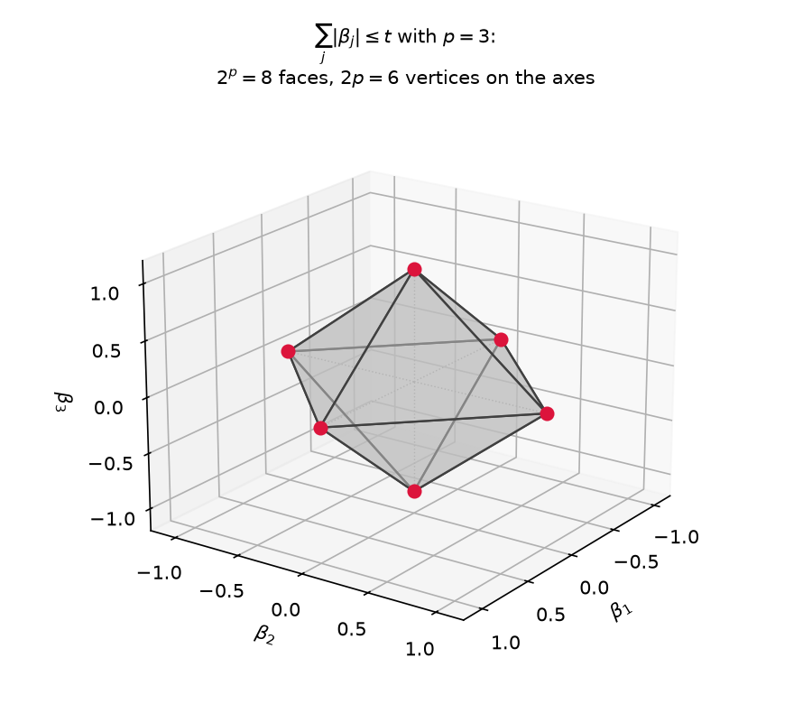
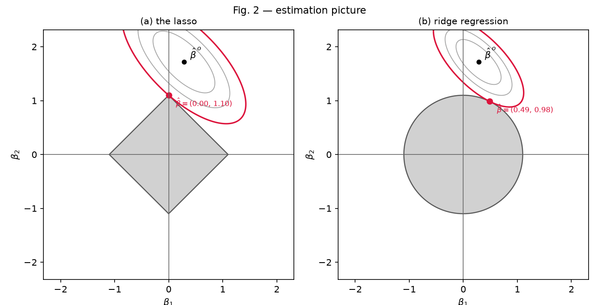
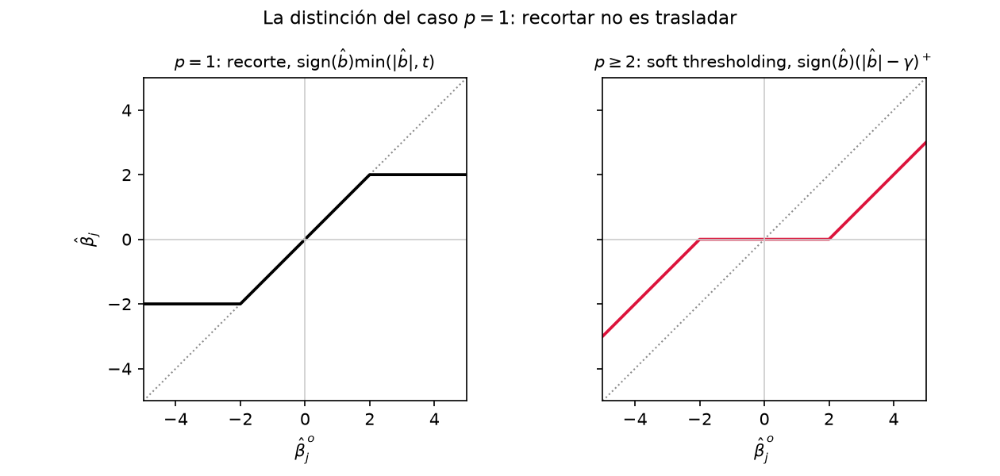
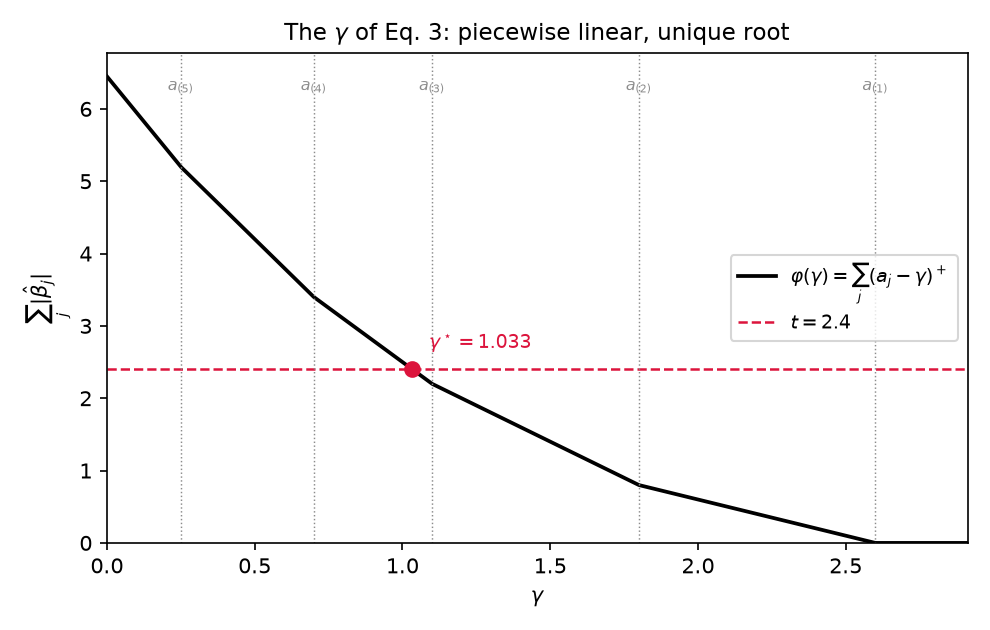
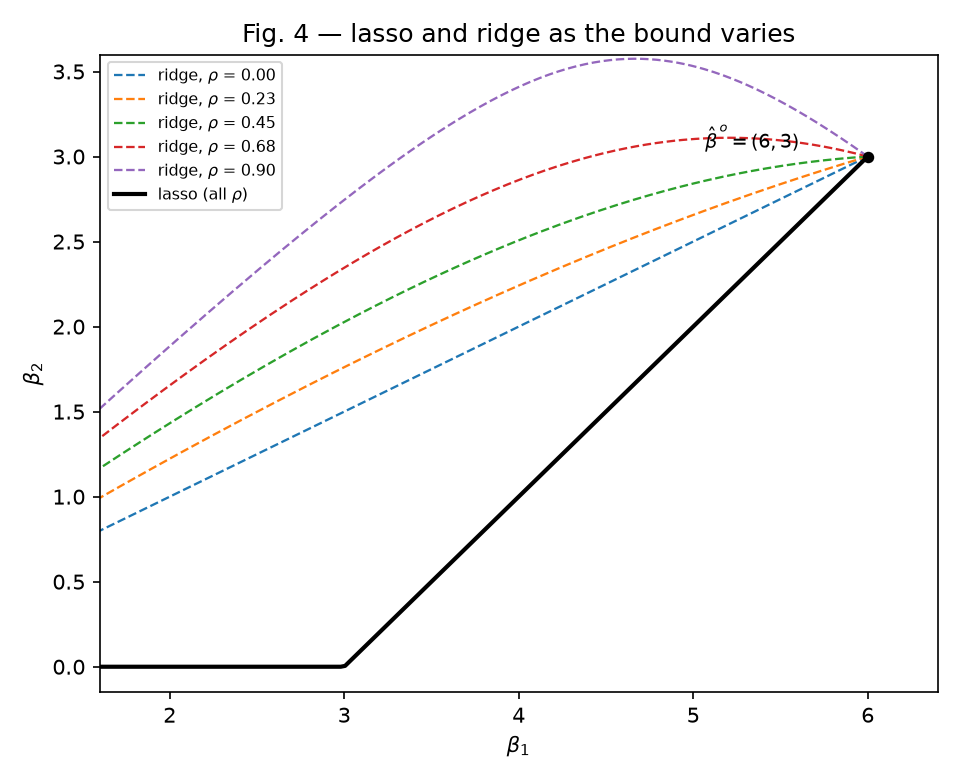
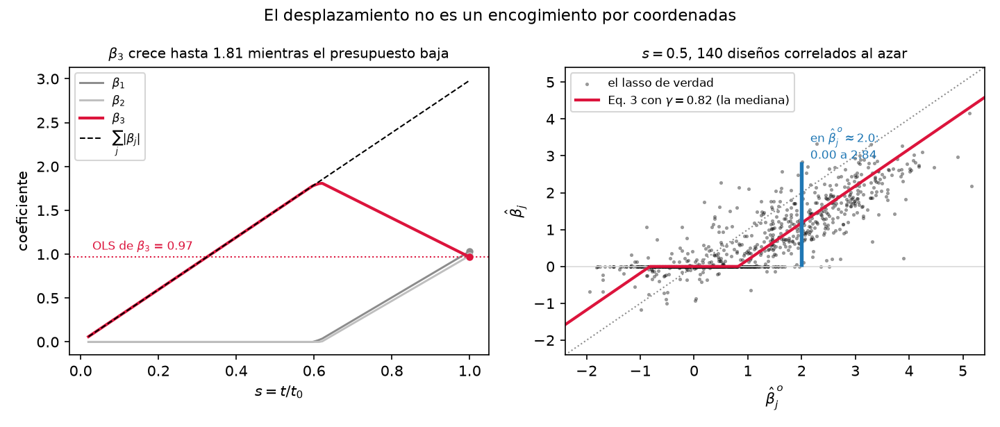
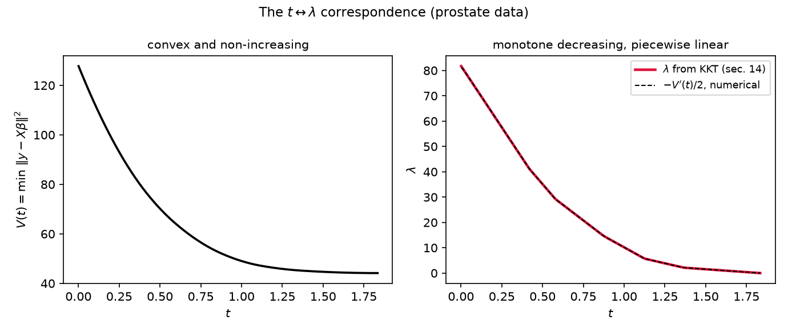
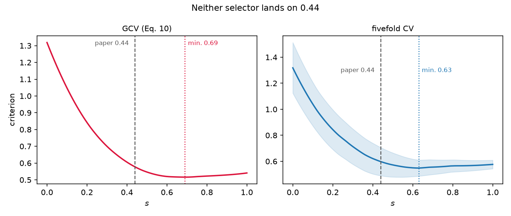
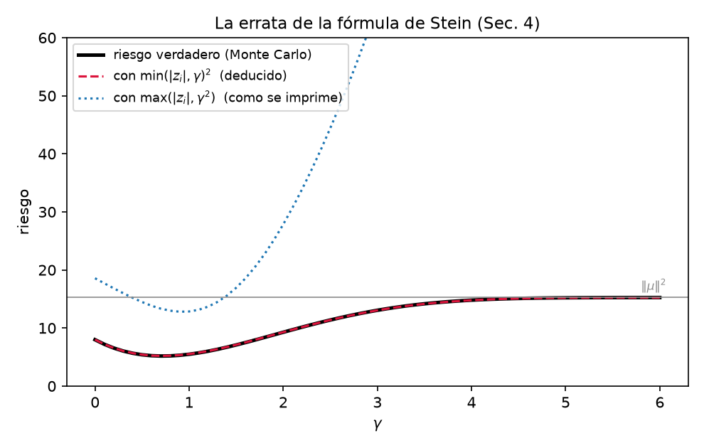
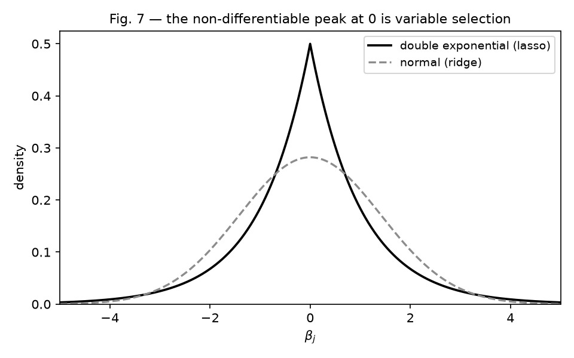

# The lasso — a full derivation

From the definition to the algorithm and to the choice of the parameter. The order
is the order of construction: we state the problem, look at its shape, solve it
completely in the cases that allow it, see what survives when the hypotheses are
lifted, and only then attack the general case.

**Notation.** $X$ is $N\times p$ with standardized predictors,
$\sum_i x_{ij}/N = 0$ and $\sum_i x_{ij}^2/N = 1$; $y$ is centred;
$S = X^\top X$ (with that normalisation $S$ has **diagonal $N$**, not 1);
$\hat\beta^{o}$ is the least squares estimate. References to Tibshirani (1996) are
made in passing, as anchor points.

The figures are **computed with the solver** of this implementation, not drawn:
each one checks what it accompanies. They are produced by
[derivation_figures.py](derivation_figures.py) and by the scripts for the paper's
own figures.

---

### Part I — The problem and its shape
&nbsp;&nbsp;1. [Statement, and why the intercept drops out](#s1)
&nbsp;&nbsp;2. [The squared error is an ellipsoid, and the lasso a projection](#s2)
&nbsp;&nbsp;3. [The feasible region is a polytope with corners on the axes](#s3)
&nbsp;&nbsp;4. [The useful range of the budget](#s4)

### Part II — Solving it where it can be solved
&nbsp;&nbsp;5. [A single predictor: non-differentiability appears](#s5)
&nbsp;&nbsp;6. [Orthonormal design: the problem separates](#s6)
&nbsp;&nbsp;7. [The multiplier, exactly](#s7)
&nbsp;&nbsp;8. [The other three shrinkage rules, for free](#s8)

### Part III — What survives with correlated predictors
&nbsp;&nbsp;9. [Two predictors: the eigenvector that erases the correlation](#s9)
&nbsp;&nbsp;10. [How far it holds, and ridge in the same mirror](#s10)
&nbsp;&nbsp;11. [Why $p>2$ breaks the symmetry](#s11)

### Part IV — The general case
&nbsp;&nbsp;12. [From the geometry to the algorithm](#s12)
&nbsp;&nbsp;13. [Why it stops, why it is optimal and why the zeros are exact](#s13)
&nbsp;&nbsp;14. [Least squares on the active set, minus a bias](#s14)

### Part V — Choosing the budget
&nbsp;&nbsp;15. [The correspondence between constraining and penalising](#s15)
&nbsp;&nbsp;16. [What we would like to minimise](#s16)
&nbsp;&nbsp;17. [One linearisation with two consequences](#s17)
&nbsp;&nbsp;18. [From leave-one-out cross-validation to GCV](#s18)
&nbsp;&nbsp;19. [Stein's risk, which the orthonormal case already allows](#s19)

### Part VI — The same thing from somewhere else
&nbsp;&nbsp;20. [The Laplace prior](#s20)

---

# Part I — The problem and its shape

<a name="s1"></a>
## 1. Statement, and why the intercept drops out

The object is

```math
\min_{\alpha,\beta}\ \sum_{i=1}^N\Big(y_i-\alpha-\sum_j\beta_jx_{ij}\Big)^2
\qquad\text{subject to}\qquad \sum_j|\beta_j|\le t .
```

Before anything else it is worth getting $\alpha$ out of the way, and we can:
**the constraint does not touch it**. For fixed $\beta$ we minimise over $\alpha$
without any constraint at all,

```math
\frac{\partial}{\partial\alpha}\sum_i\Big(y_i-\alpha-\sum_j\beta_jx_{ij}\Big)^2=0
\quad\Longrightarrow\quad
\alpha=\bar y-\sum_j\beta_j\bar x_j,
```

and since the predictors are centred, $\bar x_j=0$, so $\hat\alpha=\bar y$
**whatever $\beta$ is**, and therefore whatever $t$ is.

So centring $y$ makes the intercept disappear and leaves a clean problem in
$\beta$:

```math
\min_\beta\ \|y-X\beta\|^2\qquad\text{subject to}\qquad \sum_j|\beta_j|\le t .
```

Everything that follows works with this form. Two objects to look at separately:
the **objective function** and the **feasible region**.

---

<a name="s2"></a>
## 2. The squared error is an ellipsoid, and the lasso a projection

Let us begin with the objective, and first establish the only property of the least
squares fit that we shall need.

**The least squares residual is orthogonal to every column.** Differentiating the
squared error with respect to one coefficient,

```math
f(\beta)=\sum_i\Big(y_i-\sum_j x_{ij}\beta_j\Big)^2,
\qquad
\frac{\partial f}{\partial\beta_k}=-2\sum_i x_{ik}\Big(y_i-\sum_j x_{ij}\beta_j\Big)
=-2\,(X^\top r)_k ,
```

so that setting the $p$ derivatives to zero at the minimum is exactly

```math
X^\top r^o=0,\qquad r^o:=y-X\hat\beta^o,
```

or, rearranging, $X^\top X\hat\beta^o=X^\top y$. These are the **normal equations**,
and they are not an independent fact: they are the optimality condition of least
squares written another way.

Geometrically they say the obvious. The set $`\{X\beta:\beta\in\mathbb R^p\}`$ is the
column space of $X$, and minimising $`\|y-X\beta\|^2`$ means finding the point of that
space closest to $y$, that is, the **orthogonal projection** of $y$. The vector
joining a point to its projection is perpendicular to the subspace, and therefore to
each of its generators — the columns. Hence the name: *normal* = perpendicular.

There is a third argument, with neither calculus nor geometry, that explains why it
has to be so. If correlation were left over, $x_k^\top r=c\ne0$, then moving
$\beta_k$ by $\varepsilon$ turns the residual into $r-\varepsilon x_k$ and

```math
\|r-\varepsilon x_k\|^2=\|r\|^2-2\varepsilon c+\varepsilon^2\|x_k\|^2,
```

which at $`\varepsilon=c/\|x_k\|^2`$ equals $`\|r\|^2-c^2/\|x_k\|^2<\|r\|^2`$: we could
have done better. That is, **correlation left in the residual is error that could
still be removed**, and at the minimum none can remain. Keep this reading in mind,
because in section 14 we shall see that the lasso **does leave correlation
unextracted**, on purpose, and exactly how much.

**Now the objective.** Splitting off from the residual the part least squares
explains,

```math
y - X\beta = r^o + X(\hat\beta^o-\beta),
```

the cross term vanishes by the above, and moreover **identically in $\beta$**, which
is what makes this a global identity and not a local approximation:

```math
2\,r^{o\top}X(\hat\beta^o-\beta)=2\big[X^\top r^o\big]^\top(\hat\beta^o-\beta)=0 .
```

What remains is

```math
\boxed{\ \|y-X\beta\|^2=\underbrace{\|y-X\hat\beta^o\|^2}_{\text{constant}}+(\beta-\hat\beta^o)^\top S\,(\beta-\hat\beta^o).\ }
```

This **completely changes what the problem is**. The objective is not "a sum of
squares over the data": it is the **distance to the least squares estimate measured
in the metric $S$**, plus a constant that does not depend on $\beta$. That is:

> The lasso is the **projection of $\hat\beta^{o}$ onto the feasible region**, in the
> metric defined by $X^\top X$.

Three immediate consequences that we shall use without proving them again:

- The level sets are **concentric ellipsoids centred at $\hat\beta^o$**, with shape
  given by $S$. Minimising means inflating the ellipsoid from $\hat\beta^o$ until it
  touches the feasible region.
- The Hessian is $2S\succeq0$, so the problem is **convex**; and if $S\succ0$ it is
  strictly convex and **the minimum is unique**. This is why any correct method gives
  the same answer, and why we can compare implementations.
  (If $X$ is not of full rank, $\hat\beta^o$ is not unique, but the projection
  $X\hat\beta^o$ is, and hence so is $r^o$: the identity still stands. The paper
  notes this in passing — *"the design matrix need not be of full rank"*.)
- All the information in the data enters through only two objects, $\hat\beta^o$
  and $S$.

**The metric is not decorative, and it is worth spending a paragraph on why.** The
boxed identity invites a shortcut: if the lasso is the nearest feasible point to
$\hat\beta^o$, why not compute $\hat\beta^o$ once and take the nearest point of the
region in the ordinary sense? That projection is not even expensive — sort the
coordinates and subtract the threshold that saturates the budget, $O(p\log p)$ and no
iteration at all.

The shortcut is exact when $S=I$, and that is no accident: it is the orthonormal case
of section 6, where the lasso will turn out to *be* that thresholding rule. So the
temptation is not wrong, it is the case already solved. Everywhere else it replaces
the ellipsoid by a sphere and therefore discards the only thing the third consequence
above says matters besides $\hat\beta^o$ — namely $S$. Since those two objects
determine the problem, a four-predictor design with

```math
S/N=\begin{pmatrix}
1 & 0.707 & -0.197 & -0.553\\
0.707 & 1 & -0.214 & -0.169\\
-0.197 & -0.214 & 1 & 0.567\\
-0.553 & -0.169 & 0.567 & 1
\end{pmatrix},
\qquad
\hat\beta^{o}=(-0.244,\ 0.598,\ -1.203,\ 0.228)
```

is enough to settle it. Taking $t=0.6\sum_j|\hat\beta_j^o|=1.3638$ and writing the
excess over least squares as the quadratic form of the identity,
$(\beta-\hat\beta^o)^\top S(\beta-\hat\beta^o)$:

| | $\beta_1$ | $\beta_2$ | $\beta_3$ | $\beta_4$ | $L_1$ | excess |
|---|---|---|---|---|---|---|
| lasso | $0$ | $0.311$ | $-0.990$ | $0.063$ | $1.3638$ | $13.191$ |
| Euclidean projection | $-0.017$ | $0.370$ | $-0.975$ | $0.001$ | $1.3638$ | $13.982$ |

Both spend the budget down to the last displayed digit, and the Euclidean point fits
**worse** — $0.791$ more, some 6 per cent. That settles it without any appeal to
optimality theory: there exists a feasible point with the same $L_1$ norm and a
smaller error, so the Euclidean projection does not solve Eq. (1). It solves a
different problem that happens to share its feasible region.

And the two do not even keep the same variables. The lasso annihilates $x_1$ and
keeps $x_4$; the Euclidean projection does the reverse. The reason is legible in $S$:
$x_1$ correlates $0.707$ with $x_2$, which already represents most of it, so the lasso
prefers to spend the budget elsewhere — an argument about *pairs* of columns that a
sphere cannot make, because Euclidean distance weighs each coordinate of
$\hat\beta^o$ in isolation. This is the first appearance of something that will not go
away: what the lasso drops depends on the whole correlation structure and not on the
size of the individual coefficients.

**Where this reading stops holding.** All of the above needs $S\succ0$ for
$`\langle\cdot,\cdot\rangle_S`$ to be an inner product. If $p>N$ the matrix is singular,
$`\|\cdot\|_S`$ is only a semi-norm, and the level sets are not ellipsoids but
cylinders, unbounded in the null directions. A minimum still exists, because the
polytope is compact and the objective continuous, but it need not be unique: the
argmin can be a whole face. The word *projection* then loses its literal sense while
the problem remains perfectly well posed — which is worth flagging because $p>N$ is
the regime the lasso would later be used for most, and one the paper does not treat.
(Its exact characterisation is much later: R. J. Tibshirani, *The lasso problem and
uniqueness*, 2013.)

**And a fourth consequence, which deserves its own derivation**, because it is the property the
paper announces in the abstract — that the lasso has *"the stability of ridge
regression"* — and then leaves to the simulations of Sec. 7, when it can be proved
right here. The word "projection" above is not a manner of speaking: it is a
projection in the literal sense, with respect to the inner product

```math
\langle u,v\rangle_S=u^\top S v,\qquad \|u\|_S=\sqrt{u^\top S u},
```

which is a genuine inner product whenever $S\succ0$. And projections onto convex
sets have a property that depends on nothing else.

**The obtuse angle.** Let $C$ be closed and convex and let $z$ be the point of $C$
closest to $x$. For any $w\in C$ and any $\theta\in(0,1]$, the point $z+\theta(w-z)$
also lies in $C$ by convexity, and so cannot be closer:

```math
\|x-z-\theta(w-z)\|^2\ \ge\ \|x-z\|^2 .
```

Expanding, $`-2\theta\langle x-z,\,w-z\rangle+\theta^2\|w-z\|^2\ge0`$, and dividing by
$\theta>0$,

```math
\langle x-z,\,w-z\rangle\ \le\ \tfrac{\theta}{2}\|w-z\|^2 .
```

Since this holds for arbitrarily small $\theta$, letting $\theta\to0^+$ gives

```math
\boxed{\ \langle x-z,\ w-z\rangle\le0\qquad\text{for every }w\in C.\ }
```

In words: seen from the projection, the vector pointing back to the original point
makes an obtuse angle with any direction that enters $C$. It is what the picture of
projecting says, written down.

**From there, non-expansiveness.** Take two responses $y_1,y_2$, their least squares
estimates $x_1,x_2$ and their lassos $z_1,z_2$. Applying the above twice, once at
each point, taking as $w$ the projection of the other:

```math
\langle x_1-z_1,\ z_2-z_1\rangle\le0,
\qquad
\langle x_2-z_2,\ z_1-z_2\rangle\le0 .
```

Adding them, and writing $u=x_1-x_2$ and $v=z_1-z_2$, the two terms combine into
$`\langle u-v,\,-v\rangle\le0`$, that is $`\|v\|^2\le\langle u,v\rangle`$. And by
Cauchy–Schwarz $`\langle u,v\rangle\le\|u\|\,\|v\|`$, so $`\|v\|\le\|u\|`$:

```math
\big\|\hat\beta(y_1)-\hat\beta(y_2)\big\|_S\ \le\ \big\|\hat\beta^o(y_1)-\hat\beta^o(y_2)\big\|_S .
```

**The lasso is at least as stable as least squares itself.** And this can be carried
all the way back to the data, because $\hat\beta^o=S^{-1}X^\top y$ is linear: with
$\delta=y_1-y_2$,

```math
\|S^{-1}X^\top\delta\|_S^2=\delta^\top XS^{-1}SS^{-1}X^\top\delta
=\delta^\top\underbrace{XS^{-1}X^\top}_{H}\delta=\|H\delta\|^2\le\|\delta\|^2,
```

since $H$ is the projection matrix onto the column space, which does not lengthen.
Chaining the two, the lasso is **1-Lipschitz from $y$ to $\beta$**.

The hypothesis is worth stating: all of this is at **fixed design**. If $X$ changes
then $S$ changes, and with it the metric, and the argument does not apply as it
stands.

**And here is the contrast that makes the result more than a curiosity.** Best
subset selection also projects $y$, but onto
$`\bigcup_{|A|=k}\mathrm{span}\{x_j:j\in A\}`$ — a **union of subspaces**, which is not
convex. Without convexity there is no obtuse angle, no bound, and the map jumps:
precisely at those data where two subsets tie in RSS, an infinitesimal displacement
changes the whole model. That jump is the instability it is reproached for, and we
now know that **it does not come from selecting, but from selecting over a
non-convex set**.

This can be seen in an experiment. With two correlated predictors of identical
usefulness and $k=1$, we move $y$ along $x_1-x_2$ — a direction that shifts the
preference from one to the other, so the tie is certain to be crossed — and measure
the ratio $`\|\Delta\hat\beta\|_S/\|\Delta y\|`$ as the grid is refined:

| steps | lasso | best subset |
|---|---|---|
| 200 | 1.0000 | 118.1 |
| 800 | 1.0000 | 473.9 |
| 3200 | 1.0000 | 1897.1 |
| 12800 | 1.0000 | 7589.8 |

The right-hand column multiplies by 4 every time the grid is refined by 4: the jump
does not shrink with the step, which is the definition of a discontinuity. The
lasso's does not grow, as the bound requires.

That it comes out to $1.0000$ **exactly** and not something smaller has a reason,
and it is worth drawing out because it shows when the bound is attained. With both
coordinates active and the budget binding, the displacement is the one of section 9.
Since $X^\top(x_1-x_2)=S(1,-1)^\top$, perturbing in that direction gives
$\Delta\hat\beta^o=\varepsilon(1,-1)^\top$, which already lives in the subspace where
the constraint does not bind, and so passes through untouched:

```math
\|\Delta\hat\beta\|_S^2=\varepsilon^2(1,-1)S(1,-1)^\top=\varepsilon^2(2a-2b)
=\varepsilon^2\|x_1-x_2\|^2=\|\Delta y\|^2 .
```

The perturbation is **tangent** to the active face, so there is nothing to absorb and
the projection behaves as an isometry. The non-expansiveness bound is tight, and this
is the extreme case. It is checked in [lasso.py](lasso.py).

---

<a name="s3"></a>
## 3. The feasible region is a polytope with corners on the axes

Now the other object. What is $`\{\beta:\sum_j|\beta_j|\le t\}`$?

The key is a one-line identity. For any sign vector $`\delta\in\{-1,1\}^p`$,

```math
\delta^\top\beta=\sum_j\delta_j\beta_j\ \le\ \sum_j|\beta_j|,
```

with equality if and only if $\delta_j=\mathrm{sign}(\beta_j)$ in every non-zero
coordinate. Since such a $\delta$ always exists, the maximum is attained:

```math
\max_{\delta\in\{-1,1\}^p}\delta^\top\beta=\sum_j|\beta_j|
\qquad\Longrightarrow\qquad
\Big(\sum_j|\beta_j|\le t\ \Longleftrightarrow\ \delta^\top\beta\le t\ \ \forall\delta\Big).
```

That is: the region is the **intersection of $2^p$ half-spaces**, a polytope with
$2^p$ faces (one per sign vector) and $2p$ vertices, which are $`\pm t\,e_j`$.



With $p=3$ the whole count is visible: 8 faces and 6 vertices, all **on the axes**.
And there lies the central fact of the entire method: **a vertex is a point with
$p-1$ coordinates exactly 0**. The $L_2$ ball of ridge is the inscribed sphere —
with no faces and no corners.

Putting this together with section 2 we already have the whole problem in one
picture: an ellipsoid growing out of $\hat\beta^o$ until it touches a polytope. If it
touches on a face, no coordinate vanishes; if it touches at a corner, several do.



The contours are centred at $\hat\beta^o$ by the identity of section 2, and the red
contour is the one passing through the solution the solver returns. On the left it
touches at a corner and yields $\beta_1=2.8\times10^{-17}$; on the right, with the
$L_2$ ball, the contact is tangential and lands on no axis.

This already explains *qualitatively* why the lasso selects variables. What is
missing — and it is what occupies the rest of this document — is **how much** it
shrinks, **where** exactly the contact point is, and **how** to find it.

---

<a name="s4"></a>
## 4. The useful range of the budget

Before computing anything, let us bound the problem. Let $t_0=\sum_j|\hat\beta_j^o|$.

- If $t\ge t_0$, the point $\hat\beta^o$ is feasible; and being the global
  unconstrained minimum, it is the solution. The problem is **constant** on
  $[t_0,\infty)$.
- If $t=0$ the feasible region is $`\{0\}`$.

So all the variation happens on $t\in[0,t_0]$, and it is convenient to reparametrise

```math
s=\frac{t}{t_0}=\frac{t}{\sum_j|\hat\beta_j^{o}|}\in[0,1],
```

with $s=1$ the least squares fit and $s=0$ the zero vector. This is the indexing the
paper uses and the one we use throughout the code.

---

# Part II — Solving it where it can be solved

We have the problem stated and its geometry. Time to compute. The strategy is the
usual one: solve it completely in the simplest possible case and see which piece of
that solution survives when the case is complicated.

<a name="s5"></a>
## 5. A single predictor: non-differentiability appears

With $p=1$: minimise $`\|y-xb\|^2`$ subject to $|b|\le t$. By section 2 the objective
is a parabola centred at $\hat b=x^\top y/x^\top x$, and the feasible region is the
segment $[-t,t]$. A parabola is symmetric and decreasing towards its vertex, so the
minimum over a segment is at the point of the segment **closest to the vertex**:

```math
b^\star=\mathrm{sign}(\hat b)\,\min(|\hat b|,t).
```

This is **clipping**: if the least squares value fits in the budget, it is left
alone; if it does not, it is placed on the boundary. Nothing more.

It is worth pausing here, because this trivial case already shows the only technical
difficulty of the whole problem. The absolute value is **not differentiable at 0**,
so one cannot simply set a derivative to zero. With $p=1$ we were able to sidestep it
with a geometric argument (parabola against segment). With more coordinates we shall
not be able to, and it will have to be faced head on. That non-differentiability will
reappear three more times: in section 6, in the algorithm of section 12 and in the
Bayesian reading of section 20. **It is always the same one.**

---

<a name="s6"></a>
## 6. Orthonormal design: the problem separates

The next simplest case is not "few predictors" but **orthonormal predictors**:
$X^\top X=I$. It is the hypothesis that makes the metric disappear.

With $X^\top X=I$ we have $\hat\beta^o=X^\top y$, and the identity of section 2
becomes

```math
\|y-X\beta\|^2=\|\beta-\hat\beta^o\|^2+\text{const},
```

that is, **Euclidean** distance. The objective turns into
$\sum_j(\beta_j-\hat\beta_j^o)^2$: a sum of terms that **do not mix**. The problem
separates into $p$ one-dimensional problems... except that **they all share the same
budget $t$**. That tie is the only coupling left, and it is what will produce the
formula.

Now the non-differentiability does have to be faced. The tool is the
**subdifferential**:

```math
\partial|\beta_j|=\begin{cases}\{\mathrm{sign}(\beta_j)\}&\beta_j\ne0\\[2pt] [-1,1]&\beta_j=0\end{cases}
```

The problem is convex and $\beta=0$ is strictly feasible for $t>0$ (Slater's
condition), so KKT is **necessary and sufficient**. With multiplier $\gamma\ge0$ for
the constraint, stationarity reads

```math
0\in 2(\beta_j-\hat\beta_j^o)+2\gamma\,\partial|\beta_j| .
```

Three cases, according to the sign of the solution:

| | condition | solving | consistent if |
|---|---|---|---|
| $\beta_j>0$ | $\beta_j-\hat\beta_j^o+\gamma=0$ | $\beta_j=\hat\beta_j^o-\gamma$ | $\hat\beta_j^o>\gamma$ |
| $\beta_j<0$ | $\beta_j-\hat\beta_j^o-\gamma=0$ | $\beta_j=\hat\beta_j^o+\gamma$ | $\hat\beta_j^o<-\gamma$ |
| $\beta_j=0$ | $0\in-2\hat\beta_j^o+2\gamma[-1,1]$ | — | $\lvert\hat\beta_j^o\rvert\le\gamma$ |

They are mutually exclusive and cover all of $\mathbb{R}$, and they collapse into one
line:

```math
\boxed{\ \hat\beta_j=\mathrm{sign}(\hat\beta_j^o)\big(|\hat\beta_j^o|-\gamma\big)^{+}\ }
```

which is the paper's Eq. 3. The value of $\gamma$ is fixed by complementary slackness
$\gamma\big(\sum_j|\beta_j|-t\big)=0$: either $\gamma=0$ and we are at the least
squares fit (which requires $t\ge t_0$, consistent with section 4), or the constraint
is active and $\sum_j|\hat\beta_j|=t$.

**And here is the difference with section 5.** With $p=1$ we got clipping; now we get
a **translation**: every coefficient comes down by the *same* amount $\gamma$, and
those that overshoot zero stay at zero. What has changed is that there is **a single
multiplier shared by all coordinates** — precisely the tie that was left. The clipping
of the $p=1$ case is what one sees when there is nobody to share with.



On the left, clipping: large coefficients are untouched except for the cap. On the
right, the translation: **the whole line** comes down by the same amount. Only the
second annihilates an entire interval around the origin, and that is why only the
second selects variables.

---

<a name="s7"></a>
## 7. The multiplier, exactly

The formula above leaves $\gamma$ defined implicitly by
$\sum_j(|\hat\beta_j^o|-\gamma)^+=t$. There is no need to solve it by bisection: the
equation is explicit.

Let $a_j=|\hat\beta_j^o|$ and let $a_{(1)}\ge\dots\ge a_{(p)}$ be them sorted. The
function

```math
\varphi(\gamma)=\sum_j(a_j-\gamma)^+
```

is continuous, **piecewise linear** with knots at the $a_{(k)}$, and decreasing, with
$\varphi(0)=\sum_j a_j=t_0$ and $\varphi(a_{(1)})=0$. For $t\in[0,t_0]$ there is a
**unique root**. On the stretch where exactly the $k$ largest survive the equation is
linear,

```math
\sum_{i\le k}\big(a_{(i)}-\gamma\big)=t
\qquad\Longrightarrow\qquad
\gamma=\frac{\sum_{i\le k}a_{(i)}-t}{k},
```

and the correct $k$ is the largest one whose resulting $\gamma$ satisfies
$\gamma<a_{(k)}$.



The dotted lines are the knots: each time one more coefficient vanishes, the slope
increases by 1. Between knots it is a straight line, so it suffices to identify the
stretch and solve. This is `gamma_for_budget` in [orthonormal.py](orthonormal.py).

---

<a name="s8"></a>
## 8. The other three shrinkage rules, for free

With the machinery in place, the three classical alternatives come out in a few lines
in the same orthonormal design, and it is worth having them because the rest of this
document uses them as a term of comparison.

**Ridge.** Minimise $`\|y-X\beta\|^2+\gamma\|\beta\|^2`$; by section 2 and with
$X^\top X=I$ this is $`\|\beta-\hat\beta^o\|^2+\gamma\|\beta\|^2`$, **differentiable
everywhere** — no absolute value, no subdifferential:

```math
2(\beta_j-\hat\beta_j^o)+2\gamma\beta_j=0
\quad\Longrightarrow\quad
\hat\beta_j=\frac{\hat\beta_j^o}{1+\gamma}.
```

**Proportional** shrinkage. A multiplicative factor never takes a non-zero number to
zero: that is why ridge does not select.

**Best subset.** Keeping the $k$ largest in absolute value amounts to fixing a
threshold $\lambda$ and setting $\hat\beta_j=\hat\beta_j^o$ if
$|\hat\beta_j^o|>\lambda$ and 0 otherwise. It is **discontinuous**, and that
discontinuity is exactly the instability it is reproached for: an infinitesimal change
in the data can cross the threshold and change the model.

**Garotte.** Minimise $`\|y-\sum_j c_j\hat\beta_j^ox_j\|^2`$ with $c_j\ge0$ and
$\sum_jc_j\le t$. In an orthonormal design the objective is
$\sum_j\hat\beta_j^{o2}(c_j-1)^2+\text{const}$, and KKT with $\gamma\ge0$ for the
budget and $\mu_j\ge0$ for $c_j\ge0$ gives
$2\hat\beta_j^{o2}(c_j-1)+\gamma-\mu_j=0$. If $c_j>0$ then $\mu_j=0$ and
$c_j=1-\gamma/2\hat\beta_j^{o2}$; if that comes out negative, $c_j=0$. Hence

```math
\hat\beta_j=\Big(1-\frac{\gamma}{2\hat\beta_j^{o2}}\Big)^{\!+}\hat\beta_j^o .
```

It does cut — its threshold is at $|\hat\beta_j^o|=\sqrt{\gamma/2}$ — but the factor
tends to 1 for large coefficients, that is, it **shrinks the large ones less** than
the lasso does.


The four together, and the thing to read is the distance to the diagonal. The
comparison that matters is (b) against (c): **ridge scales and the lasso translates**,
and that is the whole difference between shrinking and selecting. (a) cuts but in
jumps, (d) cuts and hugs the diagonal in the tail.

---

# Part III — What survives with correlated predictors

Orthonormality was a strong hypothesis: it made the metric $S$ disappear and with it
the coupling between coordinates. Lifting it altogether leads straight to the general
case, which needs an algorithm. But there is an intermediate step that can be solved
by hand and that shows exactly **which part of the result depended on orthonormality
and which did not**: two predictors, with whatever correlation.

<a name="s9"></a>
## 9. Two predictors: the eigenvector that erases the correlation

Let $p=2$ and, without loss of generality, $\hat\beta_1^o,\hat\beta_2^o>0$. Suppose
the solution has both coordinates positive and the constraint active.

In the positive quadrant $|\beta_1|+|\beta_2|=\beta_1+\beta_2$ is **linear**: there is
no non-differentiability and KKT is the ordinary one. With multiplier $\gamma'$,

```math
2S(\beta-\hat\beta^o)+\gamma'\mathbf 1=0
\qquad\Longrightarrow\qquad
\beta-\hat\beta^o=-\frac{\gamma'}{2}\,S^{-1}\mathbf 1,
\qquad \mathbf 1=(1,1)^\top .
```

The displacement from the least squares fit goes in the direction $S^{-1}\mathbf1$,
which **in principle depends on the correlation**. This is where the standardization
of section 1 comes in, which so far we had only used to remove the intercept: since
all columns have the same norm, $S$ has **constant diagonal**,

```math
S=\begin{pmatrix}a&b\\ b&a\end{pmatrix},\qquad a=N,\quad b=N\rho .
```

And such a matrix has $\mathbf 1$ as an **eigenvector**:
$S\mathbf 1=(a+b)\mathbf 1$, so $S^{-1}\mathbf 1=\frac{1}{a+b}\mathbf 1$.
Substituting, with $\gamma:=\gamma'/2(a+b)$,

```math
\boxed{\ \beta_j=\hat\beta_j^o-\gamma\quad\text{in both coordinates.}\ }
```

**The correlation enters only through the scalar $a+b$, and is absorbed into
$\gamma$.** The *direction* of the displacement is fixed by the standardization, not
by $\rho$. That is why the formula "holds even if the predictors are correlated",
which is the claim of the paper's Eq. 5.

And it is exactly the same form as in the orthonormal case of section 6: subtract a
common constant. What orthonormality gave in addition was *separability*; the
**uniform translation** survives on standardization alone, provided $p=2$.

Imposing now $\beta_1+\beta_2=t$ we solve for the multiplier,

```math
\hat\beta_1^o+\hat\beta_2^o-2\gamma=t
\quad\Longrightarrow\quad
\gamma=\frac{\hat\beta_1^o+\hat\beta_2^o-t}{2},
```

and substituting gives the closed form (Eq. 6):

```math
\hat\beta_1=\Big(\frac t2+\frac{\hat\beta_1^o-\hat\beta_2^o}{2}\Big)^{\!+},
\qquad
\hat\beta_2=\Big(\frac t2-\frac{\hat\beta_1^o-\hat\beta_2^o}{2}\Big)^{\!+}.
```

---

<a name="s10"></a>
## 10. How far it holds, and ridge in the same mirror

**The range of validity.** The derivation assumed *both coordinates positive*. As the
budget tightens, $\gamma$ grows and the smaller coordinate vanishes when
$\gamma=\hat\beta_2^o$, that is when $t=\hat\beta_1^o-\hat\beta_2^o$. Below that the
problem is one-dimensional and the solution is $(t,0)$ — not what the formula gives.
So the closed form is valid on

```math
\hat\beta_1^o-\hat\beta_2^o\ \le\ t\ \le\ \hat\beta_1^o+\hat\beta_2^o,
```

and not only with the upper bound, which is the only one the paper mentions. With its
own example $\hat\beta^o=(6,3)$ the cut is at $t=3$, and the solver confirms it: at
$t=2.5$ it returns $`(2.5,\,0)`$ whereas the formula would give $`(2.75,\,0)`$.

**Ridge in the same case.** It is worth doing because the eigenvector argument carries
over unchanged and explains a phenomenon that otherwise looks capricious. Ridge solves
$(S+\lambda I)\beta=S\hat\beta^o$; since $S$ and $I$ commute they share eigenvectors,
and with a constant diagonal those eigenvectors are **fixed**: $v_+=(1,1)$ with
eigenvalue $a+b$, and $v_-=(1,-1)$ with $a-b$. Each component shrinks by its own
factor:

```math
\beta=\frac{a+b}{a+b+\lambda}\,P_+\hat\beta^o+\frac{a-b}{a-b+\lambda}\,P_-\hat\beta^o .
```

If $\rho>0$ then $a-b<a+b$ and therefore
$\frac{a-b}{a-b+\lambda}<\frac{a+b}{a+b+\lambda}$: **the antisymmetric component — what
distinguishes the two coefficients — shrinks more than the symmetric one, which is
their mean.** Ridge, literally, pulls the coefficients towards each other.

This has a counterintuitive consequence that can be quantified. With
$\hat\beta^o=(6,3)$ we have $P_+\hat\beta^o=(4.5,4.5)$ and $P_-\hat\beta^o=(1.5,-1.5)$,
so

```math
\frac{d\beta_2}{d\lambda}\Big|_{\lambda=0}=-\frac{4.5}{a+b}+\frac{1.5}{a-b}\ >\ 0
\iff 1.5(a+b)>4.5(a-b) \iff \boxed{\ \rho>\tfrac12\ }
```

that is: **the smaller coefficient rises as the constraint tightens exactly when
$\rho>1/2$**, because the pull towards the mean beats the overall shrinkage.



The whole of Part III in one figure. The lasso's black curve is **a single one**: a
straight line of slope 1 — the displacement along $-\mathbf 1$ of section 9 — from
$(6,3)$ to $(3,0)$, identical for all five $\rho$; from $(3,0)$ onwards it continues
along the axis, which is where the closed form stops holding. The ridge curves depend
on $\rho$ and fan out, and those for $\rho=0.68$ and $\rho=0.90$ **rise above
$\beta_2=3$** before coming down, which is the threshold $\rho>1/2$ just derived.

---

<a name="s11"></a>
## 11. Why $p>2$ breaks the symmetry

Everything above rests on $\mathbf 1$ being an eigenvector of $S$, and that happens
because a symmetric $2\times2$ matrix with constant diagonal **has only one degree of
freedom off the diagonal**. With $p>2$ there are $\binom p2$ distinct correlations and
$\mathbf1$ is no longer an eigenvector in general: $S^{-1}\mathbf 1$ stops being
proportional to $\mathbf1$ and **the displacement stops being the same in every
coordinate**.

The consequences are concrete:

- No more **unconditional** closed forms: there is no longer a rule taking
  $\hat\beta^o$ to $\hat\beta$ and nothing more. The problem has to be genuinely
  solved. (What does survive is a closed form *conditional* on knowing which
  coordinates survive and with what sign; we shall derive it in section 14, once we
  have something to check it against.)
- Signs can change. With $p=2$ the movement is along $-\mathbf1$ and the coordinates
  **stop** at 0 rather than crossing it, so the solution lives in the same quadrant as
  the least squares fit. With $p>2$ there is no such guarantee, and the paper shows an
  example in which the lasso lands in a different orthant (its Fig. 3).

That is the end of what can be done by hand. Time for an algorithm.

---

# Part IV — The general case

<a name="s12"></a>
## 12. From the geometry to the algorithm

Section 3 already gave the ingredient: the feasible region is the intersection of
$2^p$ half-spaces $\delta^\top\beta\le t$. And by section 2 the objective is
quadratic. So the lasso, with no approximation whatsoever, is a

> **quadratic program with $2^p$ linear constraints.**

The trouble is the $2^p$: with $p=10$ that is already 1024 constraints, and with
$p=20$, a million. But **almost none of them are active** at the optimum. The idea of
the algorithm (Sec. 6 of the paper) is not to build them: keep a set $E$ of candidate
constraints, solve the small QP that includes only those, and if the solution violates
the budget, add the violated constraint — which is $\delta=\mathrm{sign}(\hat\beta)$,
by the identity of section 3 — and repeat.

And note that this enumeration of sign vectors is, once again, **the
non-differentiability of section 5**: the absolute value is not a smooth function but
the maximum of $2^p$ linear ones, and the price of handling it with linear tools is
having to discover which of those pieces is in charge.

**What the algorithm is actually deciding.** It is worth reading this back through
section 2, where the lasso was left as a projection of $\hat\beta^o$ onto the
polytope, because the comparison says exactly where the difficulty sits. Projecting
in the Euclidean metric has a closed form: the threshold that saturates the budget
determines everything, and one never has to ask which face is touched. In the metric
$S$ there is no such formula, and the obstruction is precisely that the ellipsoid is
tilted, so **which face it touches is no longer readable off $\hat\beta^o$**.

The problem therefore splits into two of very different natures:

- a **combinatorial** part — *which* face, that is, which coordinates survive and
  with what signs;
- a **continuous** part — *where* on that face, which section 14 will show to be an
  ordinary linear solve.

Everything exponential lives in the first, and the whole of the active set method is
a search over it: propose a face, check whether the solution leaves the polytope,
correct. The second part is what section 11 promised as a closed form *conditional*
on knowing the surviving signs — and it is the algorithm that supplies the condition
the formula needs. Seen this way, the $2^p$ is not a defect of this particular method
but the cost of the geometry: a polytope has faces, and a tilted ellipsoid does not
tell you in advance which one it will land on.

---

<a name="s13"></a>
## 13. Why it stops, why it is optimal and why the zeros are exact

Three things need checking, and all three are short.

**It terminates.** Each pass adds one element to $E$, and there are at most $2^p$ sign
vectors. (In practice far fewer suffice: measured over random designs, the mean is
around $0.5p$.)

**What it returns is optimal for the full problem.** Let $P$ be the problem with all
$2^p$ constraints and $P_E$ the relaxation carrying only those in $E$. Having fewer
constraints, $P_E$ has a larger feasible region, so $\min P_E\le\min P$. On leaving the
loop, $\hat\beta$ (i) **attains** $\min P_E$ and (ii) satisfies
$\sum_j|\hat\beta_j|\le t$, that is, it is **feasible for $P$**. Then

```math
\min P\ \le\ g(\hat\beta)\ =\ \min P_E\ \le\ \min P,
```

and everything is an equality. A feasible point that also solves a relaxation solves
the original; nothing further need be verified.

**The zeros are exact.** If at the optimum there are two active sign vectors $\delta$
and $\delta'$ differing in **only** coordinate $j$, subtracting their equalities
$\delta^\top\hat\beta=t$ and $\delta'^\top\hat\beta=t$:

```math
(\delta-\delta')^\top\hat\beta=0\ \Longrightarrow\ 2\delta_j\hat\beta_j=0
\ \Longrightarrow\ \hat\beta_j=0 .
```

This is an **algebraic** consequence of two faces of the polytope meeting in an edge
or a vertex — the picture of section 3, now in arithmetic — not a numerical threshold.
That is why in the implementation the zeros come out at $10^{-17}$: all that is left
below is the round-off of the linear solve.

**A note on the $2^p$.** That exponent can be traded for extra variables instead of
being managed with an active set. Writing $\beta_j=\beta_j^+-\beta_j^-$ with
$\beta^\pm\ge0$ and $\sum_j\beta_j^++\sum_j\beta_j^-\le t$, one goes from $p$ variables
with $2^p$ constraints to $2p$ variables with only $2p+1$. That it is the same problem
is seen by going in both directions: given feasible $\beta$, the $\beta_j^\pm$ are its
positive and negative parts and $\sum_j(\beta_j^++\beta_j^-)=\sum_j|\beta_j|\le t$; and
given feasible $(\beta^+,\beta^-)$, the triangle inequality gives
$\sum_j|\beta_j^+-\beta_j^-|\le\sum_j(\beta_j^++\beta_j^-)\le t$. Both maps preserve the
objective, so the minima coincide. (That second inequality is strict if $\beta_j^+$ and
$\beta_j^-$ are both positive, but at an optimum that cannot happen: lowering both by
the same amount leaves $\beta$ unchanged and **frees budget**.) This is the variant the
paper attributes to David Gay.

With this we can already trace the whole path by sweeping $s$ from 0 to 1:


Each curve is one coefficient. The straight stretches are the intervals on which the
active set does not change, and the kinks are the values of $s$ at which a variable
enters or leaves — the same kinks that will reappear in section 15. At $s=1$ the least
squares fit is recovered and at $s=0$ everything vanishes, as section 4 required.

That those stretches come out **straight** is a fact the figure shows and that we have
not yet proved. It follows from the next section.

---

<a name="s14"></a>
## 14. Least squares on the active set, minus a bias

We now know how to compute $\hat\beta(t)$. But computing is not knowing what shape the
answer has: in Part II we had a formula, and that is why we could compare four
shrinkage rules in two pages; now we have a number coming out of a loop. The question
closing this part is whether anything of Eq. 3 survives with a general $S$.

**The optimality conditions, without orthonormality.** In section 6 we wrote
stationarity with the subdifferential under $X^\top X=I$. Nothing in that argument used
the hypothesis except to separate the problem, so we repeat it with the metric in
place. In penalised form — legitimate by section 15, which for now we need only as a
change of name —

```math
0\in-2X^\top(y-X\beta)+2\lambda\,\partial\|\beta\|_1 ,
```

and since $`\partial\|\beta\|_1`$ decomposes coordinate by coordinate, this is

```math
x_j^\top(y-X\hat\beta)=\lambda\,\mathrm{sign}(\hat\beta_j)\ \ (\hat\beta_j\ne0),
\qquad
\big|x_j^\top(y-X\hat\beta)\big|\le\lambda\ \ (\hat\beta_j=0).
```

Convexity and Slater's condition are the same as in section 6, so this remains
**necessary and sufficient**. It is worth stressing that it is **exact**: we have
approximated nothing, and in particular we have not linearised the absolute value.

Something can already be read off. That the lasso residual has the *same* correlation
$\lambda$ with every active column, and no more than $\lambda$ with the null ones, is a
strong and checkable condition: on the prostate data at $s=0.44$ the three active
coordinates give $17.985$ with a spread among them of $7.5\times10^{-14}$, and the null
ones stay at $16.31$ or below.

And here we close what was left pending in section 2. There we saw that least squares
leaves the residual **orthogonal to every column**, because any leftover correlation
would be error that could still be removed. The lasso **leaves correlation
unextracted, on purpose and in an exact amount**: extracting it would cost more $L_1$
budget than it is worth. Where least squares gives
$\max_j|x_j^\top r|=3.3\times10^{-14}$, the lasso gives $\lambda$. The normal equations
of section 2 are the case $\lambda=0$ of this, which is precisely the regime
$t\ge t_0$ of section 4.

**Solving.** Let $`A=\{j:\hat\beta_j\ne0\}`$ be the active set and $s_A$ its sign vector.
Since the coordinates outside are 0, we have $X\hat\beta=X_A\hat\beta_A$ and the active
equations form an ordinary linear system:

```math
X_A^\top\big(y-X_A\hat\beta_A\big)=\lambda s_A
\qquad\Longrightarrow\qquad
\boxed{\ \hat\beta_A=\hat\beta^{\,\mathrm{ols}(A)}-\lambda\,(X_A^\top X_A)^{-1}s_A\ }
```

That is: **least squares refitted on the active variables, displaced in the direction
$(X_A^\top X_A)^{-1}s_A$.** The nuance of "refitted" is not cosmetic — it is not the
full least squares estimate restricted to $A$, but the one obtained by running least
squares with those columns only. On the prostate data at $s=0.44$ the refit gives
$`(0.6468,\,0.2512,\,0.2744)`$ and the full fit $`(0.6883,\,0.2245,\,0.3155)`$ on the same
three. With the $\lambda$ above, the formula reproduces what the solver returns to
within a maximum error of $4.1\times10^{-15}$.

**The three things we already knew were this one.** Specialising:

| setting | leaves | which is |
|---|---|---|
| $S=I$ and $A$ everything | $\hat\beta=\hat\beta^o-\lambda s$ | Eq. 3, section 6 |
| $p=2$ standardized, $s_A=\mathbf1$ | $S^{-1}\mathbf1=\mathbf1/(a+b)$, uniform translation | Eq. 5, section 9 |
| $\lambda=0$ | $X^\top r=0$ | the normal equations, section 2 |

The eigenvector of section 9 was no accident of $p=2$: it was the case in which
$(X_A^\top X_A)^{-1}s_A$ happens to be proportional to $s_A$, which is exactly when the
displacement looks like a shrinkage.

**First consequence: the stretches are straight, and now it is proved.** On any
interval of $\lambda$ where $A$ and $s_A$ do not change, the formula is **affine in
$\lambda$**, with constant slope $-(X_A^\top X_A)^{-1}s_A$. That turns into a theorem
what Fig. 5 displayed and what section 15 will take for granted when speaking of
$\lambda(t)$: the kinks are precisely those $\lambda$ at which a coordinate enters $A$
or leaves it. It is the structure LARS exploits.

**Second consequence: the displacement is not a coordinatewise shrinkage.** The
direction $(X_A^\top X_A)^{-1}s_A$ mixes coordinates, and nothing forces its $j$-th
component to carry the sign of $s_j$. When it does not, that coefficient moves **away
from zero** as the budget tightens.



On the left, a $p=3$ design with $r_{12}=0$ and $r_{13}=r_{23}=0.65$, chosen because
there $`R^{-1}\mathbf1=(2.26,\,2.26,\,-1.94)`$ has a negative third component. The solver
gives $`\hat\beta^o=(1.03,\,0.98,\,0.97)`$, and yet $\hat\beta_3$ climbs to $1.81$ —
almost twice its least squares value — while $\sum_j|\beta_j|$, the dashed line, falls
monotonically as it must. The only thing that shrinks is the budget scalar.

It is the same phenomenon we derived for ridge in section 10, where the smaller
coefficient rose if $\rho>1/2$ because the pull towards the mean beat the shrinkage.
Here the geometry of $S_A^{-1}$ beats that of the sign. And $p\ge3$ is needed: with
$p=2$ the movement goes along $-\mathbf1$ and cannot turn around, which is exactly what
we proved in section 11.

On the right is the general claim. Over 140 random correlated designs, at fixed budget
$s=0.5$, we plot $\hat\beta_j$ against $\hat\beta_j^o$. The red curve is what Eq. 3
promises with the median $\gamma$; what comes out is a cloud. At
$\hat\beta_j^o\approx2$ the lasso spreads values between $0$ and $2.84$: if there
existed a function $h$ with $\hat\beta_j=h(\hat\beta_j^o)$, that blue segment would have
length zero. So, put bluntly:

> Outside the orthonormal design there is **no coordinatewise shrinkage rule**. The
> four curves of Fig. 1 are the portrait of a special case, not the definition of the
> method.

**Why this is not an algorithm.** The formula presupposes $A$ and $s_A$, which is as
much as presupposing the solution. And the combinatorics has not gone away: where
section 12 had $2^p$ sign vectors, here there are up to $3^p$ configurations — each
coordinate null, positive or negative — so enumeration is still not an option. The
formula **characterises**; the algorithm of section 12 **finds**. That is why the
natural object of the lasso is the whole path rather than the isolated point, and why
the next section begins by settling how to index it.

---

# Part V — Choosing the budget

We now know how to compute $\hat\beta(t)$ for every $t$. What is missing is what in
practice decides the result: **which $t$**. Before we can discuss it we need one more
tool.

<a name="s15"></a>
## 15. The correspondence between constraining and penalising

The whole development has used the **constrained** form, $\sum_j|\beta_j|\le t$.
Almost all the later literature uses the **penalised** one,
$`\|y-X\beta\|^2+\lambda\sum_j|\beta_j|`$. They are the same problem, and it is worth
knowing in exactly what sense.

Consider the value function

```math
V(t)=\min\Big\{\|y-X\beta\|^2:\ \sum_j|\beta_j|\le t\Big\}.
```

$V$ is **convex** — the value function of a convex program with respect to the
right-hand side of the constraint — and **non-increasing**, because more budget cannot
worsen the minimum. The multiplier satisfies $\lambda(t)\in-\partial V(t)$ (up to a
factor of 2 depending on how the Lagrangian is written); and since $V$ is convex,
$\partial V$ is non-decreasing, so

```math
\lambda(t)\ \text{is non-increasing in } t .
```

The correspondence is **monotone**, and that is why it makes no difference whether one
indexes by $t$, by $\lambda$ or by $s$. What does matter is not to mix conventions
silently: a `glmnet` $\lambda$ is not the one used here.



On the left $V(t)$, convex and non-increasing, and flat beyond $t_0$ as section 4
required. On the right, two independent computations of $\lambda$ superimposed: the one
coming from KKT in section 14 and the numerical derivative $-V'(t)/2$. They agree. And
one sees that $\lambda(t)$ is **piecewise linear**, with kinks where the active set
changes: the same ones as in Fig. 5. That piecewise linear structure — proved in
section 14 — is what LARS (Efron et al., 2004) exploits to traverse the whole path in
one sweep.

---

<a name="s16"></a>
## 16. What we would like to minimise

What matters about a fit is how close it is to the truth, not how close it is to the
data it was built from. With $Y=\eta(X)+\epsilon$, $E[\epsilon]=0$,
$\mathrm{var}(\epsilon)=\sigma^2$ and $\epsilon$ independent of $X$, one defines the
**model error** and the **prediction error**

```math
\mathrm{ME}=E\{\hat\eta(X)-\eta(X)\}^2,
\qquad
\mathrm{PE}=E\{Y-\hat\eta(X)\}^2 .
```

They are related trivially. Expanding with $\hat\eta$ fixed,

```math
\mathrm{PE}=E\{\eta(X)+\epsilon-\hat\eta(X)\}^2
=\underbrace{E\{\eta-\hat\eta\}^2}_{\mathrm{ME}}
+2\underbrace{E[\epsilon(\eta-\hat\eta)]}_{=0\ \text{by independence}}
+\underbrace{E[\epsilon^2]}_{\sigma^2},
```

that is, $\mathrm{PE}=\mathrm{ME}+\sigma^2$. **They differ by a constant that does not
depend on $t$**, so they are minimised at the same place: we can choose $t$ by
minimising the prediction error — which can be estimated — even though what we care
about is the model error, which cannot.

In the linear case $\eta(x)=x^\top\beta$ the model error has a closed form:

```math
\mathrm{ME}=E_X\big[(\hat\beta-\beta)^\top xx^\top(\hat\beta-\beta)\big]
=(\hat\beta-\beta)^\top V(\hat\beta-\beta),
```

with $V=E[xx^\top]$ the population covariance. In a simulation $\beta$ and $V$ are
known, so **the model error is computed exactly**, with no test set and without the
sampling noise a test set would bring. It is the metric with which the paper compares
methods in its Table 3.

**What does not work.** The training RSS does **not** estimate $\mathrm{PE}$, and it is
not a matter of small bias: it is monotone. The feasible set
$`\{\sum_j|\beta_j|\le s\,t_0\}`$ **grows** with $s$, and the minimum over a larger set
can only fall, so $\mathrm{RSS}(s)$ is non-increasing and would always pick $s=1$. Data
the fit has not seen is required — or an analytic substitute for such data, which is
what the next three sections construct.

---

<a name="s17"></a>
## 17. One linearisation with two consequences

The direct route is **cross-validation**: split the sample, fit on some folds and
measure on the one left out. It needs no further theory, but it costs one fit per fold
per grid point.

The cheap alternative requires treating the lasso as if it were linear, and there is a
way of doing that. It starts from a silly identity:

```math
\sum_j|\beta_j|=\sum_j\frac{\beta_j^2}{|\beta_j|}.
```

In itself it says nothing. But if we **freeze** $W=\mathrm{diag}(|\hat\beta_j|)$ at the
solution already computed, the right-hand side becomes a **quadratic** form
$\beta^\top W^-\beta$, and the penalised problem turns into a ridge problem, which is
differentiable and is linear:

```math
-2X^\top(y-X\beta)+2\lambda W^-\beta=0
\quad\Longrightarrow\quad
\tilde\beta=(X^\top X+\lambda W^-)^{-1}X^\top y .
```

It is worth saying what this costs and what it does not. The $\lambda$ is **not** paid
for: it already came out exactly from KKT in section 14. What this approximation is
required for are the **two things** below, which need a hat matrix and therefore a
genuine linear fit; and since $W$ has been frozen, neither of them is exact.

**(a) Standard errors.** $\tilde\beta=My$ with
$M=(X^\top X+\lambda W^-)^{-1}X^\top$ is **linear in $y$**, so its covariance is
immediate with $\mathrm{Cov}(y)=\sigma^2I$:

```math
\mathrm{Cov}(\tilde\beta)=\sigma^2MM^\top
=\sigma^2(X^\top X+\lambda W^-)^{-1}X^\top X(X^\top X+\lambda W^-)^{-1},
```

which is the paper's Eq. 7. It has a defect the paper itself points out: if
$\hat\beta_j=0$ then $1/|\hat\beta_j|\to\infty$, row $j$ of $M$ vanishes and the
estimated variance comes out **exactly 0** — a degenerate confidence interval precisely
for the coefficients we are least sure about.

> That defect settles an ambiguity along the way. Eq. 9 only says that $W^-$ is "a
> generalized inverse", and read as the Moore–Penrose pseudoinverse it would give
> $W^-_{jj}=0$ on the null coefficients, that is **zero** penalty on them — the
> opposite of what is needed. That the variances come out 0 forces the reading
> $1/|\beta_j|\to\infty$: the null coefficients **drop out of the fit**. This is the
> one used in [selection.py](selection.py).

**(b) Effective parameters.** The fitted values are $\hat y=X\tilde\beta=Hy$ with
$H=X(X^\top X+\lambda W^-)^{-1}X^\top$: a **linear smoother**. For an ordinary linear
fit on $q$ regressors $H$ is a projection and $\mathrm{tr}(H)=q$ = the number of
parameters; the trace generalises that count to smoothers that are not projections. One
then defines

```math
p(t)=\mathrm{tr}\{X(X^\top X+\lambda W^-)^{-1}X^\top\},
```

which equals $p$ at $\lambda=0$ and tends to 0 as everything vanishes.

---

<a name="s18"></a>
## 18. From leave-one-out cross-validation to GCV

Now that the lasso has a hat matrix $H$ — even if only by approximation — we can use
the machinery of linear smoothers, which allows cross-validation **without refitting**.

Let $\hat y=Hy$ and let $\hat y_i^{(-i)}$ be the prediction at $i$ when fitting without
observation $i$. Let $\tilde y$ equal $y$ but with entry $i$ replaced by
$\hat y_i^{(-i)}$. If the smoother is self-consistent — fitting to $\tilde y$ reproduces
the same fit at $i$ — then $(H\tilde y)_i=\hat y_i^{(-i)}$, and by linearity

```math
\hat y_i-\hat y_i^{(-i)}=(Hy)_i-(H\tilde y)_i=h_{ii}\big(y_i-\tilde y_i\big)
=h_{ii}\big(y_i-\hat y_i^{(-i)}\big).
```

Adding and subtracting $\hat y_i$ and solving:

```math
\boxed{\ y_i-\hat y_i^{(-i)}=\frac{y_i-\hat y_i}{1-h_{ii}}\ }
```

**The $N$ fits come out of a single one**, by dividing each residual by $1-h_{ii}$. GCV
goes one step further and replaces each $h_{ii}$ by its mean $\mathrm{tr}(H)/N$, which
avoids computing the diagonal of $H$ and makes the criterion rotation-invariant:

```math
\mathrm{GCV}(t)=\frac1N\,\frac{\mathrm{rss}(t)}{\{1-p(t)/N\}^2}.
```

The denominator is the price of complexity: the more effective parameters, the more the
RSS is inflated before being compared.



It is worth knowing that **this bridge is not free**. The lasso is not a linear smoother
and $H$ came from freezing $W$; on the prostate data, neither GCV nor fivefold CV lands
where the paper reports ($\hat s=0.44$), and the GCV curve is not flat in that region:
it is 0.578 at 0.44 against 0.516 at its minimum. CV is fairly flat — the band is $\pm1$
standard error across folds — so its 0.63 discriminates little; GCV has no such excuse.
The full diagnosis is in the [README](README.md).

---

<a name="s19"></a>
## 19. Stein's risk, which the orthonormal case already allows

A third route remains, and it is the cheapest of all: **a single optimisation**, with no
folds and no traces. It is only possible because Part II gave us the closed form.

Stein's lemma says that if $z\sim N_p(\mu,I)$ and $\hat\mu=z+g(z)$ with $g$ almost
differentiable, then

```math
E\|\hat\mu-\mu\|^2=p+E\Big(\|g(z)\|^2+2\sum_{i}\frac{\partial g_i}{\partial z_i}\Big),
```

and the remarkable part is that the right-hand side **can be evaluated from the data**,
without knowing $\mu$: it is an unbiased estimate of the risk. Applying it to the *soft
thresholding* of section 6, with $g_i=\hat\mu_i-z_i$:

| region | $\hat\mu_i$ | $g_i$ | $g_i^2$ | $\partial g_i/\partial z_i$ |
|---|---|---|---|---|
| $\lvert z_i\rvert>\gamma$ | $`z_i-\gamma\,\mathrm{sign}(z_i)`$ | $`-\gamma\,\mathrm{sign}(z_i)`$ | $\gamma^2$ | $0$ |
| $\lvert z_i\rvert<\gamma$ | $0$ | $-z_i$ | $z_i^2$ | $-1$ |

In the first region $z_i^2>\gamma^2$ and $\gamma^2$ is kept; in the second
$z_i^2<\gamma^2$ and $z_i^2$ is kept. In both cases, **the smaller of the two**:

```math
\|g\|^2=\sum_i\min(|z_i|,\gamma)^2,
\qquad 2\sum_i\frac{\partial g_i}{\partial z_i}=-2\,\#\{i:|z_i|<\gamma\},
```

and therefore

```math
\boxed{\ E\|\hat\mu-\mu\|^2=p-2\,\#\{i:|z_i|<\gamma\}+\sum_{i}\min(|z_i|,\gamma)^2 .\ }
```

Minimising over $\gamma$ gives $\hat\gamma$, and from it the corresponding budget,
$\hat t=\sum_j(|\hat\beta_j^o|-\hat\gamma)^+$, which is no more than evaluating the
formula of section 6 and summing.

**The paper prints this formula with `max` where `min` belongs**, and with the square on
$\gamma$ rather than outside the parenthesis. It is falsifiable without argument,
because an unbiased estimator has to average to the true risk, and it suffices to look
at the two extremes: at $\gamma\to0$ nothing is thresholded, $\hat\mu=z$ and the risk is
$p$; at $\gamma\to\infty$ everything vanishes, $\hat\mu=0$ and the risk is $`\|\mu\|^2`$.

| | true risk | with `min` | as printed |
|---|---|---|---|
| $\gamma\to0$ | $p$ | $p-0+0=p$ ✔ | $p+\sum_i\lvert z_i\rvert$ ✘ |
| $\gamma\to\infty$ | $\lVert\mu\rVert^2$ | $p-2p+\sum z_i^2\to\lVert\mu\rVert^2$ ✔ | $p-2p+p\gamma^2\to\infty$ ✘ |

(in the second case using $`E\sum_iz_i^2=p+\|\mu\|^2`$). The version with `min` is
moreover the one in Donoho & Johnstone (1994), which the paper itself cites two lines
below. Checked against the JSTOR scan, it is not an OCR artefact.



Contrasted with Monte Carlo: the red curve lies on top of the black one across the whole
range and the blue one blows up. At large $\gamma$ the true risk tends to
$`\|\mu\|^2=15.25`$, the version with `min` gives 15.33 and the printed one, 1144.

---

# Part VI — The same thing from somewhere else

<a name="s20"></a>
## 20. The Laplace prior

Everything so far has been optimisation. The same estimator arises from a completely
different starting point, and the translation explains in another way why there are
zeros.

With likelihood $y\mid\beta\sim N(X\beta,\sigma^2I)$ and independent Laplace priors
$f(\beta_j)=\frac{1}{2\tau}e^{-|\beta_j|/\tau}$, the posterior is

```math
f(\beta\mid y)\ \propto\ \exp\Big\{-\frac{1}{2\sigma^2}\|y-X\beta\|^2\Big\}\prod_j\exp\Big(-\frac{|\beta_j|}{\tau}\Big),
```

and taking $-\log$ and multiplying by $2\sigma^2$ — which does not move the minimum —

```math
-2\sigma^2\log f(\beta\mid y)=\|y-X\beta\|^2+\frac{2\sigma^2}{\tau}\sum_j|\beta_j|+\text{const}.
```

The **posterior mode** is exactly the penalised lasso with $\lambda=2\sigma^2/\tau$.
Ridge is the same thing with a normal prior.



Drawn at the **same variance**, so that the comparison is one of shape. The double
exponential puts more mass near 0 *and* in the tails, at the expense of the middle
region: it is the lasso's bias towards coefficients that are either null or large, now
as a statement about what we believe *a priori* about the world.

And the peak of that density at 0 is the same non-differentiable $|\beta_j|$ we stumbled
on in section 5, which forced the subdifferential in section 6 and the enumeration of
sign vectors in section 12. Seen this way: **what makes the lasso hard to optimise and
what makes it select variables are the same fact.** A smooth prior gives an interior
mode and an easy problem; a peaked prior gives zeros and a non-differentiable problem.
One cannot be had without the other.
