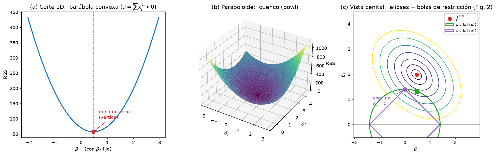
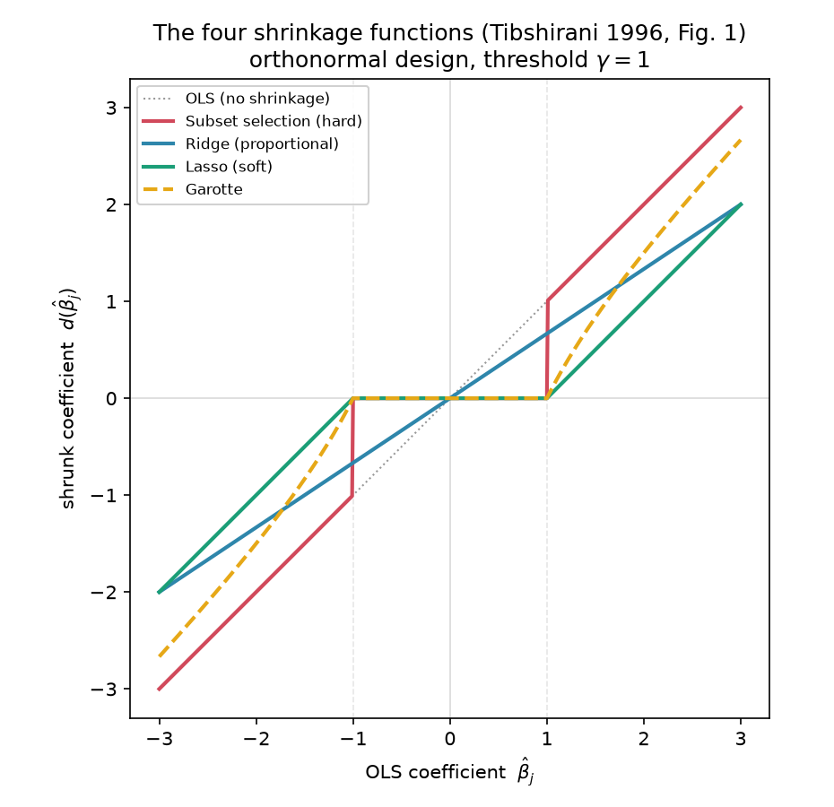
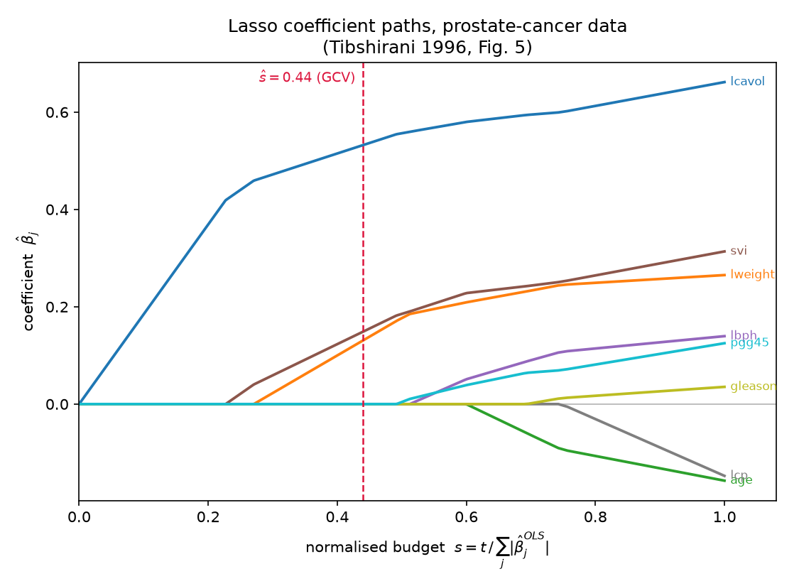

# Lasso via coordinate descent — Tibshirani (1996)

Implementation of the lasso from *Regression Shrinkage and Selection via the
Lasso* (Tibshirani, 1996). See the [review](../../reviews/1996-tibshirani-lasso.md)
for the paper's context and results.

Built incrementally. Current status:

| # | Piece | Status |
|---|-------|--------|
| 0 | Convexity of the RSS + Fig. 2 constraint geometry | ✅ `convex_rss.py` |
| 1 | Coordinate-descent solver + soft thresholding | ✅ `lasso.py` |
| 2 | Fig. 1 — the four shrinkage functions (subset / ridge / lasso / garotte) | ✅ `shrinkage_functions.py` |
| 3 | Fig. 5 + Table 1 — coefficient paths on the prostate-cancer data | ✅ `prostate_paths.py` |
| 4 | Table 3 — MSE comparison OLS / lasso-CV / ridge over 50 replicates | ⬜ pending |
| 5 | Cross-check the solver against `sklearn.linear_model.Lasso` | ⬜ pending |

## Fundamentos — from OLS to the Lagrangian form

Notas de repaso antes de la Pieza 1: por qué la "forma lagrangiana" del lasso no
usa `lambda` como el multiplicador de Lagrange de cálculo.

**1. OLS.** Con `y = X b + noise`, se minimiza el error cuadrático
`RSS(b) = ||y - X b||^2`. Es convexo; derivando e igualando a cero salen las
*normal equations* y la solución cerrada:

    X^T X b = X^T y   =>   b_hat = (X^T X)^{-1} X^T y

Si las columnas de `X` están correladas, `X^T X` está mal condicionada y `b_hat`
tiene varianza enorme. De ahí la idea de **acotar** `b`.

**2. Forma restringida (Eq. 1 del paper).** Se le pone presupuesto a `b`:

    min_b ||y - X b||^2   s.a.   sum_j |b_j| <= t     (lasso, L1)
    min_b ||y - X b||^2   s.a.   sum_j b_j^2  <= t^2   (ridge, L2)

Geométrico y claro: minimizar dentro de una bola — rombo para L1, círculo para
L2 (Fig. 2).

**3. Forma lagrangiana (lo que despista).** El Lagrange de cálculo, con
restricción de *igualdad* `g(b) = t`, es `L = f(b) + lam*(g(b) - t)` y se
resuelve `grad_b L = 0` **y** `dL/dlam = 0` — esta última devuelve la restricción
y `lam` es una incógnita que se despeja. **El lasso no hace eso.** Como la
restricción es *desigualdad*, se escribe

    min_b  ||y - X b||^2  +  lam * sum_j |b_j|

con **`lam` fijo, elegido por el usuario**, minimizando **solo sobre `b`**. El
término `-lam*t` es constante en `b` y desaparece; por eso se ve `+lam*sum|b_j|`
y no `lam*(sum|b_j| - t)`. En vez de fijar `t` y despejar su `lam`, se hace al
revés: se fija `lam` y él determina implícitamente un `t`.

Lo justifica la **dualidad de Lagrange** (problema convexo): para cada `t` existe
un `lam(t) >= 0` que da el mismo `b_hat`, y viceversa. El mapa `t <-> lam` es
monótono decreciente y **depende de los datos** (sin fórmula cerrada), así que en
la práctica se **barre `lam`** en una rejilla y se elige por cross-validation, o
se normaliza `s = t / sum_j |b_j^OLS|` en `[0, 1]` como en el paper.

    t >= ||b_OLS||_1   <->   lam = 0        -> OLS puro (restricción inactiva)
    t intermedio       <->   lam > 0        -> encoge / selecciona
    t = 0              <->   lam -> inf      -> todo b = 0

**4. Por qué ridge tiene cerrada y lasso no.** En forma lagrangiana ridge es
diferenciable: se suma `lam*I` a las normal equations,

    b_hat_ridge = (X^T X + lam*I)^{-1} X^T y

Ese `lam*I` es, tangible, lo que estabiliza la inversa. El lasso tiene `|b_j|`,
no derivable en 0 -> sin fórmula cerrada -> descenso por coordenadas + soft
thresholding (Pieza 1).

### Comparación OLS / Ridge / Lasso

| | OLS | Ridge (L2) | Lasso (L1) |
|---|---|---|---|
| Objetivo (lagrangiano) | `||y-Xb||^2` | `||y-Xb||^2 + lam*sum b_j^2` | `||y-Xb||^2 + lam*sum|b_j|` |
| Restricción equivalente | ninguna | `sum b_j^2 <= t^2` (círculo) | `sum |b_j| <= t` (rombo) |
| Solución | `(X^TX)^{-1}X^Ty` | `(X^TX+lam*I)^{-1}X^Ty` | sin cerrada (CD + soft-thr.) |
| Diferenciable en 0 | sí | sí | **no** (esquinas del rombo) |
| Efecto sobre `b` | — | encoge proporcional `b/(1+lam)`* | soft threshold `sign(b)(|b|-g)+`* |
| ¿Anula coeficientes? | no | **no** (nunca exacto 0) | **sí** (selección de variables) |

\* Las formas cerradas `b/(1+lam)` y el soft threshold son exactas solo en diseño
ortonormal (`X^T X = I`); es el caso de la Eq. 3 y de la Pieza 2.

### El cuenco convexo, dibujado (`convex_rss.py`)

`RSS(b) = y^T y - 2 y^T X b + b^T (X^T X) b` es cuadrática en `b`, con Hessiana
constante `2 X^T X`, semidefinida positiva porque `v^T X^T X v = ||X v||^2 >= 0`.
Eso la hace **convexa**: un cuenco con un único mínimo, sin trampas locales — por
eso el descenso por coordenadas (Pieza 1) converge siempre al óptimo global.
`convex_rss.py` lo muestra con un ejemplo de 2 predictores:

- **(a)** un corte 1D → parábola que abre hacia arriba (`a = sum x_i^2 > 0`).
- **(b)** la superficie 3D → el cuenco (paraboloide).
- **(c)** vista cenital → curvas de nivel elípticas centradas en `b_hat`, con el
  rombo `L1` y el círculo `L2` (Fig. 2). El óptimo lasso cae en el **vértice**
  del rombo (`b1 = 0`, selección) mientras que el de ridge queda en el interior
  del círculo (`b1 != 0`, sin selección).

Run `python convex_rss.py` (guarda `convex_rss.png`). Requiere `numpy` +
`matplotlib`.



## Piece 1 — the solver (`lasso.py`)

Solves the Lagrangian form of the lasso (Eq. 1) by cyclic coordinate descent
with soft thresholding — the modern standard (Sec. 6 note; Friedman et al. 2007),
not the quadratic-programming algorithm of the original paper.

    f(b) = (1 / 2N) * ||y - X b||^2  +  lam * sum_j |b_j|

Inputs follow the paper's convention (Eq. 1): columns of `X` standardized to
`(1/N) sum_i x_ij^2 = 1`, and `y` centered so the intercept drops out. A
`standardize()` helper is included.

### Run

```bash
python lasso.py
```

Requires only `numpy`.

### Validation — against the paper, not a library

In an orthonormal design (`X^T X / N = I`) the paper gives the closed-form
solution as soft thresholding of the OLS coefficients (**Eq. 3**). The script
builds such a design and checks that coordinate descent reproduces that closed
form. It does, to machine precision:

```
lam   max|CD - closed form|   #nonzero  coefficients
0.0   1.11e-15                8         [ 2.95  0.05  1.58 -0.08  0.06  1.93  0.03  0.  ]
0.25  1.78e-15                3         [ 2.7   0.    1.33 -0.    0.    1.68  0.    0.  ]
0.5   1.78e-15                3         [ 2.45  0.    1.08 -0.    0.    1.43  0.    0.  ]
1.0   1.55e-15                3         [ 1.95  0.    0.58 -0.    0.    0.93  0.    0.  ]
2.0   0.00e+00                1         [ 0.95  0.    0.   -0.    0.    0.    0.    0.  ]

Validation vs Eq. (3) closed form: PASS
```

With a sparse ground truth `beta = [3, 0, 1.5, 0, 0, 2, 0, 0]`, raising `lam`
first zeroes the five null coefficients (variable selection) and then shrinks
the survivors linearly toward zero — the signature of soft thresholding, versus
ridge's proportional shrinkage.

## Piece 2 — the four shrinkage functions (`shrinkage_functions.py`)

Reproduces **Fig. 1** of the paper. In an orthonormal design each method acts
coordinate-wise on the OLS coefficient `beta_hat`, so it is a scalar function
`d(beta_hat)` (Sec. 2.2). The script plots all four against the 45° OLS line:

- **Subset (hard):** follows OLS, then **jumps discontinuously to 0** at `|b|=γ`
  — the instability the paper criticises.
- **Ridge:** `b/(1+λ)`, proportional shrinkage, **never exactly 0**.
- **Lasso (soft):** flat 0 on `[-γ, γ]`, then parallel to OLS shifted down by γ
  — Eq. (3), continuous *and* selects.
- **Garotte:** flat 0 on `[-γ, γ]`, then bends back toward OLS for large `|b|`.

Reuses `soft_threshold` from `lasso.py`. Run `python shrinkage_functions.py`
(saves `fig1_shrinkage_functions.png`) or execute the `# %%` cells in VS Code's
Interactive Window to see it inline. Requires `numpy` + `matplotlib`.



## Piece 3 — coefficient paths on real data (`prostate_paths.py`)

Reproduces **Fig. 5** and **Table 1**: the lasso applied to the prostate-cancer
data of Stamey et al. (1989) — *N* = 97 men, 8 predictors, response `lpsa` — the
same dataset the paper analyses in Sec. 4. This is where variable selection can
be watched happening on real data rather than on a simulation.

The path is parametrised the way the paper does it, by the **normalised budget**
rather than by the penalty:

    s = t / sum_j |beta_j^OLS|      in [0, 1]

`s = 1` is OLS (constraint inactive), `s = 0` kills everything. The script solves
the Lagrangian form over a grid of `lam` and converts each fit to its own `s`.

### Data

`data/prostate.data`, from the [Elements of Statistical Learning
site](https://hastie.su.domains/ElemStatLearn/datasets/prostate.data). Not
versioned (see `.gitignore`); the script expects it at that path. All 97
observations are used, as in the paper — not the train/test split used in ESL.

### Run

```bash
python prostate_paths.py
```

Requires `numpy`, `pandas`, `matplotlib`.

### Validation — Table 1 reproduced exactly

The paper selects `s_hat = 0.44` by generalised cross-validation and reports
that only **`lcavol`, `lweight` and `svi`** survive. Our path at that budget:

```
Model at s = 0.440 (lam = 0.1945)
predictor        OLS     lasso
lcavol         0.662     0.532
lweight        0.265     0.131
age           -0.157     0.000   <- dropped
lbph           0.140     0.000   <- dropped
svi            0.314     0.149
lcp           -0.148     0.000   <- dropped
gleason        0.035     0.000   <- dropped
pgg45          0.125     0.000   <- dropped

Retained (3): lcavol, lweight, svi
```

**Same three predictors as the paper**, with the surviving coefficients shrunk
well below their OLS values (`lcavol` 0.66 → 0.53, `svi` 0.31 → 0.15) — the
bias the lasso trades for variance.



Reading the plot right to left (from OLS towards zero) shows the order in which
the lasso discards predictors: `age` and `lcp` (the two negative coefficients)
go first around `s = 0.6`, then `gleason`, `pgg45` and `lbph`, leaving the same
three the paper reports. Each coefficient hits zero and *stays* zero — the
piecewise-linear, continuous path that soft thresholding produces, in contrast
with subset selection's jumps.
